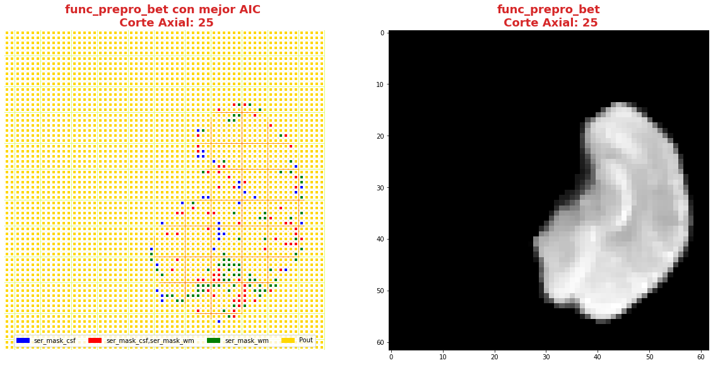
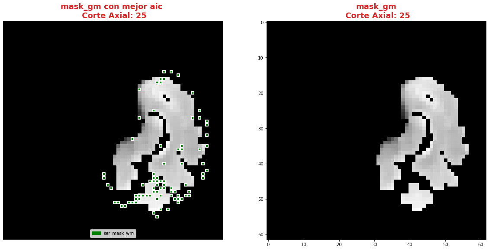
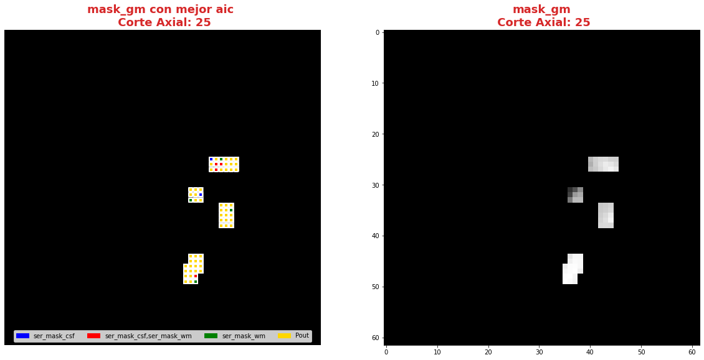
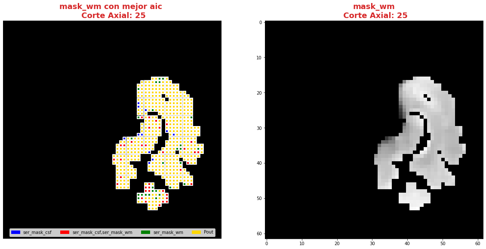
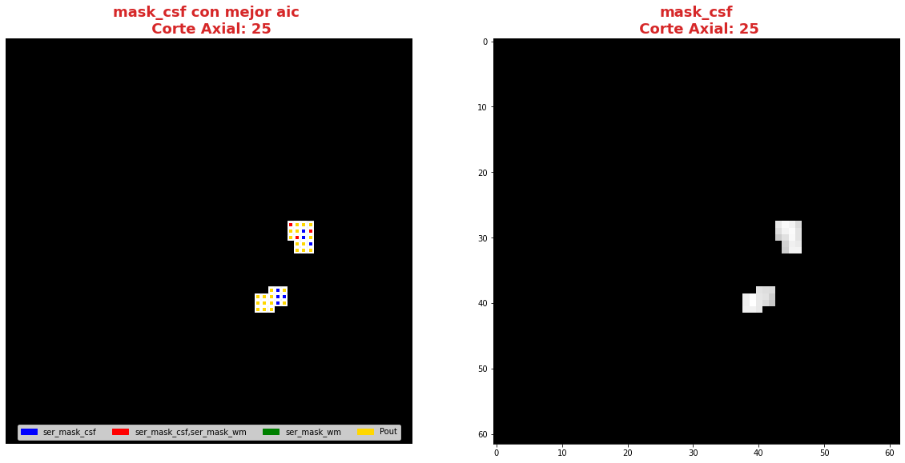
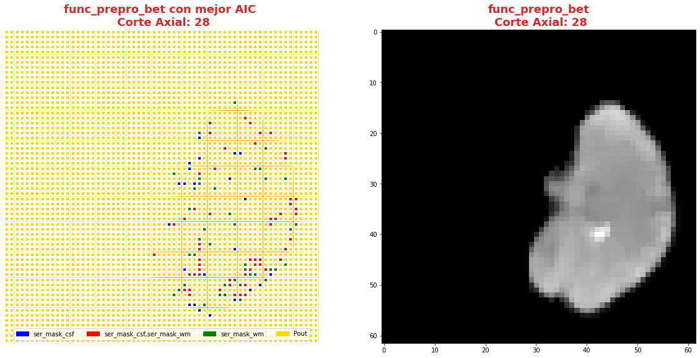
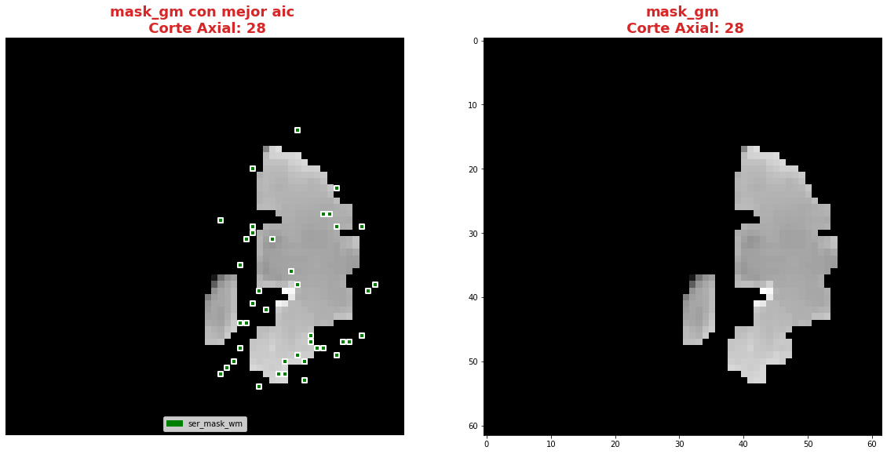
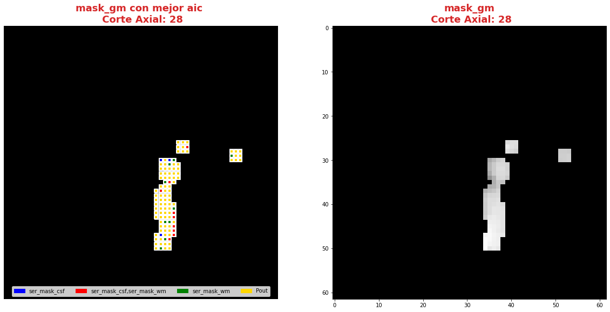
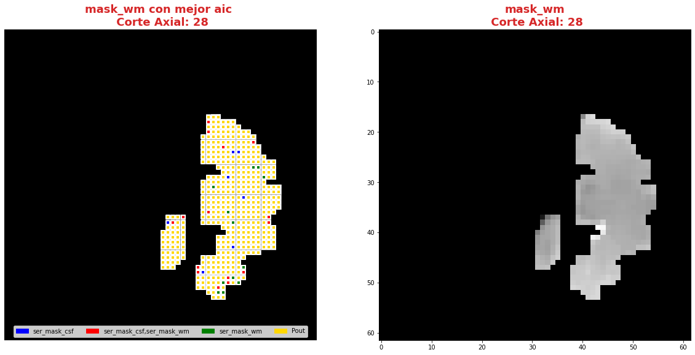
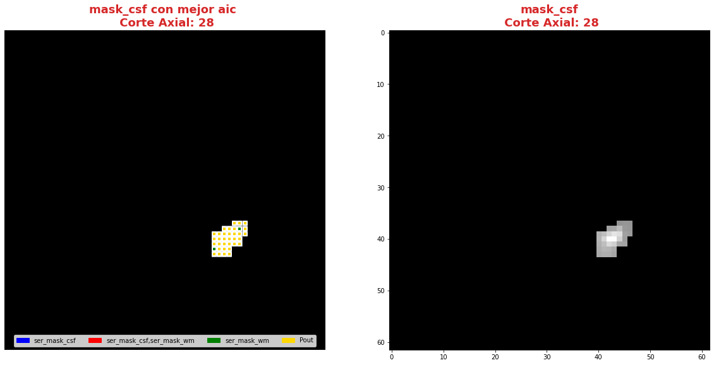

---

---

***Andres Eduardo Aracena Rangel***

*Estudiante del programa del Magister en Física Médica*

---

---


El siguiente Script de Python forma parte del trabajo especial de grado.

Profesora Guía:

*PhD María Daniela Cornejo*

---

---

&nbsp;
Con referencia:

- [Pagina oficial NIbabel](https://nipy.org/nibabel/index.html) 

Imagenes de fMRI extraidas de OpenNuero:
 
 - [ds002422](https://openneuro.org/datasets/ds002422/versions/1.1.0)
 
---

---

 Acronimos:

- CSF: Cerebrospinal Fluid (*líquido cefalorraquídeo*)
- GM: Gray Matter (*materia gris*)
- WM: White Matter (*materia blanca*)

---

---

NOTA:
Cuando indiquemos imagenes brain o mascaras brain, nos estamos refieriendo a las imagenes o mascaras de csf, wm, gm

---

---

# Regresión regresión lineal múltiple mediante el  método de mínimo cuadrado ordinarios.

Para encontrar el modelo de regresión lineal múltiple que mejor se ajusta a la variable dependiente, usaremos el método de mínimo cuadrado ordinarios (OLS, de las siglas en ingles de Ordinary Least Squares).

## Importamos librerias


```python
import time # medir el tiempo de ejecución de nuestros programas
start = time.process_time()
inicio = time.time()
```


```python
import os # El módulo os nos permite acceder a funcionalidades dependientes del Sistema Operativo
from os.path import join as opj   # Este método concatena varios componentes de ruta con exactamente un separador de directorio(‘/’)
import matplotlib.pyplot as plt   # Permite la generación de gráficos
import pandas as pd               #Biblioteca para manipulación de marcos de datos
import numpy as np
from numpy import random
import nibabel as nib

import matplotlib.patches as mpatches


#Biblioteca para estimar modelos estadísticos y realizar pruebas estadísticas
import statsmodels.api as sm
```

## Definimos parámetros


```python
'''
Ruta del directorio de la data
'''
path_data = '/home/aracena/thesis_ds002422/' 

# ruta donde reposa la imagen funcional procesada con bet

path_fmri = opj(path_data,'02_fase1_extraccion_brain_fmri_prepro','output')

#ruta mascaras brain
path_brain = opj(path_data,'01_fase1_extraccion_mask_brain','output','datasink','masks_brain')

'''
Ruta donde reposan las series promedios brain en archivo csv
'''
# Ruta donde reposan las series brain
path_csv = opj(path_data,'03_fase2_extraccion_series_tiempo_brain', 'output', '0.95', 'archivos_csv')

'''
Ruta donde reposan las series promedios 'brain' y 'series aleatorias' en archivo csv
'''
path_series = opj(path_data,'04_fase2_promedio_series_tiempo_brain','output','0.95', 'archivos_csv')

'''
Ruta donde se guardaran los resultados
'''
path_output = opj(path_data,'08_fase5_analisis_estadistico_aic/', 'output')
path_png = opj(path_output,'archivos_png')
               
# Crear la carpeta de salida
os.system('mkdir -p %s'%path_output)
os.system('mkdir -p %s'%path_png)

'''
Creamos la carpeta de salida para tablas
'''
path_out_DF = opj(path_output,'tablas_proyecto')
os.system('mkdir -p %s'%path_out_DF)


'''
lista de tejidos a procesar
'''
tejido = ['csf', 'gm', 'wm']

        
'''
Ingrese el umbral que desea extraer (se extrajeron tres mask brain para tres umbrales distintos)
'''
umbral_sel = '0.95'
```

## Funciones

### Función para graficar series de tiempo


```python
'''
Función grafica las series de tiempo de una DF introducida. Se requiere input:

- df_data = Dataframe que contiene las series de tiempo
- name_save = nombre con que desea guardar el grafico
'''

def plot_series_time(df_data, resaltar, titulo, name_save): 
    # Creamos una lista con las claves del diccionario ingresado
    tejido = list(df_data.keys())
    # definimos una ventana
    vent_min = 50
    vent_max = 75


    font1 = {'fontsize':14, 'fontweight':'bold', 'color':'tab:blue'}
    font2  = {'fontsize':18, 'fontweight':'bold', 'color':'tab:red'}

    fig, ax = plt.subplots(figsize = (17,8))
    for i,tisue in enumerate(tejido):
        if resaltar[0] == 'all':
            ax.plot(df_data[tisue], linewidth=2, label=tisue)
        elif i < len(resaltar):
            ax.plot(df_data[resaltar[i]], linewidth=2, label=tisue)
        else:           
            ax.plot(df_data[tisue], linewidth=1, label=tisue)

    ax.legend()
    ax.set_xlabel('Tiempo ($\\tau_N$)',fontdict=font1)
    ax.set_ylabel('Señal fMRI',fontdict=font1)
    ax.set_title(titulo, fontdict = font2)
    ax.grid(axis = 'x', color = 'gray', linestyle = 'dashed')
    ax.grid(axis = 'y', color = 'gray', linestyle = 'dashed')
    ax.axvspan(vent_min,vent_max, alpha=0.3, facecolor='y')

    plt.savefig(opj(path_png, name_save))
```

### Función crear lista de las series de un DF (lista de los valores de la columna del DF) y eliminar series


```python
'''
Función  que extrae una lista de los valores de las columnas de un dataframe.

Inputs:

- df: Dataframe que se desea extrae una lista de los valores de las columnas,
- elmiminar: lista de los valores de las columnas del DF que desea eliminar. Se debe ingresar una lista:
        * NO eliminar ningun valor de las columnas DF --> ['none']
        * Elimimnar uno o mas valores de la lista --> ['nombre_1' , 'nombre_2']
        
        LOS VALORES DEBE ESTAR EN FORMATO STRING (entre comillas simples o dobles)

Output:

- list_series: lista de series del DF
'''

def lista_dataframe(df, eliminar):
    # Creamos una lista de las columnas del dataframe
    series = df.columns.values
    list_series = list(series)
    
    tam = len(eliminar)

    if tam == 1:
        if eliminar[0] == 'none':
            list_series
        else:
            list_series.remove(eliminar[0]) 
    if tam != 1:   
        for i in range(tam):
            list_series.remove(eliminar[i])        
    
    return list_series    
```

### Función de conjunto potencia ó de número de combinaciones

En matemáticas, dado un conjunto $S$, se llama conjunto potencia o conjunto de partes de $S$ (se denota por $P(S)$ o $2^S$) al conjunto formado por todos los subconjuntos posibles de $S$.

Por ejemplo, si $S= {a, b, c}$ entonces el conjunto potencia de $S$ es 

*P(S) = {{ }, {a}, {b}, {c}, {a, b}, {a, c}, {b, c}, {a, b, c} }*


```python
'''
Función para extraer todos los subconjuntos posibles de un conjunto de una lista de entrada.

Inputs:

- lista_conjunto: Lista donde se desea extraer el conjunto potencia
- columnas: Numero de columnas para ordenar las combinaciones/modelos

Output:

- r: Lista de las combinaciones/modelos.
'''

def potencia(list_conjunto):
    '''
    Calcula y devuelve el conjunto potencia del conjunto c.
    En matemáticas, el conjunto potencia de un conjunto dado es otro conjunto 
    formado por todos los subconjuntos del conjunto dado.
    '''
   
    # Número de combinaciones
    if len(list_conjunto) == 0:
        return [[]]
    r = potencia(list_conjunto[:-1])
    
    return r + [s + [list_conjunto[-1]] for s in r]
```

### Funcion para crear un dataframe de las combinaciones/modelos


```python
'''
Función para visualizar las combinaciones/modelos en un dataframe, para ser incorporada en documentos.

Inputs:

- lista_combi: Lista de combinaciones/modelos 
- columnas: Numero de columnas para ordenar las combinaciones/modelos

Output:

- df_combi: Dataframe con las combinaciones/modelos
'''


def crear_df_combi(lista_combi, columnas):
    combi = lista_combi
    '''
    ordenamos la lista
    '''
    combi.sort()
    
    '''
    Se reescribe el elemento lista de la lista en un solo valor, 
    que es la combinacion/modelo
    '''

    list_combi =[]
    beta = str('$\\beta$')
    for i, co in enumerate(combi):
        modelo= beta+str(0)
        for j, mo in enumerate(combi[i]):
            modelo = modelo + ' + ' + beta + str(j+1) + ' ' + mo
        list_combi.append(modelo)   
    
    '''
    PROCESO DE CONVERTIR DE LISTA 1D A UN DATAFRAME FIL X COLUM
    '''
    # Indique cuantas columnas quiere representar las combinaciones en un DF
    colum = columnas

    # Como se quiere crear una matriz de 'colum' columnas, 
    # verifico si 'long' es divisible entre 'colum'; de no ser serlo, 
    # agrego un elemneto vacio a la lista hasta conseguirlo
    long = len(list_combi)
    n=0
    while n==0:
        if long % colum == 0: 
            n=1
        else:
            list_combi.append('')
            long = len(list_combi)
            
    # Conviertimos la lista en un array
    co = np.array(list_combi)

    # Conviertimos un array de 1D a laa dimension fil x colum
    fil = int(long/colum) # numero de filas

    co = co.reshape(fil,colum)

    # Convertirmos la matriz fil x colum en un DF
    df_combi = pd.DataFrame(co)

    '''
    Cambiamos nombre de columnas
    '''
    #Creamos lista de nuevos nombres
    new_colum = []
    for i in range(colum):
        new_colum.append('Combinaciones / Modelos')

    df_combi.columns = new_colum

    '''
    Renombramos indice
    '''
    #Creamos diccionario de nuevos indices
    new_index = {}
    for i in range(fil):
        new_index[i]= ' '

    #renombramos indices
    df_combi.rename(index=new_index, inplace=True)
    
    return df_combi    
```


```python
'''
Función para visualizar las combinaciones/modelos en un dataframe, para ser incorporada en documentos.

Inputs:

- lista_combi: Lista de combinaciones/modelos 
- columnas: Numero de columnas para ordenar las combinaciones/modelos

Output:

- df_combi: Dataframe con las combinaciones/modelos
'''


def crear_df_combi_1(lista_combi, columnas):
    '''
    ordenamos la lista
    '''
    combi.sort()
    
    '''
    Se reescribe el elemento lista de la lista en un solo valor, 
    que es la combinacion/modelo
    '''
    le = len(combi)
    list_combi =[]
    for i, co in enumerate(combi):
        ser = co
        w = len(ser)
        for i, se in enumerate(ser):
            if i == 0:
                agr = se
            else:
                agr = agr + ' + ' + se
        list_combi.append(agr)
        
    '''
    PROCESO DE CONVERTIR DE LISTA 1D A UN DATAFRAME FIL X COLUM
    '''
    # Indique cuantas columnas quiere representar las combinaciones en un DF
    colum = columnas

    # Como se quiere crear una matriz de 'colum' columnas, 
    # verifico si 'long' es divisible entre 'colum'; de no ser serlo, 
    # agrego un elemneto vacio a la lista hasta conseguirlo
    long = len(list_combi)
    n=0
    while n==0:
        if long % colum == 0: 
            n=1
        else:
            list_combi.append('')
            long = len(list_combi)
            
    # Conviertimos la lista en un array
    co = np.array(list_combi)

    # Conviertimos un array de 1D a laa dimension fil x colum
    fil = int(long/colum) # numero de filas

    co = co.reshape(fil,colum)

    # Convertirmos la matriz fil x colum en un DF
    df_combi = pd.DataFrame(co)

    '''
    Cambiamos nombre de columnas
    '''
    #Creamos lista de nuevos nombres
    new_colum = []
    for i in range(colum):
        new_colum.append('Combinaciones / Modelos')

    df_combi.columns = new_colum

    '''
    Renombramos indice
    '''
    #Creamos diccionario de nuevos indices
    new_index = {}
    for i in range(fil):
        new_index[i]= ' '

    #renombramos indices
    df_combi.rename(index=new_index, inplace=True)
    
    return df_combi    
```

### Función aplicacion modelo OLS


```python
'''
df_analisis: Dataframe que contien la serie dependiente (variable dependiente o variable de respuesta)
                y las series predictoras (ariables independientes o variables predictoras)
var_depen: Variable dependiente del dataframe (serie a predecir)
modelo: modelo a predecir la variable dependiente

Output: 

aic, r2, r2_adj, model: estadistios
'''


def estadisticos(df_analisis, var_depen, modelo):
    # Y: normalmente significa la variable respuesta (variable dependiente o variable de respuesta)
    #define response variable
    Y = df_analisis[var_depen]

    # X: usualmente significa nuestras variables de entrada (variables independientes o variables predictoras)
    X = df_analisis[modelo]

    #agregar constante a las variables predictoras [intercepción (beta_0) al modelo]
    X = sm.add_constant(X)

    #ajustamos modelo de regresión
    model = sm.OLS(Y, X).fit()    # sm.OLS(respuesta, entrada)

    #guardamos estadisticos AIC, R2, R2-AJUSTADO
    aic = model.aic
    r2 = model.rsquared
    r2_adj = model.rsquared_adj
    
    return aic, r2, r2_adj, model
```

### Función para determinar el mejor modelo mediante modelo de regresión OSL


```python
def best_osl(df_depen, df_indep, var_depen, lista_combi):
    
    '''
    CReamos una lista de las series del corte de la var dep
    '''
    num_ser  = df_var_depen.columns.to_list()

    a = pd.DataFrame()
    b = pd.DataFrame()
    aa = pd.DataFrame()
    bb = pd.DataFrame()
    aaa = pd.DataFrame()
    bbb = pd.DataFrame()
    for i, nuser in enumerate(num_ser):
        #creamos una lista que identifica la serie del voxel, con la camtidad de combinaciones
        serie = []
        for j in enumerate(lista_combi):
            serie.append(nuser)
        #se crea dataframe que identifica voxel en estudio
        df_serie = pd.DataFrame(serie, columns=['serie'])

        #extraemos la serie de tiempo del voxel i
        serie_estudio = df_depen.iloc[:,[i]]
        serie_estudio.columns=[var_depen]

        analisis = pd.merge(serie_estudio, df_indep,
                               right_index=True,left_index=True)

        #Ejecutamos la funcion aic
        RESULTADO_AIC = {}
        RESULTADO_R2 = {}
        RESULTADO_R2_AJU = {}
        modelo = {}
        for i, c in enumerate(lista_combi):
            li = lista_combi[i]
            anali = estadisticos(df_analisis=analisis,
                                 var_depen= var_depen,
                                 modelo=li)
            AIC = round(anali[0],2)
            R2 = round(anali[1],4)
            R2_AJU = round(anali[2],4)        
            c = ','.join(c)
            RESULTADO_AIC[c] = AIC
            RESULTADO_R2[c] = R2
            RESULTADO_R2_AJU[c] = R2_AJU
            modelo[c] = anali[3]


        '''
        DataFrame AIC
        '''
        #representamos el resultado aic en un dataframe
        DF_AIC = pd.DataFrame(list(RESULTADO_AIC.items()),
                       columns=['MODELO', 'AIC'])

        #representamos el resultado del modelo(resultado de la regresión
        # lineal) en un dataframe
        DF_MODELO = pd.DataFrame(list(modelo.items()),
                       columns=['MODELO', 'resultado_regresión'])

        # Unimos DF de resultado aic con DF modelo
        DF_AIC = pd.merge(DF_AIC,DF_MODELO, on='MODELO')

        #ordenamos de mayor a menor
        DFM_AIC = DF_AIC.sort_values('AIC')

        #restablecer el índice (para poder eliminar luego los dos ultimos)
        DFM_AIC.reset_index(drop=True, inplace=True)

        #unimos DFM con la identificacion del voxel
        best_model_aic = pd.merge(df_serie, DFM_AIC,
                           right_index=True,left_index=True)

        #elegimos el mejor modelo del voxel en estudio
        be = 1
        en =  len(lista_combi)
        best_aic = best_model_aic.drop(range(1, en, 1),axis=0)

        if i == 0:
            # creamos a y b para concatenar los demas resultados
            a = best_model_aic
            b = best_aic
        else:
            best_model_aic = pd.concat([a, best_model_aic])
            best_aic = pd.concat([b, best_aic])
            a = best_model_aic
            b = best_aic

        #restablecer el índice
        best_model_aic.reset_index(drop=True, inplace=True)
        best_aic.reset_index(drop=True, inplace=True)


        '''
        DataFrame R2
        '''

        #representamos el resultado aic en un dataframe
        DF_R2 = pd.DataFrame(list(RESULTADO_R2.items()),
                       columns=['MODELO', 'R2'])
        #representamos el resultado del modelo(resultado de la regresión
        # lineal) en un dataframe
        DF_MODELO_R2 = pd.DataFrame(list(modelo.items()),
                       columns=['MODELO', 'resultado_regresión'])

        # Unimos DF de resultado aic con DF modelo
        DF_R2 = pd.merge(DF_R2,DF_MODELO_R2, on='MODELO')


        #ordenamos de mayor a menor
        DFM_R2 = DF_R2.sort_values('R2',ascending=False)

        #restablecer el índice (para poder eliminar luego los dos ultimos)
        DFM_R2.reset_index(drop=True, inplace=True)

        #unimos DFM con la identificacion del voxel
        best_model_r2 = pd.merge(df_serie, DFM_R2,
                           right_index=True,left_index=True)

        #elegimos el mejor modelo del voxel en estudio
        be = 1
        en =  len(lista_combi)
        best_r2 = best_model_r2.drop(range(1, en, 1),axis=0)

        if i == 0:
            # creamos a y b para concatenar los demas resultados
            aa = best_model_r2
            bb = best_r2
        else:
            best_model_r2 = pd.concat([aa, best_model_r2])
            best_r2 = pd.concat([bb, best_r2])
            aa = best_model_r2
            bb = best_r2

        #restablecer el índice
        best_model_r2.reset_index(drop=True, inplace=True)
        best_r2.reset_index(drop=True, inplace=True)


        '''
        DataFrame R2-ajustado
        '''
        #representamos el resultado aic en un dataframe
        DF_R2_AJU = pd.DataFrame(list(RESULTADO_R2_AJU.items()),
                       columns=['MODELO', 'R2-ajus'])

        #representamos el resultado del modelo(resultado de la regresión
        # lineal) en un dataframe
        DF_MODELO_R2_AJU = pd.DataFrame(list(modelo.items()),
                       columns=['MODELO', 'resultado_regresión'])

        # Unimos DF de resultado aic con DF modelo
        DF_R2_AJU= pd.merge(DF_R2_AJU,DF_MODELO_R2_AJU, on='MODELO')

        #ordenamos de mayor a menor
        DFM_R2_AJU = DF_R2_AJU.sort_values('R2-ajus',ascending=False)

        #restablecer el índice (para poder eliminar luego los dos ultimos)
        DFM_R2_AJU.reset_index(drop=True, inplace=True)

        #unimos DFM con la identificacion del voxel
        best_model_aju = pd.merge(df_serie, DFM_R2_AJU,
                           right_index=True,left_index=True)

        #elegimos el mejor modelo del voxel en estudio
        be = 1
        en =  len(lista_combi)
        best_r2_aju = best_model_aju.drop(range(1, en, 1),axis=0)

        if i == 0:
            # creamos a y b para concatenar los demas resultados
            aaa = best_model_aju
            bbb = best_r2_aju
        else:
            best_model_aju = pd.concat([aaa, best_model_aju])
            best_r2_aju = pd.concat([bbb, best_r2_aju])
            aaa = best_model_aju
            bbb = best_r2_aju

        #restablecer el índice
        best_model_aju.reset_index(drop=True, inplace=True)
        best_r2_aju.reset_index(drop=True, inplace=True)

    return  best_aic, best_model_aic, best_r2, best_model_r2, best_r2_aju, best_model_aju, 
    #print(DFM_R2)
    #print('\n',best_model)
    #print('\n', best_aic)
```

### Función para extraer los valores p de los regresores


```python
'''
Función para extraer los valores p de las variables regresoras y su analisis con respecto al nivel 
significancia. Se requiere como inputs:

- df_ana = DF que se desea analisar y que debe contener los resultados de la regresión lineal
- nivel_signif = Nivel de significancia, si es de 5%, ingresamos 0.05, 
                                         si es del 10%, ingresamos 0.1, etc

Como output obtendremos un DF con el analisis sobre el valor p en los regresores
'''


def analisi_p(df_anali, nivel_signif):
    import pandas as pd
    '''
    Extraemos el primer indice de la DF a analizar. Esto se realiza, ya que en el analisis podremos escojer 
    los mejores aic de un conjunto de series que no empiece en el voxel/serie cero, por ejemplo, 
    puedo escojer los voxels del valor 4865 al 9728 que corresponden al segundo corte, y si utilizamos 
    el ciclo for desde 0, nos cambiara la identificación del voxel para para ser ingresado a la DF; 
    por ejemplo, el primer voxel al pasar por el ciclo es el 4865, y el ciclo lo guaradara 
    como 0
    '''

    inicio = df_anali.index.start

    '''
    Extraemos los valores p
    '''
    tam = len(df_anali)

    df_coef = pd.DataFrame()
    df_suma = pd.DataFrame()
    for i in range(tam):
        #extraemos resultados de la regresión lineal (RL) de las series de la imagen
        best_model = df_anali['resultado_regresión'][i+inicio]     
        indice = inicio + i
        #creamos DF de los valores p de la RL de la serie
        df_co = pd.DataFrame(round(best_model.pvalues,2)).T
        df_co.index = [indice]    

        #concatenamos
        df_coef = pd.concat([df_coef,df_co])

        #extraemos nombre de las columnas (regresores) en una lista; se extraee de la lista antes de concaenar
        regresores = df_co.columns.values  
        list_regresor = list(regresores)

        suma_evaluacion = 0
        valores_p = [] # creamos una lista para guardar los valores p y luego anexarla al DF best_aic

        for i, re in enumerate(list_regresor):
            coef = df_coef[re][indice]
            if coef < nivel_signif:
                suma_evaluacion = suma_evaluacion
            else:
                suma_evaluacion = suma_evaluacion + 1

            valores_p.append(coef)

        '''
        Agregamos el resultado de la lista de valores p de los regresores y 
        la suma_evaluación al DF en evaluación
        '''
        df_su = pd.DataFrame()
        df_su['valores_p_regresores'] = [valores_p]
        df_su['suma_evaluación'] = [suma_evaluacion]
        df_su.index = [indice]

        # concatenamos
        df_suma = pd.concat([df_suma,df_su])

    '''
    Unimos en un DF el resultado final
    '''
    analisis_p = pd.merge(df_coef, df_suma,
                       right_index=True,left_index=True)
    '''
    Unimos con la DF analisi_p con la DF de entrada
    '''
    best_p_1 = pd.merge(df_anali, analisis_p,
                           right_index=True,left_index=True)

    # eliminamos la columna resultado_regresión, 
    best_p = best_p_1.drop(['resultado_regresión'], axis=1)
    
    '''
    Crearemos un DF donde anexaremos una nueva columna, donde al evaluar suma_evaluacion si es 0, 
    agregamos el modelo AIC, si es mayor a cero, agregamos la palabra 'Pout', indicandonos que el
    modelo iene un valor p matyor a 0.05
    '''
    modelo_p = pd.DataFrame()

    for i in range(tam):
        valeva = best_p['suma_evaluación'][i+inicio]

        model_p = pd.DataFrame()
        if valeva == 0:
            model_p['MODELO_P'] = [best_p['MODELO'][i+inicio]]
        else:
            model_p['MODELO_P'] = ['Pout']

        model_p.index = [i+inicio]
        modelo_p = pd.concat([modelo_p,model_p])
    '''
    UNIMOS DF
    '''
    df_anali_p = pd.merge(best_p, modelo_p,
                     right_index=True,left_index=True)
    
    return df_anali_p
```


```python
'''
Función para extraer los valores p de las variables regresoras y su analisis con respecto al nivel 
significancia. Se requiere como inputs:

- df_ana = DF que se desea analisar y que debe contener los resultados de la regresión lineal
- nivel_signif = Nivel de significancia, si es de 5%, ingresamos 0.05, 
                                         si es del 10%, ingresamos 0.1, etc

Como output obtendremos un DF con el analisis sobre el valor p en los regresores
'''


def analisi_p_1(df_anali, nivel_signif):
    import pandas as pd
    '''
    Extraemos el primer indice de la DF a analizar. Esto se realiza, ya que en el analisis podremos escojer 
    los mejores aic de un conjunto de series que no empiece en el voxel/serie cero, por ejemplo, 
    puedo escojer los voxels del valor 4865 al 9728 que corresponden al segundo corte, y si utilizamos 
    el ciclo for desde 0, nos cambiara la identificación del voxel para para ser ingresado a la DF; 
    por ejemplo, el primer voxel al pasar por el ciclo es el 4865, y el ciclo lo guaradara 
    como 0
    '''

    inicio = df_anali.index.start

    '''
    Extraemos los valores p
    '''
    tam = len(df_anali)

    df_coef = pd.DataFrame()
    df_suma = pd.DataFrame()
    for i in range(tam):
        #extraemos resultados de la regresión lineal (RL) de las series de la imagen
        best_model = df_anali['resultado_regresión'][i+inicio]     
        indice = inicio + i
        #creamos DF de los valores p de la RL de la serie
        df_co = pd.DataFrame(round(best_model.pvalues,2)).T
        df_co.index = [indice]   

        #concatenamos
        df_coef = pd.concat([df_coef,df_co])

        #extraemos nombre de las columnas (regresores) en una lista; se extrae de la lista antes de concaenar
        regresores = df_co.columns.values  
        list_regresor = list(regresores)

        suma_evaluacion = 0
        valores_p = [] # creamos una lista para guardar los valores p y luego anexarla al DF best_aic
        
        # El la evaluación, no tomamos en cuenta el valor p de la constante
        for i in range(len(list_regresor)-1):            
            coef = df_coef[list_regresor[i+1]][indice]
            if coef < nivel_signif:
                suma_evaluacion = suma_evaluacion
            else:
                suma_evaluacion = suma_evaluacion + 1

            valores_p.append(coef)

        '''
        Agregamos el resultado de la lista de valores p de los regresores y 
        la suma_evaluación al DF en evaluación
        '''
        df_su = pd.DataFrame()
        df_su['valores_p_regresores_ser'] = [valores_p]
        df_su['suma_evaluación'] = [suma_evaluacion]
        df_su.index = [indice]

        # concatenamos
        df_suma = pd.concat([df_suma,df_su])

    '''
    Unimos en un DF el resultado final
    '''
    analisis_p = pd.merge(df_coef, df_suma,
                       right_index=True,left_index=True)
    '''
    Unimos con la DF analisi_p con la DF de entrada
    '''
    best_p_1 = pd.merge(df_anali, analisis_p,
                           right_index=True,left_index=True)

    # eliminamos la columna resultado_regresión, 
    best_p = best_p_1.drop(['resultado_regresión'], axis=1)
    
    '''
    Crearemos un DF donde anexaremos una nueva columna, donde al evaluar suma_evaluacion si es 0, 
    agregamos el modelo AIC, si es mayor a cero, agregamos la palabra 'Pout', indicandonos que el
    modelo iene un valor p matyor a 0.05
    '''
    modelo_p = pd.DataFrame()

    for i in range(tam):
        valeva = best_p['suma_evaluación'][i+inicio]

        model_p = pd.DataFrame()
        if valeva == 0:
            model_p['MODELO_P'] = [best_p['MODELO'][i+inicio]]
        else:
            model_p['MODELO_P'] = ['Pout']

        model_p.index = [i+inicio]
        modelo_p = pd.concat([modelo_p,model_p])
    '''
    UNIMOS DF
    '''
    df_anali_p = pd.merge(best_p, modelo_p,
                     right_index=True,left_index=True)
    
    return df_anali_p
```

### Función para graficar la variable dependiente en un modelo de OSL y el resultado del mejor modelo


```python
'''
Función para graficar la variable dependiente en un modelo de OSL y el resultado del mejor modelo 
mediante modelo de regresión OSL.

Inputs:

- df_depen = Dataframe de la variable dependiente del modelo de OSL 
- models_osl = Dataframe de los modelos de regresion al aplicar la funcion 'best_osl'. Ingresar solo
                el resultado segun alguno de los estadistico de AIC, R2 o R2_adjustado.
- best = seleccionar el modelo que quiere graficar. Si desea graficar el mejor modelo, se ingresa 0; 
        si desea graficar el segundo mejor modelo, se ingresa 1, y asi sucesivamente.
- titulo = titulo de la grafica
- name_save = nombre con el que se desea guardar la grafica
'''

def plot_series_osl(df_depen, models_osl, best, titulo, name_save): 
    '''
    Elegimos el modelo segun variable input best
    '''
    best_model= models_osl['resultado_regresión'][best]
    print(best_model.summary())
    
    '''
    Crear la etiqueta del mejor modelo
    '''

    for i, mo in enumerate(models_osl['MODELO'][best]):
        mo=models_osl['MODELO'][best].split(',') #Split regresa una lista de las palabras en la cadena, 
                                 # usando separador como el delimitador.

    '''
    Creamos nombre con los coeficientes y series del mejor modelo
    '''
    beta = str('$\\beta$')
    modelo_win = df_depen.columns.values[0]+' = '+beta+str(0)
    for i, m in enumerate(mo):
        modelo_win = modelo_win + ' + ' + beta + str(i+1) + m 
    
    '''
    Creamos etiqueta de la variable dependiente
    '''
    label_depen = df_depen.columns.values
    label_depen = label_depen[0]
    
    '''
    Dataframe del modelo de regresion OSL
    '''
    df_osl = pd.DataFrame(best_model.fittedvalues)
    df_osl.columns = ['modelo OLS']    
    
    # definimos una ventana
    vent_min = 50
    vent_max = 75


    font1 = {'fontsize':14, 'fontweight':'bold', 'color':'tab:blue'}
    font2  = {'fontsize':18, 'fontweight':'bold', 'color':'tab:red'}

    fig, ax = plt.subplots(figsize = (17,8))
    ax.plot(df_depen, linewidth=2, label=label_depen)
    ax.plot(df_osl, '--.', linewidth=2, color = 'red', label=modelo_win)

    ax.legend()
    ax.set_xlabel('Tiempo ($\\tau_N$)',fontdict=font1)
    ax.set_ylabel('Señal fMRI',fontdict=font1)
    ax.set_title(titulo, fontdict = font2)
    ax.grid(axis = 'x', color = 'gray', linestyle = 'dashed')
    ax.grid(axis = 'y', color = 'gray', linestyle = 'dashed')
    ax.axvspan(vent_min,vent_max, alpha=0.3, facecolor='y')

    plt.savefig(opj(path_png, name_save))
```

### Función para comparar los modelos segun los estadisticos AIC, R2 Y R2 ajustado


```python
'''
Función que genera un dataframe de comparacion de los modelos segun los estadisticos AIC, R2 Y R2 ajustado.

Inputs:

aic = DF modelos segun el estadistico AIC (DF resultante de la funcion 'best_osl')
r2 = DF modelos segun el estadistico R2 (DF resultante de la funcion 'best_osl')
r2_ajus = DF modelos segun el estadistico R2_ajus (DF resultante de la funcion 'best_osl')
'''

def compara_models_estad(aic,r2,r2_ajus):
    df_aic_best = aic_all.copy()
    df_aic_best = df_aic_best.drop(['serie', 'resultado_regresión'], axis=1)
    
    df_r2_best = r2_all.copy()
    df_r2_best = df_r2_best.drop(['serie', 'resultado_regresión'], axis=1)
    
    df_r2_aju_best = r2_ajus_all.copy()
    df_r2_aju_best = df_r2_aju_best.drop(['serie', 'resultado_regresión'], axis=1)
    
    df4 = pd.merge(df_aic_best,df_r2_best,on='MODELO',how='left')
    df5 = pd.merge(df4,df_r2_aju_best,on='MODELO',how='left')

    df5.style.highlight_max(axis=0)
    
    return     df5.style.\
                    highlight_max(subset=['AIC'], color='salmon').\
                    highlight_min(subset=['AIC'], color='yellow').\
                    highlight_max(subset=['R2','R2-ajus'], color='yellow').\
                    highlight_min(subset=['R2','R2-ajus'], color='salmon').\
                    format({'id':'{:.0f}'})
    
```

### Función agregar la posición x,y,z a los voxel/series de un DF y una caracteristica


```python
'''
Función agregar la posición x,y,z a los voxel/series de un DF. Se requiere como inputs:

- voxel_posicion = DF de la posición de los voxeles en x,y,z
- df_anali = DF que se desea anexarle la posición delos voxels
- carac = caracteristica/variable que desea anexar al nuevo DF junto con a posición de los voxels

Como output obtendremos un DF con la posición de los voxels y la caracteristica seleccionada
'''

def dataframe_posicion(voxel_posicion, df_anali, carac):  
    '''
    Extraemos el mejor modelo con evaluacion del valor p
    '''
    sel_model_p = df_anali[[carac]]

    '''
    Unimos DF
    '''

    df_anali_voxels = pd.merge(voxel_posicion, sel_model_p,
                            right_index=True,left_index=True)
    return df_anali_voxels
```

### Función para visualizar resultado de la regresión lineal en un corte


```python
def visual_analis_corte_sagital(df_sel, datos_img_fis, vol, corte_selec,df_color):    
    '''
    Visualizamos
    '''
    vol_img_data = datos_img_fis[:, :, :, vol]
    corte_coro = vol_img_data[:, :, corte_selec]

    font1 = {'fontsize':14, 'fontweight':'bold', 'color':'tab:blue'}
    font2  = {'fontsize':18, 'fontweight':'bold', 'color':'tab:red'}
    titulo =['func_prepro_bet con mejor AIC \n Corte Axial: ' + str(corte_selec), 
             'func_prepro_bet\n Corte Axial: ' + str(corte_selec)]

    fig, axes = plt.subplots(1, 2, figsize=(20, 20))

    axes[0].imshow(corte_coro, cmap = 'Wistia')
    axes[1].imshow(corte_coro , cmap = 'gray')
    
    #Extraemos una lista del indice
    lista_indice = df_sel.index.to_list()

    for i,lis in enumerate(lista_indice):
        k = df_sel['MODELO_P'][lis]
        color = df_color['color'][k]

        axes[0].scatter(df_sel['y'][lis],df_sel['z'][lis], 
                          marker="s",edgecolor='white', 
                          color=color,linewidth=2,  s=40)            
        axes[0].axis('off')

    for i,title in enumerate(titulo):
        axes[i].set_title(title, fontdict=font2)

    #creamos leyenda
    list_label = list(df_color.index)

    leyen = []
    for i, la in enumerate(list_label):
        le = mpatches.Patch(color=df_color['color'][la], label=la)
        leyen.append(le)
    
    axes[0].legend(handles=leyen,loc = 'lower center',ncol=4)
    
    fig.patch.set_facecolor('xkcd:white')
    plt.show()
    
    return df_sel
```

### Función para visulizar solo los modelos que se ajustan a wm en un corte


```python
def visual_solo_wm(df_sel, datos_img_fis, vol, corte_selec):    
    '''
    Visualizamos
    '''
    vol_img_data = datos_img_fis[:, :, :, vol]
    corte_coro = vol_img_data[:, :, corte_selec]

    font1 = {'fontsize':14, 'fontweight':'bold', 'color':'tab:blue'}
    font2  = {'fontsize':18, 'fontweight':'bold', 'color':'tab:red'}
    titulo =['mask_gm con mejor aic \n Corte Axial: ' + str(corte_selec), 
             'mask_gm\n Corte Axial: ' + str(corte_selec)]

    fig, axes = plt.subplots(1, 2, figsize=(20, 20))

    axes[0].imshow(corte_coro, cmap = 'gray')
    axes[1].imshow(corte_coro , cmap = 'gray')
    
    #Extraemos una lista del indice
    lista_indice = df_sel.index.to_list()
    
    for i,lis in enumerate(lista_indice):
        k = df_sel['MODELO_P'][lis]
        if k == 'ser_mask_wm':
            colore = 'green'
            le_1 = mpatches.Patch(color=colore, label=k)
            axes[0].scatter(df_sel['y'][lis],df_sel['z'][lis], 
                              marker="s",edgecolor='white', 
                              color=colore,linewidth=2,  s=40)
            axes[0].axis('off')


    for i,title in enumerate(titulo):
        axes[i].set_title(title, fontdict=font2)

    fig.patch.set_facecolor('xkcd:white')
    axes[0].legend(handles=[le_1],loc = 'lower center',ncol=4)
    #axes[0].legend(handles=[le_2],loc = 'lower center',ncol=4)
    plt.show()
    
    return df_sel
```

### Funcion para visualizar resultado dela regresón lineal solo en los voxels que dan forma la mascara


```python
def visual_analis_mask(df_sel, mascara, vol, corte_selec,df_color):    
    '''
    Visualizamos
    '''
    vol_img_data = datos_img[mascara][:, :, :, vol]
    corte_coro = vol_img_data[:, :, corte_selec]

    font1 = {'fontsize':14, 'fontweight':'bold', 'color':'tab:blue'}
    font2  = {'fontsize':18, 'fontweight':'bold', 'color':'tab:red'}
    titulo =[mascara + ' con mejor aic \n Corte Axial: ' + str(corte_selec), 
             mascara + '\n Corte Axial: ' + str(corte_selec)]

    fig, axes = plt.subplots(1, 2, figsize=(20, 20))

    axes[0].imshow(corte_coro, cmap = 'gray')
    axes[1].imshow(corte_coro , cmap = 'gray')
    
    #Extraemos una lista del indice
    lista_indice = df_sel.index.to_list()

    for i,lis in enumerate(lista_indice):
        k = df_sel['MODELO_P'][lis]
        color = df_color['color'][k]

        axes[0].scatter(df_sel['y'][lis],df_sel['z'][lis], 
                          marker="s",edgecolor='white', 
                          color=color,linewidth=2,  s=40)            
        axes[0].axis('off')

    for i,title in enumerate(titulo):
        axes[i].set_title(title, fontdict=font2)

    #creamos leyenda
    list_label = list(df_color.index)

    leyen = []
    for i, la in enumerate(list_label):
        le = mpatches.Patch(color=df_color['color'][la], label=la)
        leyen.append(le)
    
    axes[0].legend(handles=leyen,loc = 'lower center',ncol=4)
    
    fig.patch.set_facecolor('xkcd:white')
    plt.show()
    
    return df_sel
```

## Cargamos imagen y datos de la imagen funcional


```python
img_func = 'fmri_prepro_bet.nii.gz'               # Nombre de la imagen funcional preprocesada con bet
img_func_orig = nib.load(opj(path_fmri,img_func)) # Cargamos imagen nifti
datos_func_orig = img_func_orig.get_fdata()       # Cargamos datos de la imagen
```

## Cargamos imagenes y datos de las mascaras del tejido cerebral


```python
img_masks = 'fmri_rest_prepro.nii.gz'               # Nombre de las mascaras del tejido cerebral

'''
mask_csf
'''

mask_csf_orig = nib.load(opj(path_brain, 'mask_ext_csf','threshold_0.95', img_masks)) # Cargamos imagen nifti
datos_mask_csf= mask_csf_orig.get_fdata()                                         # Cargamos datos de la imagen

'''
mask_wm
'''

mask_wm_orig = nib.load(opj(path_brain, 'mask_ext_wm','threshold_0.95', img_masks)) # Cargamos imagen nifti
datos_mask_wm= mask_wm_orig.get_fdata()                                         # Cargamos datos de la imagen

'''
mask_gm
'''

mask_gm_orig = nib.load(opj(path_brain, 'mask_ext_gm','threshold_0.95', img_masks)) # Cargamos imagen nifti
datos_mask_gm= mask_gm_orig.get_fdata()                                         # Cargamos datos de la imagen
```

## Creamos Diccinario con los datos de las imagenes


```python
datos_img={'func_prepro_bet': datos_func_orig, 'mask_csf': datos_mask_csf, 
           'mask_wm': datos_mask_wm , 'mask_gm': datos_mask_gm}
```


```python
datos_img['mask_csf'].shape
```


    (62, 62, 44, 196)


## Cargamos las series que conforman cada una de las imagenes
Las series de todos los voxels de la imagen funcional es extraida del notebook **02_fase2_extraccion_series_tiempo_brain**.

### Series de tiempo de la imagen funcional preprocesada bet


```python
df_func = pd.read_csv (opj(path_csv,'serie_tiempo_all_func.csv'))
df_func
```


<div>
<style scoped>
    .dataframe tbody tr th:only-of-type {
        vertical-align: middle;
    }

    .dataframe tbody tr th {
        vertical-align: top;
    }

    .dataframe thead th {
        text-align: right;
    }
</style>
<table border="1" class="dataframe">
  <thead>
    <tr style="text-align: right;">
      <th></th>
      <th>0</th>
      <th>1</th>
      <th>2</th>
      <th>3</th>
      <th>4</th>
      <th>5</th>
      <th>6</th>
      <th>7</th>
      <th>8</th>
      <th>9</th>
      <th>...</th>
      <th>169126</th>
      <th>169127</th>
      <th>169128</th>
      <th>169129</th>
      <th>169130</th>
      <th>169131</th>
      <th>169132</th>
      <th>169133</th>
      <th>169134</th>
      <th>169135</th>
    </tr>
  </thead>
  <tbody>
    <tr>
      <th>0</th>
      <td>0.0</td>
      <td>0.0</td>
      <td>0.0</td>
      <td>0.0</td>
      <td>0.0</td>
      <td>0.0</td>
      <td>0.0</td>
      <td>0.0</td>
      <td>0.0</td>
      <td>0.0</td>
      <td>...</td>
      <td>0.0</td>
      <td>0.0</td>
      <td>0.0</td>
      <td>0.0</td>
      <td>0.0</td>
      <td>0.0</td>
      <td>0.0</td>
      <td>0.0</td>
      <td>0.0</td>
      <td>0.0</td>
    </tr>
    <tr>
      <th>1</th>
      <td>0.0</td>
      <td>0.0</td>
      <td>0.0</td>
      <td>0.0</td>
      <td>0.0</td>
      <td>0.0</td>
      <td>0.0</td>
      <td>0.0</td>
      <td>0.0</td>
      <td>0.0</td>
      <td>...</td>
      <td>0.0</td>
      <td>0.0</td>
      <td>0.0</td>
      <td>0.0</td>
      <td>0.0</td>
      <td>0.0</td>
      <td>0.0</td>
      <td>0.0</td>
      <td>0.0</td>
      <td>0.0</td>
    </tr>
    <tr>
      <th>2</th>
      <td>0.0</td>
      <td>0.0</td>
      <td>0.0</td>
      <td>0.0</td>
      <td>0.0</td>
      <td>0.0</td>
      <td>0.0</td>
      <td>0.0</td>
      <td>0.0</td>
      <td>0.0</td>
      <td>...</td>
      <td>0.0</td>
      <td>0.0</td>
      <td>0.0</td>
      <td>0.0</td>
      <td>0.0</td>
      <td>0.0</td>
      <td>0.0</td>
      <td>0.0</td>
      <td>0.0</td>
      <td>0.0</td>
    </tr>
    <tr>
      <th>3</th>
      <td>0.0</td>
      <td>0.0</td>
      <td>0.0</td>
      <td>0.0</td>
      <td>0.0</td>
      <td>0.0</td>
      <td>0.0</td>
      <td>0.0</td>
      <td>0.0</td>
      <td>0.0</td>
      <td>...</td>
      <td>0.0</td>
      <td>0.0</td>
      <td>0.0</td>
      <td>0.0</td>
      <td>0.0</td>
      <td>0.0</td>
      <td>0.0</td>
      <td>0.0</td>
      <td>0.0</td>
      <td>0.0</td>
    </tr>
    <tr>
      <th>4</th>
      <td>0.0</td>
      <td>0.0</td>
      <td>0.0</td>
      <td>0.0</td>
      <td>0.0</td>
      <td>0.0</td>
      <td>0.0</td>
      <td>0.0</td>
      <td>0.0</td>
      <td>0.0</td>
      <td>...</td>
      <td>0.0</td>
      <td>0.0</td>
      <td>0.0</td>
      <td>0.0</td>
      <td>0.0</td>
      <td>0.0</td>
      <td>0.0</td>
      <td>0.0</td>
      <td>0.0</td>
      <td>0.0</td>
    </tr>
    <tr>
      <th>...</th>
      <td>...</td>
      <td>...</td>
      <td>...</td>
      <td>...</td>
      <td>...</td>
      <td>...</td>
      <td>...</td>
      <td>...</td>
      <td>...</td>
      <td>...</td>
      <td>...</td>
      <td>...</td>
      <td>...</td>
      <td>...</td>
      <td>...</td>
      <td>...</td>
      <td>...</td>
      <td>...</td>
      <td>...</td>
      <td>...</td>
      <td>...</td>
    </tr>
    <tr>
      <th>191</th>
      <td>0.0</td>
      <td>0.0</td>
      <td>0.0</td>
      <td>0.0</td>
      <td>0.0</td>
      <td>0.0</td>
      <td>0.0</td>
      <td>0.0</td>
      <td>0.0</td>
      <td>0.0</td>
      <td>...</td>
      <td>0.0</td>
      <td>0.0</td>
      <td>0.0</td>
      <td>0.0</td>
      <td>0.0</td>
      <td>0.0</td>
      <td>0.0</td>
      <td>0.0</td>
      <td>0.0</td>
      <td>0.0</td>
    </tr>
    <tr>
      <th>192</th>
      <td>0.0</td>
      <td>0.0</td>
      <td>0.0</td>
      <td>0.0</td>
      <td>0.0</td>
      <td>0.0</td>
      <td>0.0</td>
      <td>0.0</td>
      <td>0.0</td>
      <td>0.0</td>
      <td>...</td>
      <td>0.0</td>
      <td>0.0</td>
      <td>0.0</td>
      <td>0.0</td>
      <td>0.0</td>
      <td>0.0</td>
      <td>0.0</td>
      <td>0.0</td>
      <td>0.0</td>
      <td>0.0</td>
    </tr>
    <tr>
      <th>193</th>
      <td>0.0</td>
      <td>0.0</td>
      <td>0.0</td>
      <td>0.0</td>
      <td>0.0</td>
      <td>0.0</td>
      <td>0.0</td>
      <td>0.0</td>
      <td>0.0</td>
      <td>0.0</td>
      <td>...</td>
      <td>0.0</td>
      <td>0.0</td>
      <td>0.0</td>
      <td>0.0</td>
      <td>0.0</td>
      <td>0.0</td>
      <td>0.0</td>
      <td>0.0</td>
      <td>0.0</td>
      <td>0.0</td>
    </tr>
    <tr>
      <th>194</th>
      <td>0.0</td>
      <td>0.0</td>
      <td>0.0</td>
      <td>0.0</td>
      <td>0.0</td>
      <td>0.0</td>
      <td>0.0</td>
      <td>0.0</td>
      <td>0.0</td>
      <td>0.0</td>
      <td>...</td>
      <td>0.0</td>
      <td>0.0</td>
      <td>0.0</td>
      <td>0.0</td>
      <td>0.0</td>
      <td>0.0</td>
      <td>0.0</td>
      <td>0.0</td>
      <td>0.0</td>
      <td>0.0</td>
    </tr>
    <tr>
      <th>195</th>
      <td>0.0</td>
      <td>0.0</td>
      <td>0.0</td>
      <td>0.0</td>
      <td>0.0</td>
      <td>0.0</td>
      <td>0.0</td>
      <td>0.0</td>
      <td>0.0</td>
      <td>0.0</td>
      <td>...</td>
      <td>0.0</td>
      <td>0.0</td>
      <td>0.0</td>
      <td>0.0</td>
      <td>0.0</td>
      <td>0.0</td>
      <td>0.0</td>
      <td>0.0</td>
      <td>0.0</td>
      <td>0.0</td>
    </tr>
  </tbody>
</table>
<p>196 rows × 169136 columns</p>
</div>


```python
'''
Verificamos si los nombres de las columnas son string o enteros
'''
colum_name = df_func.columns.values

tipo = type(colum_name[0])

if tipo == str:
    '''
    Convertimos los nombres de columna en string a int
    '''
    colum_name_int = []
    for i,ne in enumerate(colum_name):
        colum_name_int.append(int(ne))

'''
Agregamos los nombres de la serie en entero
'''
df_func.columns = colum_name_int

'''
Verificamos
'''
#verificamos
df_func[125156]
```


    0      602.551086
    1      607.188904
    2      591.853455
    3      599.024963
    4      587.435974
              ...    
    191    596.145020
    192    600.325745
    193    594.977112
    194    593.999084
    195    590.688110
    Name: 125156, Length: 196, dtype: float64


### Series de tiempo de la imagen mask_csf


```python
pd.options.display.max_columns = 12 # para mejorar la visualización del DataFrame

df_csf = pd.read_csv(opj(path_csv,'serie_tiempo_all_mask_csf.csv'))
df_csf
```


<div>
<style scoped>
    .dataframe tbody tr th:only-of-type {
        vertical-align: middle;
    }

    .dataframe tbody tr th {
        vertical-align: top;
    }

    .dataframe thead th {
        text-align: right;
    }
</style>
<table border="1" class="dataframe">
  <thead>
    <tr style="text-align: right;">
      <th></th>
      <th>42789</th>
      <th>42790</th>
      <th>42791</th>
      <th>42833</th>
      <th>42834</th>
      <th>42835</th>
      <th>...</th>
      <th>119218</th>
      <th>119219</th>
      <th>119220</th>
      <th>119224</th>
      <th>119225</th>
      <th>119226</th>
    </tr>
  </thead>
  <tbody>
    <tr>
      <th>0</th>
      <td>147.668701</td>
      <td>199.851395</td>
      <td>321.464417</td>
      <td>319.859619</td>
      <td>390.075043</td>
      <td>485.286591</td>
      <td>...</td>
      <td>575.245911</td>
      <td>564.928162</td>
      <td>563.222595</td>
      <td>571.135742</td>
      <td>569.495667</td>
      <td>573.659790</td>
    </tr>
    <tr>
      <th>1</th>
      <td>147.734985</td>
      <td>203.295837</td>
      <td>316.090210</td>
      <td>320.602753</td>
      <td>394.869293</td>
      <td>489.250885</td>
      <td>...</td>
      <td>576.844482</td>
      <td>574.859253</td>
      <td>572.265747</td>
      <td>574.809692</td>
      <td>565.620789</td>
      <td>569.487976</td>
    </tr>
    <tr>
      <th>2</th>
      <td>147.813690</td>
      <td>198.290558</td>
      <td>318.719666</td>
      <td>324.457642</td>
      <td>391.678802</td>
      <td>484.849060</td>
      <td>...</td>
      <td>571.221802</td>
      <td>582.090027</td>
      <td>579.156067</td>
      <td>568.527588</td>
      <td>569.592651</td>
      <td>570.382019</td>
    </tr>
    <tr>
      <th>3</th>
      <td>148.630875</td>
      <td>207.636703</td>
      <td>311.952423</td>
      <td>325.447235</td>
      <td>387.747406</td>
      <td>489.182068</td>
      <td>...</td>
      <td>562.674438</td>
      <td>564.800537</td>
      <td>562.293640</td>
      <td>570.185669</td>
      <td>564.723206</td>
      <td>571.315186</td>
    </tr>
    <tr>
      <th>4</th>
      <td>148.653290</td>
      <td>203.587326</td>
      <td>304.501617</td>
      <td>329.378143</td>
      <td>391.722839</td>
      <td>488.992188</td>
      <td>...</td>
      <td>570.756592</td>
      <td>564.414001</td>
      <td>564.004456</td>
      <td>575.846069</td>
      <td>566.695435</td>
      <td>577.148010</td>
    </tr>
    <tr>
      <th>...</th>
      <td>...</td>
      <td>...</td>
      <td>...</td>
      <td>...</td>
      <td>...</td>
      <td>...</td>
      <td>...</td>
      <td>...</td>
      <td>...</td>
      <td>...</td>
      <td>...</td>
      <td>...</td>
      <td>...</td>
    </tr>
    <tr>
      <th>191</th>
      <td>141.190781</td>
      <td>206.106812</td>
      <td>308.748840</td>
      <td>318.514404</td>
      <td>415.739349</td>
      <td>496.409668</td>
      <td>...</td>
      <td>567.523254</td>
      <td>567.580322</td>
      <td>570.030457</td>
      <td>570.975403</td>
      <td>568.758972</td>
      <td>574.168945</td>
    </tr>
    <tr>
      <th>192</th>
      <td>148.696869</td>
      <td>212.194748</td>
      <td>314.824097</td>
      <td>325.573364</td>
      <td>412.295959</td>
      <td>502.475403</td>
      <td>...</td>
      <td>575.559021</td>
      <td>570.799500</td>
      <td>576.565796</td>
      <td>573.521729</td>
      <td>570.436768</td>
      <td>570.730591</td>
    </tr>
    <tr>
      <th>193</th>
      <td>152.130447</td>
      <td>211.498489</td>
      <td>313.927216</td>
      <td>315.044403</td>
      <td>415.206024</td>
      <td>503.547485</td>
      <td>...</td>
      <td>582.249146</td>
      <td>576.852112</td>
      <td>569.587463</td>
      <td>565.593323</td>
      <td>567.328613</td>
      <td>574.088501</td>
    </tr>
    <tr>
      <th>194</th>
      <td>146.669983</td>
      <td>214.301300</td>
      <td>301.381012</td>
      <td>306.016785</td>
      <td>417.359467</td>
      <td>507.997894</td>
      <td>...</td>
      <td>571.097778</td>
      <td>570.077942</td>
      <td>573.925476</td>
      <td>576.993652</td>
      <td>574.053040</td>
      <td>576.496826</td>
    </tr>
    <tr>
      <th>195</th>
      <td>140.227005</td>
      <td>208.586624</td>
      <td>303.595093</td>
      <td>295.467163</td>
      <td>411.607483</td>
      <td>511.367737</td>
      <td>...</td>
      <td>573.688782</td>
      <td>574.971375</td>
      <td>568.996338</td>
      <td>571.335266</td>
      <td>571.035278</td>
      <td>575.821350</td>
    </tr>
  </tbody>
</table>
<p>196 rows × 664 columns</p>
</div>


```python
'''
Verificamos si los nombres de las columnas son string o enteros
'''
colum_name = df_csf.columns.values

tipo = type(colum_name[0])

if tipo == str:
    '''
    Convertimos los nombres de columna en string a int
    '''
    colum_name_int = []
    for i,ne in enumerate(colum_name):
        colum_name_int.append(int(ne))

'''
Agregamos los nombres de la serie en entero
'''
df_csf.columns = colum_name_int

'''
Verificamos
'''
df_csf[42789]
```


    0      147.668701
    1      147.734985
    2      147.813690
    3      148.630875
    4      148.653290
              ...    
    191    141.190781
    192    148.696869
    193    152.130447
    194    146.669983
    195    140.227005
    Name: 42789, Length: 196, dtype: float64


### Series de tiempo de la imagen mask_wm


```python
df_wm = pd.read_csv(opj(path_csv,'serie_tiempo_all_mask_wm.csv'))
df_wm
```


<div>
<style scoped>
    .dataframe tbody tr th:only-of-type {
        vertical-align: middle;
    }

    .dataframe tbody tr th {
        vertical-align: top;
    }

    .dataframe thead th {
        text-align: right;
    }
</style>
<table border="1" class="dataframe">
  <thead>
    <tr style="text-align: right;">
      <th></th>
      <th>45521</th>
      <th>45522</th>
      <th>45523</th>
      <th>45565</th>
      <th>45566</th>
      <th>45567</th>
      <th>...</th>
      <th>149133</th>
      <th>149134</th>
      <th>149135</th>
      <th>149177</th>
      <th>149178</th>
      <th>149179</th>
    </tr>
  </thead>
  <tbody>
    <tr>
      <th>0</th>
      <td>558.509705</td>
      <td>540.997253</td>
      <td>541.389648</td>
      <td>612.870605</td>
      <td>588.416565</td>
      <td>589.830811</td>
      <td>...</td>
      <td>707.064514</td>
      <td>696.431885</td>
      <td>692.887207</td>
      <td>705.565552</td>
      <td>682.213257</td>
      <td>680.011780</td>
    </tr>
    <tr>
      <th>1</th>
      <td>557.310730</td>
      <td>531.426636</td>
      <td>531.750427</td>
      <td>614.956848</td>
      <td>591.456055</td>
      <td>590.338989</td>
      <td>...</td>
      <td>707.434204</td>
      <td>692.308960</td>
      <td>688.676697</td>
      <td>699.486694</td>
      <td>686.828613</td>
      <td>682.569702</td>
    </tr>
    <tr>
      <th>2</th>
      <td>553.042358</td>
      <td>542.496765</td>
      <td>542.752930</td>
      <td>612.459534</td>
      <td>588.968567</td>
      <td>598.140747</td>
      <td>...</td>
      <td>706.353638</td>
      <td>700.280396</td>
      <td>695.907104</td>
      <td>697.278992</td>
      <td>682.359070</td>
      <td>680.453552</td>
    </tr>
    <tr>
      <th>3</th>
      <td>556.084290</td>
      <td>536.858459</td>
      <td>537.048035</td>
      <td>609.126282</td>
      <td>580.387085</td>
      <td>599.528992</td>
      <td>...</td>
      <td>703.976257</td>
      <td>696.470581</td>
      <td>690.543945</td>
      <td>697.413391</td>
      <td>687.366211</td>
      <td>683.097656</td>
    </tr>
    <tr>
      <th>4</th>
      <td>552.461121</td>
      <td>535.620850</td>
      <td>535.744812</td>
      <td>614.710693</td>
      <td>584.458618</td>
      <td>586.557007</td>
      <td>...</td>
      <td>705.783508</td>
      <td>696.361450</td>
      <td>691.490540</td>
      <td>704.485046</td>
      <td>686.238892</td>
      <td>679.217285</td>
    </tr>
    <tr>
      <th>...</th>
      <td>...</td>
      <td>...</td>
      <td>...</td>
      <td>...</td>
      <td>...</td>
      <td>...</td>
      <td>...</td>
      <td>...</td>
      <td>...</td>
      <td>...</td>
      <td>...</td>
      <td>...</td>
      <td>...</td>
    </tr>
    <tr>
      <th>191</th>
      <td>561.972473</td>
      <td>529.630554</td>
      <td>535.687500</td>
      <td>614.773926</td>
      <td>587.987854</td>
      <td>587.687195</td>
      <td>...</td>
      <td>706.727905</td>
      <td>695.396240</td>
      <td>688.720825</td>
      <td>699.697327</td>
      <td>680.160156</td>
      <td>678.870422</td>
    </tr>
    <tr>
      <th>192</th>
      <td>557.835083</td>
      <td>536.516235</td>
      <td>541.599182</td>
      <td>609.853760</td>
      <td>583.662842</td>
      <td>583.317261</td>
      <td>...</td>
      <td>708.028015</td>
      <td>696.687439</td>
      <td>687.257263</td>
      <td>702.897400</td>
      <td>682.628296</td>
      <td>680.961609</td>
    </tr>
    <tr>
      <th>193</th>
      <td>559.801941</td>
      <td>531.376709</td>
      <td>534.836853</td>
      <td>609.734924</td>
      <td>575.786438</td>
      <td>575.395325</td>
      <td>...</td>
      <td>703.313477</td>
      <td>693.849243</td>
      <td>689.939636</td>
      <td>694.144592</td>
      <td>685.434326</td>
      <td>684.456177</td>
    </tr>
    <tr>
      <th>194</th>
      <td>555.847839</td>
      <td>542.341858</td>
      <td>533.729126</td>
      <td>616.521912</td>
      <td>573.733948</td>
      <td>573.296631</td>
      <td>...</td>
      <td>700.210693</td>
      <td>692.626648</td>
      <td>690.553711</td>
      <td>694.869263</td>
      <td>688.940613</td>
      <td>687.568787</td>
    </tr>
    <tr>
      <th>195</th>
      <td>553.873474</td>
      <td>537.616516</td>
      <td>535.468933</td>
      <td>618.154297</td>
      <td>582.465637</td>
      <td>581.981445</td>
      <td>...</td>
      <td>706.183105</td>
      <td>698.888000</td>
      <td>693.698914</td>
      <td>699.624329</td>
      <td>685.680481</td>
      <td>679.593079</td>
    </tr>
  </tbody>
</table>
<p>196 rows × 9439 columns</p>
</div>


```python
'''
Verificamos si los nombres de las columnas son string o enteros
'''
colum_name = df_wm.columns.values

tipo = type(colum_name[0])

if tipo == str:
    '''
    Convertimos los nombres de columna en string a int
    '''
    colum_name_int = []
    for i,ne in enumerate(colum_name):
        colum_name_int.append(int(ne))

'''
Agregamos los nombres de la serie en entero
'''
df_wm.columns = colum_name_int

'''
Verificamos
'''
df_wm[45521]
```


    0      558.509705
    1      557.310730
    2      553.042358
    3      556.084290
    4      552.461121
              ...    
    191    561.972473
    192    557.835083
    193    559.801941
    194    555.847839
    195    553.873474
    Name: 45521, Length: 196, dtype: float64


### Series de tiempo de la imagen mask_gm


```python
df_gm = pd.read_csv(opj(path_csv,'serie_tiempo_all_mask_gm.csv'))
df_gm
```


<div>
<style scoped>
    .dataframe tbody tr th:only-of-type {
        vertical-align: middle;
    }

    .dataframe tbody tr th {
        vertical-align: top;
    }

    .dataframe thead th {
        text-align: right;
    }
</style>
<table border="1" class="dataframe">
  <thead>
    <tr style="text-align: right;">
      <th></th>
      <th>69984</th>
      <th>69985</th>
      <th>69986</th>
      <th>70028</th>
      <th>70029</th>
      <th>70030</th>
      <th>...</th>
      <th>138011</th>
      <th>138012</th>
      <th>138013</th>
      <th>138054</th>
      <th>138055</th>
      <th>138056</th>
    </tr>
  </thead>
  <tbody>
    <tr>
      <th>0</th>
      <td>482.691833</td>
      <td>483.875824</td>
      <td>523.863342</td>
      <td>500.585510</td>
      <td>543.190735</td>
      <td>562.234924</td>
      <td>...</td>
      <td>645.991577</td>
      <td>620.883484</td>
      <td>566.739197</td>
      <td>604.856079</td>
      <td>611.386292</td>
      <td>608.635925</td>
    </tr>
    <tr>
      <th>1</th>
      <td>490.438690</td>
      <td>490.441040</td>
      <td>517.636902</td>
      <td>499.352142</td>
      <td>536.707214</td>
      <td>559.764709</td>
      <td>...</td>
      <td>641.451172</td>
      <td>617.706116</td>
      <td>565.928284</td>
      <td>607.190735</td>
      <td>616.314758</td>
      <td>612.303101</td>
    </tr>
    <tr>
      <th>2</th>
      <td>485.499817</td>
      <td>484.313629</td>
      <td>512.508789</td>
      <td>502.541199</td>
      <td>533.103638</td>
      <td>558.305786</td>
      <td>...</td>
      <td>642.839539</td>
      <td>626.015991</td>
      <td>560.519287</td>
      <td>603.756348</td>
      <td>613.508911</td>
      <td>611.362244</td>
    </tr>
    <tr>
      <th>3</th>
      <td>476.901245</td>
      <td>484.134796</td>
      <td>516.711487</td>
      <td>492.174194</td>
      <td>539.963135</td>
      <td>557.129456</td>
      <td>...</td>
      <td>634.700623</td>
      <td>620.761414</td>
      <td>577.031738</td>
      <td>596.944275</td>
      <td>603.076233</td>
      <td>608.359131</td>
    </tr>
    <tr>
      <th>4</th>
      <td>485.044861</td>
      <td>488.924286</td>
      <td>517.882935</td>
      <td>494.482971</td>
      <td>544.175903</td>
      <td>557.237122</td>
      <td>...</td>
      <td>635.966248</td>
      <td>614.508911</td>
      <td>553.956726</td>
      <td>606.033569</td>
      <td>615.232788</td>
      <td>603.548889</td>
    </tr>
    <tr>
      <th>...</th>
      <td>...</td>
      <td>...</td>
      <td>...</td>
      <td>...</td>
      <td>...</td>
      <td>...</td>
      <td>...</td>
      <td>...</td>
      <td>...</td>
      <td>...</td>
      <td>...</td>
      <td>...</td>
      <td>...</td>
    </tr>
    <tr>
      <th>191</th>
      <td>479.272766</td>
      <td>482.000244</td>
      <td>520.089600</td>
      <td>495.016785</td>
      <td>538.495911</td>
      <td>557.342529</td>
      <td>...</td>
      <td>636.059387</td>
      <td>623.618591</td>
      <td>569.794250</td>
      <td>598.263672</td>
      <td>613.219727</td>
      <td>609.638550</td>
    </tr>
    <tr>
      <th>192</th>
      <td>484.100555</td>
      <td>482.913391</td>
      <td>516.416931</td>
      <td>497.960968</td>
      <td>550.385437</td>
      <td>567.474548</td>
      <td>...</td>
      <td>631.828430</td>
      <td>606.168701</td>
      <td>565.765930</td>
      <td>603.287720</td>
      <td>609.638672</td>
      <td>608.893311</td>
    </tr>
    <tr>
      <th>193</th>
      <td>484.148315</td>
      <td>482.442291</td>
      <td>520.879272</td>
      <td>497.371368</td>
      <td>547.918213</td>
      <td>564.610901</td>
      <td>...</td>
      <td>628.325562</td>
      <td>612.783081</td>
      <td>564.594421</td>
      <td>602.537537</td>
      <td>611.554382</td>
      <td>612.415527</td>
    </tr>
    <tr>
      <th>194</th>
      <td>484.834839</td>
      <td>488.470093</td>
      <td>519.455383</td>
      <td>500.314392</td>
      <td>543.865784</td>
      <td>567.100037</td>
      <td>...</td>
      <td>629.879944</td>
      <td>612.956604</td>
      <td>568.226501</td>
      <td>604.447266</td>
      <td>611.404968</td>
      <td>607.777649</td>
    </tr>
    <tr>
      <th>195</th>
      <td>484.571167</td>
      <td>487.482025</td>
      <td>511.344116</td>
      <td>499.336914</td>
      <td>542.434387</td>
      <td>562.707520</td>
      <td>...</td>
      <td>642.090210</td>
      <td>621.086975</td>
      <td>580.031555</td>
      <td>606.760132</td>
      <td>614.058228</td>
      <td>614.360046</td>
    </tr>
  </tbody>
</table>
<p>196 rows × 1794 columns</p>
</div>


```python
'''
Verificamos si los nombres de las columnas son string o enteros
'''
colum_name = df_gm.columns.values

tipo = type(colum_name[0])

if tipo == str:
    '''
    Convertimos los nombres de columna en string a int
    '''
    colum_name_int = []
    for i,ne in enumerate(colum_name):
        colum_name_int.append(int(ne))

'''
Agregamos los nombres de la serie en entero
'''
df_gm.columns = colum_name_int

'''
Verificamos
'''
df_gm[69984]
```


    0      482.691833
    1      490.438690
    2      485.499817
    3      476.901245
    4      485.044861
              ...    
    191    479.272766
    192    484.100555
    193    484.148315
    194    484.834839
    195    484.571167
    Name: 69984, Length: 196, dtype: float64


## Cargamos las series promedio global CSF, GM y WM.


```python
'''
Cargamos la serie del csf
'''
df_csf = pd.read_csv (opj(path_series,'serie_tiempo_val_prom_ser_mask_csf.csv'))

'''
Cargamos la serie del gm
'''
df_gm = pd.read_csv (opj(path_series,'serie_tiempo_val_prom_ser_mask_gm.csv'))


'''
Cargamos la serie del wm
'''
df_wm = pd.read_csv (opj(path_series,'serie_tiempo_val_prom_ser_mask_wm.csv'))
```

## Cargamos las posiciones de los voxels de las imagenes

### Posición voxels imagen funcional preprocesada bet


```python
'''
Cargamos el archivo csv de las posicion de los voxels
'''
voxels_func = pd.read_csv (opj(path_csv,'pos_vox_func.csv'))

# Convertimos la columna voxel/serie en indice, sin eliminar la columna
voxels_func = voxels_func.set_index('voxel/serie', drop=False)
voxels_func
```


<div>
<style scoped>
    .dataframe tbody tr th:only-of-type {
        vertical-align: middle;
    }

    .dataframe tbody tr th {
        vertical-align: top;
    }

    .dataframe thead th {
        text-align: right;
    }
</style>
<table border="1" class="dataframe">
  <thead>
    <tr style="text-align: right;">
      <th></th>
      <th>voxel/serie</th>
      <th>z</th>
      <th>y</th>
      <th>x</th>
    </tr>
    <tr>
      <th>voxel/serie</th>
      <th></th>
      <th></th>
      <th></th>
      <th></th>
    </tr>
  </thead>
  <tbody>
    <tr>
      <th>0</th>
      <td>0</td>
      <td>0</td>
      <td>0</td>
      <td>0</td>
    </tr>
    <tr>
      <th>1</th>
      <td>1</td>
      <td>0</td>
      <td>0</td>
      <td>1</td>
    </tr>
    <tr>
      <th>2</th>
      <td>2</td>
      <td>0</td>
      <td>0</td>
      <td>2</td>
    </tr>
    <tr>
      <th>3</th>
      <td>3</td>
      <td>0</td>
      <td>0</td>
      <td>3</td>
    </tr>
    <tr>
      <th>4</th>
      <td>4</td>
      <td>0</td>
      <td>0</td>
      <td>4</td>
    </tr>
    <tr>
      <th>...</th>
      <td>...</td>
      <td>...</td>
      <td>...</td>
      <td>...</td>
    </tr>
    <tr>
      <th>169131</th>
      <td>169131</td>
      <td>61</td>
      <td>61</td>
      <td>39</td>
    </tr>
    <tr>
      <th>169132</th>
      <td>169132</td>
      <td>61</td>
      <td>61</td>
      <td>40</td>
    </tr>
    <tr>
      <th>169133</th>
      <td>169133</td>
      <td>61</td>
      <td>61</td>
      <td>41</td>
    </tr>
    <tr>
      <th>169134</th>
      <td>169134</td>
      <td>61</td>
      <td>61</td>
      <td>42</td>
    </tr>
    <tr>
      <th>169135</th>
      <td>169135</td>
      <td>61</td>
      <td>61</td>
      <td>43</td>
    </tr>
  </tbody>
</table>
<p>169136 rows × 4 columns</p>
</div>


### Posición voxels imagen mask_csf


```python
'''
Cargamos el archivo csv de las posicion de los voxels
'''
voxels_csf = pd.read_csv (opj(path_csv,'pos_vox_mask_csf.csv'))

# Convertimos la columna voxel/serie en indice, sin eliminar la columna
voxels_csf = voxels_csf.set_index('voxel/serie', drop=False)
voxels_csf
```


<div>
<style scoped>
    .dataframe tbody tr th:only-of-type {
        vertical-align: middle;
    }

    .dataframe tbody tr th {
        vertical-align: top;
    }

    .dataframe thead th {
        text-align: right;
    }
</style>
<table border="1" class="dataframe">
  <thead>
    <tr style="text-align: right;">
      <th></th>
      <th>voxel/serie</th>
      <th>z</th>
      <th>y</th>
      <th>x</th>
    </tr>
    <tr>
      <th>voxel/serie</th>
      <th></th>
      <th></th>
      <th></th>
      <th></th>
    </tr>
  </thead>
  <tbody>
    <tr>
      <th>42789</th>
      <td>42789</td>
      <td>15</td>
      <td>42</td>
      <td>21</td>
    </tr>
    <tr>
      <th>42790</th>
      <td>42790</td>
      <td>15</td>
      <td>42</td>
      <td>22</td>
    </tr>
    <tr>
      <th>42791</th>
      <td>42791</td>
      <td>15</td>
      <td>42</td>
      <td>23</td>
    </tr>
    <tr>
      <th>42833</th>
      <td>42833</td>
      <td>15</td>
      <td>43</td>
      <td>21</td>
    </tr>
    <tr>
      <th>42834</th>
      <td>42834</td>
      <td>15</td>
      <td>43</td>
      <td>22</td>
    </tr>
    <tr>
      <th>...</th>
      <td>...</td>
      <td>...</td>
      <td>...</td>
      <td>...</td>
    </tr>
    <tr>
      <th>119219</th>
      <td>119219</td>
      <td>43</td>
      <td>43</td>
      <td>23</td>
    </tr>
    <tr>
      <th>119220</th>
      <td>119220</td>
      <td>43</td>
      <td>43</td>
      <td>24</td>
    </tr>
    <tr>
      <th>119224</th>
      <td>119224</td>
      <td>43</td>
      <td>43</td>
      <td>28</td>
    </tr>
    <tr>
      <th>119225</th>
      <td>119225</td>
      <td>43</td>
      <td>43</td>
      <td>29</td>
    </tr>
    <tr>
      <th>119226</th>
      <td>119226</td>
      <td>43</td>
      <td>43</td>
      <td>30</td>
    </tr>
  </tbody>
</table>
<p>664 rows × 4 columns</p>
</div>


### Posición voxels imagen mask_wm


```python
'''
Cargamos el archivo csv de las posicion de los voxels
'''
voxels_wm = pd.read_csv (opj(path_csv,'pos_vox_mask_wm.csv'))

# Convertimos la columna voxel/serie en indice, sin eliminar la columna
voxels_wm = voxels_wm.set_index('voxel/serie', drop=False)
voxels_wm
```


<div>
<style scoped>
    .dataframe tbody tr th:only-of-type {
        vertical-align: middle;
    }

    .dataframe tbody tr th {
        vertical-align: top;
    }

    .dataframe thead th {
        text-align: right;
    }
</style>
<table border="1" class="dataframe">
  <thead>
    <tr style="text-align: right;">
      <th></th>
      <th>voxel/serie</th>
      <th>z</th>
      <th>y</th>
      <th>x</th>
    </tr>
    <tr>
      <th>voxel/serie</th>
      <th></th>
      <th></th>
      <th></th>
      <th></th>
    </tr>
  </thead>
  <tbody>
    <tr>
      <th>45521</th>
      <td>45521</td>
      <td>16</td>
      <td>42</td>
      <td>25</td>
    </tr>
    <tr>
      <th>45522</th>
      <td>45522</td>
      <td>16</td>
      <td>42</td>
      <td>26</td>
    </tr>
    <tr>
      <th>45523</th>
      <td>45523</td>
      <td>16</td>
      <td>42</td>
      <td>27</td>
    </tr>
    <tr>
      <th>45565</th>
      <td>45565</td>
      <td>16</td>
      <td>43</td>
      <td>25</td>
    </tr>
    <tr>
      <th>45566</th>
      <td>45566</td>
      <td>16</td>
      <td>43</td>
      <td>26</td>
    </tr>
    <tr>
      <th>...</th>
      <td>...</td>
      <td>...</td>
      <td>...</td>
      <td>...</td>
    </tr>
    <tr>
      <th>149134</th>
      <td>149134</td>
      <td>54</td>
      <td>41</td>
      <td>18</td>
    </tr>
    <tr>
      <th>149135</th>
      <td>149135</td>
      <td>54</td>
      <td>41</td>
      <td>19</td>
    </tr>
    <tr>
      <th>149177</th>
      <td>149177</td>
      <td>54</td>
      <td>42</td>
      <td>17</td>
    </tr>
    <tr>
      <th>149178</th>
      <td>149178</td>
      <td>54</td>
      <td>42</td>
      <td>18</td>
    </tr>
    <tr>
      <th>149179</th>
      <td>149179</td>
      <td>54</td>
      <td>42</td>
      <td>19</td>
    </tr>
  </tbody>
</table>
<p>9439 rows × 4 columns</p>
</div>


### Posición voxels imagen mask_gm


```python
'''
Cargamos el archivo csv de las posicion de los voxels
'''
voxels_gm = pd.read_csv (opj(path_csv,'pos_vox_mask_gm.csv'))

# Convertimos la columna voxel/serie en indice, sin eliminar la columna
voxels_gm = voxels_gm.set_index('voxel/serie', drop=False)
voxels_gm
```


<div>
<style scoped>
    .dataframe tbody tr th:only-of-type {
        vertical-align: middle;
    }

    .dataframe tbody tr th {
        vertical-align: top;
    }

    .dataframe thead th {
        text-align: right;
    }
</style>
<table border="1" class="dataframe">
  <thead>
    <tr style="text-align: right;">
      <th></th>
      <th>voxel/serie</th>
      <th>z</th>
      <th>y</th>
      <th>x</th>
    </tr>
    <tr>
      <th>voxel/serie</th>
      <th></th>
      <th></th>
      <th></th>
      <th></th>
    </tr>
  </thead>
  <tbody>
    <tr>
      <th>69984</th>
      <td>69984</td>
      <td>25</td>
      <td>40</td>
      <td>24</td>
    </tr>
    <tr>
      <th>69985</th>
      <td>69985</td>
      <td>25</td>
      <td>40</td>
      <td>25</td>
    </tr>
    <tr>
      <th>69986</th>
      <td>69986</td>
      <td>25</td>
      <td>40</td>
      <td>26</td>
    </tr>
    <tr>
      <th>70028</th>
      <td>70028</td>
      <td>25</td>
      <td>41</td>
      <td>24</td>
    </tr>
    <tr>
      <th>70029</th>
      <td>70029</td>
      <td>25</td>
      <td>41</td>
      <td>25</td>
    </tr>
    <tr>
      <th>...</th>
      <td>...</td>
      <td>...</td>
      <td>...</td>
      <td>...</td>
    </tr>
    <tr>
      <th>138012</th>
      <td>138012</td>
      <td>50</td>
      <td>36</td>
      <td>28</td>
    </tr>
    <tr>
      <th>138013</th>
      <td>138013</td>
      <td>50</td>
      <td>36</td>
      <td>29</td>
    </tr>
    <tr>
      <th>138054</th>
      <td>138054</td>
      <td>50</td>
      <td>37</td>
      <td>26</td>
    </tr>
    <tr>
      <th>138055</th>
      <td>138055</td>
      <td>50</td>
      <td>37</td>
      <td>27</td>
    </tr>
    <tr>
      <th>138056</th>
      <td>138056</td>
      <td>50</td>
      <td>37</td>
      <td>28</td>
    </tr>
  </tbody>
</table>
<p>1794 rows × 4 columns</p>
</div>


## Seleccionar un corte y extraemos las series correspondientes a ese corte

### Selección del corte sagital


```python
'''
Indicamos el corte sagital
'''
corte_sagital = 25
```

### Extraemos las series que corresponden al corte seleccionado en la imagen funcional

#### Extraemos las posiciones de los voxels del corte seleccionado


```python
'''
Extraemos las posiciones de los voxels del corte seleccionado
'''
voxels_sel  = voxels_func[voxels_func['x']==corte_sagital]
voxels_sel
```


<div>
<style scoped>
    .dataframe tbody tr th:only-of-type {
        vertical-align: middle;
    }

    .dataframe tbody tr th {
        vertical-align: top;
    }

    .dataframe thead th {
        text-align: right;
    }
</style>
<table border="1" class="dataframe">
  <thead>
    <tr style="text-align: right;">
      <th></th>
      <th>voxel/serie</th>
      <th>z</th>
      <th>y</th>
      <th>x</th>
    </tr>
    <tr>
      <th>voxel/serie</th>
      <th></th>
      <th></th>
      <th></th>
      <th></th>
    </tr>
  </thead>
  <tbody>
    <tr>
      <th>25</th>
      <td>25</td>
      <td>0</td>
      <td>0</td>
      <td>25</td>
    </tr>
    <tr>
      <th>69</th>
      <td>69</td>
      <td>0</td>
      <td>1</td>
      <td>25</td>
    </tr>
    <tr>
      <th>113</th>
      <td>113</td>
      <td>0</td>
      <td>2</td>
      <td>25</td>
    </tr>
    <tr>
      <th>157</th>
      <td>157</td>
      <td>0</td>
      <td>3</td>
      <td>25</td>
    </tr>
    <tr>
      <th>201</th>
      <td>201</td>
      <td>0</td>
      <td>4</td>
      <td>25</td>
    </tr>
    <tr>
      <th>...</th>
      <td>...</td>
      <td>...</td>
      <td>...</td>
      <td>...</td>
    </tr>
    <tr>
      <th>168941</th>
      <td>168941</td>
      <td>61</td>
      <td>57</td>
      <td>25</td>
    </tr>
    <tr>
      <th>168985</th>
      <td>168985</td>
      <td>61</td>
      <td>58</td>
      <td>25</td>
    </tr>
    <tr>
      <th>169029</th>
      <td>169029</td>
      <td>61</td>
      <td>59</td>
      <td>25</td>
    </tr>
    <tr>
      <th>169073</th>
      <td>169073</td>
      <td>61</td>
      <td>60</td>
      <td>25</td>
    </tr>
    <tr>
      <th>169117</th>
      <td>169117</td>
      <td>61</td>
      <td>61</td>
      <td>25</td>
    </tr>
  </tbody>
</table>
<p>3844 rows × 4 columns</p>
</div>


#### Extraemos las series que corresponden a ese corte


```python
'''
Extraemos una lista del indice
'''
lista_indice = voxels_sel[voxels_sel['x']==corte_sagital].index.to_list()


'''
Extraemos las series del corte seleccionado.
Cuando queramos usar los índices de las columnas para extraer las series, 
podemos usar iloc()
'''
df_func_corte = df_func.iloc[:,lista_indice]
df_func_corte
```


<div>
<style scoped>
    .dataframe tbody tr th:only-of-type {
        vertical-align: middle;
    }

    .dataframe tbody tr th {
        vertical-align: top;
    }

    .dataframe thead th {
        text-align: right;
    }
</style>
<table border="1" class="dataframe">
  <thead>
    <tr style="text-align: right;">
      <th></th>
      <th>25</th>
      <th>69</th>
      <th>113</th>
      <th>157</th>
      <th>201</th>
      <th>245</th>
      <th>...</th>
      <th>168897</th>
      <th>168941</th>
      <th>168985</th>
      <th>169029</th>
      <th>169073</th>
      <th>169117</th>
    </tr>
  </thead>
  <tbody>
    <tr>
      <th>0</th>
      <td>0.0</td>
      <td>0.0</td>
      <td>0.0</td>
      <td>0.0</td>
      <td>0.0</td>
      <td>0.0</td>
      <td>...</td>
      <td>0.0</td>
      <td>0.0</td>
      <td>0.0</td>
      <td>0.0</td>
      <td>0.0</td>
      <td>0.0</td>
    </tr>
    <tr>
      <th>1</th>
      <td>0.0</td>
      <td>0.0</td>
      <td>0.0</td>
      <td>0.0</td>
      <td>0.0</td>
      <td>0.0</td>
      <td>...</td>
      <td>0.0</td>
      <td>0.0</td>
      <td>0.0</td>
      <td>0.0</td>
      <td>0.0</td>
      <td>0.0</td>
    </tr>
    <tr>
      <th>2</th>
      <td>0.0</td>
      <td>0.0</td>
      <td>0.0</td>
      <td>0.0</td>
      <td>0.0</td>
      <td>0.0</td>
      <td>...</td>
      <td>0.0</td>
      <td>0.0</td>
      <td>0.0</td>
      <td>0.0</td>
      <td>0.0</td>
      <td>0.0</td>
    </tr>
    <tr>
      <th>3</th>
      <td>0.0</td>
      <td>0.0</td>
      <td>0.0</td>
      <td>0.0</td>
      <td>0.0</td>
      <td>0.0</td>
      <td>...</td>
      <td>0.0</td>
      <td>0.0</td>
      <td>0.0</td>
      <td>0.0</td>
      <td>0.0</td>
      <td>0.0</td>
    </tr>
    <tr>
      <th>4</th>
      <td>0.0</td>
      <td>0.0</td>
      <td>0.0</td>
      <td>0.0</td>
      <td>0.0</td>
      <td>0.0</td>
      <td>...</td>
      <td>0.0</td>
      <td>0.0</td>
      <td>0.0</td>
      <td>0.0</td>
      <td>0.0</td>
      <td>0.0</td>
    </tr>
    <tr>
      <th>...</th>
      <td>...</td>
      <td>...</td>
      <td>...</td>
      <td>...</td>
      <td>...</td>
      <td>...</td>
      <td>...</td>
      <td>...</td>
      <td>...</td>
      <td>...</td>
      <td>...</td>
      <td>...</td>
      <td>...</td>
    </tr>
    <tr>
      <th>191</th>
      <td>0.0</td>
      <td>0.0</td>
      <td>0.0</td>
      <td>0.0</td>
      <td>0.0</td>
      <td>0.0</td>
      <td>...</td>
      <td>0.0</td>
      <td>0.0</td>
      <td>0.0</td>
      <td>0.0</td>
      <td>0.0</td>
      <td>0.0</td>
    </tr>
    <tr>
      <th>192</th>
      <td>0.0</td>
      <td>0.0</td>
      <td>0.0</td>
      <td>0.0</td>
      <td>0.0</td>
      <td>0.0</td>
      <td>...</td>
      <td>0.0</td>
      <td>0.0</td>
      <td>0.0</td>
      <td>0.0</td>
      <td>0.0</td>
      <td>0.0</td>
    </tr>
    <tr>
      <th>193</th>
      <td>0.0</td>
      <td>0.0</td>
      <td>0.0</td>
      <td>0.0</td>
      <td>0.0</td>
      <td>0.0</td>
      <td>...</td>
      <td>0.0</td>
      <td>0.0</td>
      <td>0.0</td>
      <td>0.0</td>
      <td>0.0</td>
      <td>0.0</td>
    </tr>
    <tr>
      <th>194</th>
      <td>0.0</td>
      <td>0.0</td>
      <td>0.0</td>
      <td>0.0</td>
      <td>0.0</td>
      <td>0.0</td>
      <td>...</td>
      <td>0.0</td>
      <td>0.0</td>
      <td>0.0</td>
      <td>0.0</td>
      <td>0.0</td>
      <td>0.0</td>
    </tr>
    <tr>
      <th>195</th>
      <td>0.0</td>
      <td>0.0</td>
      <td>0.0</td>
      <td>0.0</td>
      <td>0.0</td>
      <td>0.0</td>
      <td>...</td>
      <td>0.0</td>
      <td>0.0</td>
      <td>0.0</td>
      <td>0.0</td>
      <td>0.0</td>
      <td>0.0</td>
    </tr>
  </tbody>
</table>
<p>196 rows × 3844 columns</p>
</div>


```python
num_ser = df_func_corte.shape[1]
print('El (los) corte(s) tiene(n) ---> '+ str(num_ser) + ' voxels/series')
```

    El (los) corte(s) tiene(n) ---> 3844 voxels/series


## Definimos DataFrame con la variable depiendiente y las variables independientes


```python
'''
DF con la variable dependiente
'''
df_var_depen = df_func_corte

'''
DF con la variables indeopendientes (series promedio global csf y wm)
'''

df_var_indep = pd.merge(df_csf,df_wm,
                        right_index=True,left_index=True)
df_var_indep 
```


<div>
<style scoped>
    .dataframe tbody tr th:only-of-type {
        vertical-align: middle;
    }

    .dataframe tbody tr th {
        vertical-align: top;
    }

    .dataframe thead th {
        text-align: right;
    }
</style>
<table border="1" class="dataframe">
  <thead>
    <tr style="text-align: right;">
      <th></th>
      <th>ser_mask_csf</th>
      <th>ser_mask_wm</th>
    </tr>
  </thead>
  <tbody>
    <tr>
      <th>0</th>
      <td>608.445532</td>
      <td>545.955034</td>
    </tr>
    <tr>
      <th>1</th>
      <td>607.909773</td>
      <td>545.948231</td>
    </tr>
    <tr>
      <th>2</th>
      <td>608.436558</td>
      <td>545.871291</td>
    </tr>
    <tr>
      <th>3</th>
      <td>606.512312</td>
      <td>545.199905</td>
    </tr>
    <tr>
      <th>4</th>
      <td>607.254498</td>
      <td>545.471301</td>
    </tr>
    <tr>
      <th>...</th>
      <td>...</td>
      <td>...</td>
    </tr>
    <tr>
      <th>191</th>
      <td>608.981452</td>
      <td>545.935069</td>
    </tr>
    <tr>
      <th>192</th>
      <td>609.086091</td>
      <td>545.772953</td>
    </tr>
    <tr>
      <th>193</th>
      <td>608.484934</td>
      <td>545.998505</td>
    </tr>
    <tr>
      <th>194</th>
      <td>608.888241</td>
      <td>546.368934</td>
    </tr>
    <tr>
      <th>195</th>
      <td>608.049152</td>
      <td>546.133773</td>
    </tr>
  </tbody>
</table>
<p>196 rows × 2 columns</p>
</div>


## Regresión Lineal OLS al corte seleccionado

Usaremos el módulo statsmodels de Python para implementar el método Ordinary Least Squares( OLS ) de regresión lineal. Para la primera Validación, usaremos la data de *df_suma_random*, sin agregar series aleatorias adicionales.

### Extraemos las combinaciones

Para extraer las posibles combinaciones o modelos que me pueden predecir la serie promedio global de la GM (*ser_mask_gm*), en esta primera validación tomamos en cuenta la serie promedio global de la CSF y WM (*ser_mask_csf* y *ser_mask_wm*) para la construcción de los modelos.

#### Lista de series que forman parte de las combinaciones ó modelos

Para extraer la lista que formaran parte de las combinaciones ó modelos, usamos la funcion *lista_dataframe*. Ahora, debemos tener claro que dataframe usaremos como input, para asi poder definir el input de la función *eliminar*. Por ejemplo, si usamos el dataframe *df_ser_random* y no queremos que la serie error sea parte del modelo, el input *eliminar* debe ser la lista *eliminar=['error']*; si usamos el dataframe *df_suma_random* y no queremos que la serie error sea parte del modelo, asi como la *ser_sum* ya que es la que queremos predecir, el input *eliminar* debe ser la lista *eliminar=['ser_sum', 'error']*


```python
'''
Aplicamos funcion lista_dataframe
'''
list_ser = lista_dataframe(df=df_var_indep,
                           eliminar='')

list_ser
```


    ['ser_mask_csf', 'ser_mask_wm']


#### Combinaciones de las series para generar ser_tiem_sum


```python
'''
Posibles combinaciones de las series para generar ser_tiem_sum
'''
#ejecutamos funcion potencia
combi = potencia(list_ser)
combi
```


    [[], ['ser_mask_csf'], ['ser_mask_wm'], ['ser_mask_csf', 'ser_mask_wm']]


Como al ejecutar la función potencia, entre los subconjuntos esta el conjunto vacio, lo eliminamos de nuestra lista


```python
'''
Eliminamos primer elemento lista combi
'''
combi.pop(0)

print('posibles combinaciones de las series brain:\n', combi, '\n\n')

print('cantidad de combinaciones/modelos:\n\n', len(combi))
```

    posibles combinaciones de las series brain:
     [['ser_mask_csf'], ['ser_mask_wm'], ['ser_mask_csf', 'ser_mask_wm']] 
    
    
    cantidad de combinaciones/modelos:
    
     3


#### Generamos un DF de las combinaciones/modelos para un documento


```python
pd.set_option( 'max_colwidth', 1)
crear_df_combi(lista_combi=combi, 
               columnas = 1)
```


<div>
<style scoped>
    .dataframe tbody tr th:only-of-type {
        vertical-align: middle;
    }

    .dataframe tbody tr th {
        vertical-align: top;
    }

    .dataframe thead th {
        text-align: right;
    }
</style>
<table border="1" class="dataframe">
  <thead>
    <tr style="text-align: right;">
      <th></th>
      <th>Combinaciones / Modelos</th>
    </tr>
  </thead>
  <tbody>
    <tr>
      <th></th>
      <td>$\beta$0 + $\beta$1 ser_mask_csf</td>
    </tr>
    <tr>
      <th></th>
      <td>$\beta$0 + $\beta$1 ser_mask_csf + $\beta$2 ser_mask_wm</td>
    </tr>
    <tr>
      <th></th>
      <td>$\beta$0 + $\beta$1 ser_mask_wm</td>
    </tr>
  </tbody>
</table>
</div>


### Aplicamos el modelo OLS

#### Ejecutamos la función  *best_osl*  para determinar el mejor modelo mediante modelo de regresión OSL


```python
modelo_regre = best_osl(df_depen=df_var_depen, 
                        df_indep=df_var_indep, 
                        var_depen='ser_mask_gm',
                        lista_combi=combi)
```

    /home/aracena/anaconda3/lib/python3.9/site-packages/statsmodels/regression/linear_model.py:926: RuntimeWarning: divide by zero encountered in log
      llf = -nobs2*np.log(2*np.pi) - nobs2*np.log(ssr / nobs) - nobs2
    /home/aracena/anaconda3/lib/python3.9/site-packages/statsmodels/regression/linear_model.py:1738: RuntimeWarning: invalid value encountered in double_scalars
      return 1 - self.ssr/self.centered_tss


```python
mejor_aic = modelo_regre[0]
aic_all = modelo_regre[1]
mejor_r2 = modelo_regre[2]
r2_all = modelo_regre[3]
mejor_r2_ajus = modelo_regre[4]
r2_ajus_all = modelo_regre[5]
```


```python
mejor_aic
```


<div>
<style scoped>
    .dataframe tbody tr th:only-of-type {
        vertical-align: middle;
    }

    .dataframe tbody tr th {
        vertical-align: top;
    }

    .dataframe thead th {
        text-align: right;
    }
</style>
<table border="1" class="dataframe">
  <thead>
    <tr style="text-align: right;">
      <th></th>
      <th>serie</th>
      <th>MODELO</th>
      <th>AIC</th>
      <th>resultado_regresión</th>
    </tr>
  </thead>
  <tbody>
    <tr>
      <th>0</th>
      <td>25</td>
      <td>ser_mask_csf</td>
      <td>-inf</td>
      <td>&lt;statsmodels.regression.linear_model.RegressionResultsWrapper object at 0x7ff3d4bfc340&gt;</td>
    </tr>
    <tr>
      <th>1</th>
      <td>69</td>
      <td>ser_mask_csf</td>
      <td>-inf</td>
      <td>&lt;statsmodels.regression.linear_model.RegressionResultsWrapper object at 0x7ff3d4bc4d00&gt;</td>
    </tr>
    <tr>
      <th>2</th>
      <td>113</td>
      <td>ser_mask_csf</td>
      <td>-inf</td>
      <td>&lt;statsmodels.regression.linear_model.RegressionResultsWrapper object at 0x7ff3d4bc4970&gt;</td>
    </tr>
    <tr>
      <th>3</th>
      <td>157</td>
      <td>ser_mask_csf</td>
      <td>-inf</td>
      <td>&lt;statsmodels.regression.linear_model.RegressionResultsWrapper object at 0x7ff3d2e234c0&gt;</td>
    </tr>
    <tr>
      <th>4</th>
      <td>201</td>
      <td>ser_mask_csf</td>
      <td>-inf</td>
      <td>&lt;statsmodels.regression.linear_model.RegressionResultsWrapper object at 0x7ff3d2e0a880&gt;</td>
    </tr>
    <tr>
      <th>...</th>
      <td>...</td>
      <td>...</td>
      <td>...</td>
      <td>...</td>
    </tr>
    <tr>
      <th>3839</th>
      <td>168941</td>
      <td>ser_mask_csf</td>
      <td>-inf</td>
      <td>&lt;statsmodels.regression.linear_model.RegressionResultsWrapper object at 0x7ff3d0e61940&gt;</td>
    </tr>
    <tr>
      <th>3840</th>
      <td>168985</td>
      <td>ser_mask_csf</td>
      <td>-inf</td>
      <td>&lt;statsmodels.regression.linear_model.RegressionResultsWrapper object at 0x7ff3d0e1c250&gt;</td>
    </tr>
    <tr>
      <th>3841</th>
      <td>169029</td>
      <td>ser_mask_csf</td>
      <td>-inf</td>
      <td>&lt;statsmodels.regression.linear_model.RegressionResultsWrapper object at 0x7ff3d0e4acd0&gt;</td>
    </tr>
    <tr>
      <th>3842</th>
      <td>169073</td>
      <td>ser_mask_csf</td>
      <td>-inf</td>
      <td>&lt;statsmodels.regression.linear_model.RegressionResultsWrapper object at 0x7ff3d0e689d0&gt;</td>
    </tr>
    <tr>
      <th>3843</th>
      <td>169117</td>
      <td>ser_mask_csf</td>
      <td>-inf</td>
      <td>&lt;statsmodels.regression.linear_model.RegressionResultsWrapper object at 0x7ff3d0e05d00&gt;</td>
    </tr>
  </tbody>
</table>
<p>3844 rows × 4 columns</p>
</div>


```python
pd.set_option('display.max_colwidth', 60)
aic_all
```


<div>
<style scoped>
    .dataframe tbody tr th:only-of-type {
        vertical-align: middle;
    }

    .dataframe tbody tr th {
        vertical-align: top;
    }

    .dataframe thead th {
        text-align: right;
    }
</style>
<table border="1" class="dataframe">
  <thead>
    <tr style="text-align: right;">
      <th></th>
      <th>serie</th>
      <th>MODELO</th>
      <th>AIC</th>
      <th>resultado_regresión</th>
    </tr>
  </thead>
  <tbody>
    <tr>
      <th>0</th>
      <td>25</td>
      <td>ser_mask_csf</td>
      <td>-inf</td>
      <td>&lt;statsmodels.regression.linear_model.RegressionResultsWr...</td>
    </tr>
    <tr>
      <th>1</th>
      <td>25</td>
      <td>ser_mask_csf,ser_mask_wm</td>
      <td>-inf</td>
      <td>&lt;statsmodels.regression.linear_model.RegressionResultsWr...</td>
    </tr>
    <tr>
      <th>2</th>
      <td>25</td>
      <td>ser_mask_wm</td>
      <td>-inf</td>
      <td>&lt;statsmodels.regression.linear_model.RegressionResultsWr...</td>
    </tr>
    <tr>
      <th>3</th>
      <td>69</td>
      <td>ser_mask_csf</td>
      <td>-inf</td>
      <td>&lt;statsmodels.regression.linear_model.RegressionResultsWr...</td>
    </tr>
    <tr>
      <th>4</th>
      <td>69</td>
      <td>ser_mask_csf,ser_mask_wm</td>
      <td>-inf</td>
      <td>&lt;statsmodels.regression.linear_model.RegressionResultsWr...</td>
    </tr>
    <tr>
      <th>...</th>
      <td>...</td>
      <td>...</td>
      <td>...</td>
      <td>...</td>
    </tr>
    <tr>
      <th>11527</th>
      <td>169073</td>
      <td>ser_mask_csf,ser_mask_wm</td>
      <td>-inf</td>
      <td>&lt;statsmodels.regression.linear_model.RegressionResultsWr...</td>
    </tr>
    <tr>
      <th>11528</th>
      <td>169073</td>
      <td>ser_mask_wm</td>
      <td>-inf</td>
      <td>&lt;statsmodels.regression.linear_model.RegressionResultsWr...</td>
    </tr>
    <tr>
      <th>11529</th>
      <td>169117</td>
      <td>ser_mask_csf</td>
      <td>-inf</td>
      <td>&lt;statsmodels.regression.linear_model.RegressionResultsWr...</td>
    </tr>
    <tr>
      <th>11530</th>
      <td>169117</td>
      <td>ser_mask_csf,ser_mask_wm</td>
      <td>-inf</td>
      <td>&lt;statsmodels.regression.linear_model.RegressionResultsWr...</td>
    </tr>
    <tr>
      <th>11531</th>
      <td>169117</td>
      <td>ser_mask_wm</td>
      <td>-inf</td>
      <td>&lt;statsmodels.regression.linear_model.RegressionResultsWr...</td>
    </tr>
  </tbody>
</table>
<p>11532 rows × 4 columns</p>
</div>


#### Aplicamos función *analisi_p* para extraer los valores p de los regresores, y confirmar mejor modelo


```python
analisis_p_aic = analisi_p(df_anali=mejor_aic, 
                           nivel_signif=0.05)

analisis_p_aic
```


<div>
<style scoped>
    .dataframe tbody tr th:only-of-type {
        vertical-align: middle;
    }

    .dataframe tbody tr th {
        vertical-align: top;
    }

    .dataframe thead th {
        text-align: right;
    }
</style>
<table border="1" class="dataframe">
  <thead>
    <tr style="text-align: right;">
      <th></th>
      <th>serie</th>
      <th>MODELO</th>
      <th>AIC</th>
      <th>const</th>
      <th>ser_mask_csf</th>
      <th>ser_mask_wm</th>
      <th>valores_p_regresores</th>
      <th>suma_evaluación</th>
      <th>MODELO_P</th>
    </tr>
  </thead>
  <tbody>
    <tr>
      <th>0</th>
      <td>25</td>
      <td>ser_mask_csf</td>
      <td>-inf</td>
      <td>NaN</td>
      <td>NaN</td>
      <td>NaN</td>
      <td>[nan, nan]</td>
      <td>2</td>
      <td>Pout</td>
    </tr>
    <tr>
      <th>1</th>
      <td>69</td>
      <td>ser_mask_csf</td>
      <td>-inf</td>
      <td>NaN</td>
      <td>NaN</td>
      <td>NaN</td>
      <td>[nan, nan]</td>
      <td>2</td>
      <td>Pout</td>
    </tr>
    <tr>
      <th>2</th>
      <td>113</td>
      <td>ser_mask_csf</td>
      <td>-inf</td>
      <td>NaN</td>
      <td>NaN</td>
      <td>NaN</td>
      <td>[nan, nan]</td>
      <td>2</td>
      <td>Pout</td>
    </tr>
    <tr>
      <th>3</th>
      <td>157</td>
      <td>ser_mask_csf</td>
      <td>-inf</td>
      <td>NaN</td>
      <td>NaN</td>
      <td>NaN</td>
      <td>[nan, nan]</td>
      <td>2</td>
      <td>Pout</td>
    </tr>
    <tr>
      <th>4</th>
      <td>201</td>
      <td>ser_mask_csf</td>
      <td>-inf</td>
      <td>NaN</td>
      <td>NaN</td>
      <td>NaN</td>
      <td>[nan, nan]</td>
      <td>2</td>
      <td>Pout</td>
    </tr>
    <tr>
      <th>...</th>
      <td>...</td>
      <td>...</td>
      <td>...</td>
      <td>...</td>
      <td>...</td>
      <td>...</td>
      <td>...</td>
      <td>...</td>
      <td>...</td>
    </tr>
    <tr>
      <th>3839</th>
      <td>168941</td>
      <td>ser_mask_csf</td>
      <td>-inf</td>
      <td>NaN</td>
      <td>NaN</td>
      <td>NaN</td>
      <td>[nan, nan]</td>
      <td>2</td>
      <td>Pout</td>
    </tr>
    <tr>
      <th>3840</th>
      <td>168985</td>
      <td>ser_mask_csf</td>
      <td>-inf</td>
      <td>NaN</td>
      <td>NaN</td>
      <td>NaN</td>
      <td>[nan, nan]</td>
      <td>2</td>
      <td>Pout</td>
    </tr>
    <tr>
      <th>3841</th>
      <td>169029</td>
      <td>ser_mask_csf</td>
      <td>-inf</td>
      <td>NaN</td>
      <td>NaN</td>
      <td>NaN</td>
      <td>[nan, nan]</td>
      <td>2</td>
      <td>Pout</td>
    </tr>
    <tr>
      <th>3842</th>
      <td>169073</td>
      <td>ser_mask_csf</td>
      <td>-inf</td>
      <td>NaN</td>
      <td>NaN</td>
      <td>NaN</td>
      <td>[nan, nan]</td>
      <td>2</td>
      <td>Pout</td>
    </tr>
    <tr>
      <th>3843</th>
      <td>169117</td>
      <td>ser_mask_csf</td>
      <td>-inf</td>
      <td>NaN</td>
      <td>NaN</td>
      <td>NaN</td>
      <td>[nan, nan]</td>
      <td>2</td>
      <td>Pout</td>
    </tr>
  </tbody>
</table>
<p>3844 rows × 9 columns</p>
</div>


```python
analisis_p_aic.set_index('serie', inplace = True)
analisis_p_aic
```


<div>
<style scoped>
    .dataframe tbody tr th:only-of-type {
        vertical-align: middle;
    }

    .dataframe tbody tr th {
        vertical-align: top;
    }

    .dataframe thead th {
        text-align: right;
    }
</style>
<table border="1" class="dataframe">
  <thead>
    <tr style="text-align: right;">
      <th></th>
      <th>MODELO</th>
      <th>AIC</th>
      <th>const</th>
      <th>ser_mask_csf</th>
      <th>ser_mask_wm</th>
      <th>valores_p_regresores</th>
      <th>suma_evaluación</th>
      <th>MODELO_P</th>
    </tr>
    <tr>
      <th>serie</th>
      <th></th>
      <th></th>
      <th></th>
      <th></th>
      <th></th>
      <th></th>
      <th></th>
      <th></th>
    </tr>
  </thead>
  <tbody>
    <tr>
      <th>25</th>
      <td>ser_mask_csf</td>
      <td>-inf</td>
      <td>NaN</td>
      <td>NaN</td>
      <td>NaN</td>
      <td>[nan, nan]</td>
      <td>2</td>
      <td>Pout</td>
    </tr>
    <tr>
      <th>69</th>
      <td>ser_mask_csf</td>
      <td>-inf</td>
      <td>NaN</td>
      <td>NaN</td>
      <td>NaN</td>
      <td>[nan, nan]</td>
      <td>2</td>
      <td>Pout</td>
    </tr>
    <tr>
      <th>113</th>
      <td>ser_mask_csf</td>
      <td>-inf</td>
      <td>NaN</td>
      <td>NaN</td>
      <td>NaN</td>
      <td>[nan, nan]</td>
      <td>2</td>
      <td>Pout</td>
    </tr>
    <tr>
      <th>157</th>
      <td>ser_mask_csf</td>
      <td>-inf</td>
      <td>NaN</td>
      <td>NaN</td>
      <td>NaN</td>
      <td>[nan, nan]</td>
      <td>2</td>
      <td>Pout</td>
    </tr>
    <tr>
      <th>201</th>
      <td>ser_mask_csf</td>
      <td>-inf</td>
      <td>NaN</td>
      <td>NaN</td>
      <td>NaN</td>
      <td>[nan, nan]</td>
      <td>2</td>
      <td>Pout</td>
    </tr>
    <tr>
      <th>...</th>
      <td>...</td>
      <td>...</td>
      <td>...</td>
      <td>...</td>
      <td>...</td>
      <td>...</td>
      <td>...</td>
      <td>...</td>
    </tr>
    <tr>
      <th>168941</th>
      <td>ser_mask_csf</td>
      <td>-inf</td>
      <td>NaN</td>
      <td>NaN</td>
      <td>NaN</td>
      <td>[nan, nan]</td>
      <td>2</td>
      <td>Pout</td>
    </tr>
    <tr>
      <th>168985</th>
      <td>ser_mask_csf</td>
      <td>-inf</td>
      <td>NaN</td>
      <td>NaN</td>
      <td>NaN</td>
      <td>[nan, nan]</td>
      <td>2</td>
      <td>Pout</td>
    </tr>
    <tr>
      <th>169029</th>
      <td>ser_mask_csf</td>
      <td>-inf</td>
      <td>NaN</td>
      <td>NaN</td>
      <td>NaN</td>
      <td>[nan, nan]</td>
      <td>2</td>
      <td>Pout</td>
    </tr>
    <tr>
      <th>169073</th>
      <td>ser_mask_csf</td>
      <td>-inf</td>
      <td>NaN</td>
      <td>NaN</td>
      <td>NaN</td>
      <td>[nan, nan]</td>
      <td>2</td>
      <td>Pout</td>
    </tr>
    <tr>
      <th>169117</th>
      <td>ser_mask_csf</td>
      <td>-inf</td>
      <td>NaN</td>
      <td>NaN</td>
      <td>NaN</td>
      <td>[nan, nan]</td>
      <td>2</td>
      <td>Pout</td>
    </tr>
  </tbody>
</table>
<p>3844 rows × 8 columns</p>
</div>


## Extraemos el resultado del anlisis p y con la posicion de los voels de la serie


```python
aic_p_voxels = dataframe_posicion(voxel_posicion= voxels_sel, 
                                   df_anali= analisis_p_aic, 
                                   carac= 'MODELO_P')
aic_p_voxels
```


<div>
<style scoped>
    .dataframe tbody tr th:only-of-type {
        vertical-align: middle;
    }

    .dataframe tbody tr th {
        vertical-align: top;
    }

    .dataframe thead th {
        text-align: right;
    }
</style>
<table border="1" class="dataframe">
  <thead>
    <tr style="text-align: right;">
      <th></th>
      <th>voxel/serie</th>
      <th>z</th>
      <th>y</th>
      <th>x</th>
      <th>MODELO_P</th>
    </tr>
    <tr>
      <th>voxel/serie</th>
      <th></th>
      <th></th>
      <th></th>
      <th></th>
      <th></th>
    </tr>
  </thead>
  <tbody>
    <tr>
      <th>25</th>
      <td>25</td>
      <td>0</td>
      <td>0</td>
      <td>25</td>
      <td>Pout</td>
    </tr>
    <tr>
      <th>69</th>
      <td>69</td>
      <td>0</td>
      <td>1</td>
      <td>25</td>
      <td>Pout</td>
    </tr>
    <tr>
      <th>113</th>
      <td>113</td>
      <td>0</td>
      <td>2</td>
      <td>25</td>
      <td>Pout</td>
    </tr>
    <tr>
      <th>157</th>
      <td>157</td>
      <td>0</td>
      <td>3</td>
      <td>25</td>
      <td>Pout</td>
    </tr>
    <tr>
      <th>201</th>
      <td>201</td>
      <td>0</td>
      <td>4</td>
      <td>25</td>
      <td>Pout</td>
    </tr>
    <tr>
      <th>...</th>
      <td>...</td>
      <td>...</td>
      <td>...</td>
      <td>...</td>
      <td>...</td>
    </tr>
    <tr>
      <th>168941</th>
      <td>168941</td>
      <td>61</td>
      <td>57</td>
      <td>25</td>
      <td>Pout</td>
    </tr>
    <tr>
      <th>168985</th>
      <td>168985</td>
      <td>61</td>
      <td>58</td>
      <td>25</td>
      <td>Pout</td>
    </tr>
    <tr>
      <th>169029</th>
      <td>169029</td>
      <td>61</td>
      <td>59</td>
      <td>25</td>
      <td>Pout</td>
    </tr>
    <tr>
      <th>169073</th>
      <td>169073</td>
      <td>61</td>
      <td>60</td>
      <td>25</td>
      <td>Pout</td>
    </tr>
    <tr>
      <th>169117</th>
      <td>169117</td>
      <td>61</td>
      <td>61</td>
      <td>25</td>
      <td>Pout</td>
    </tr>
  </tbody>
</table>
<p>3844 rows × 5 columns</p>
</div>


## Visualizamos el resultado de la regesión lineal en el corte seleccionado de la imagen funcional preprocesada

### Creamos una DF de los colores


```python
'''
Conocemos las posibles combinaciones y creamos una lista 1d
'''
lista_com = []
for i in range(len(combi)):
    co = combi[i][0]
    le = len(combi[i])
    for j in range(le-1):
        co = co + ',' +combi[i][j+1]
    lista_com.append(co)
lista_com
```


    ['ser_mask_csf', 'ser_mask_csf,ser_mask_wm', 'ser_mask_wm']


```python
# agregamos a la lista 'Pout'
lista_com.append('Pout')
lista_com
```


    ['ser_mask_csf', 'ser_mask_csf,ser_mask_wm', 'ser_mask_wm', 'Pout']


```python
'''
Creamos un DF con las combinaciones
'''
df_color = pd.DataFrame(lista_com)
df_color.columns = ['MODELO']
df_color.set_index('MODELO', inplace=True) # Convertimos la columna 'MODELO' en indice
# agregamos columna vacia de color
df_color['color'] = ''
df_color
```


<div>
<style scoped>
    .dataframe tbody tr th:only-of-type {
        vertical-align: middle;
    }

    .dataframe tbody tr th {
        vertical-align: top;
    }

    .dataframe thead th {
        text-align: right;
    }
</style>
<table border="1" class="dataframe">
  <thead>
    <tr style="text-align: right;">
      <th></th>
      <th>color</th>
    </tr>
    <tr>
      <th>MODELO</th>
      <th></th>
    </tr>
  </thead>
  <tbody>
    <tr>
      <th>ser_mask_csf</th>
      <td></td>
    </tr>
    <tr>
      <th>ser_mask_csf,ser_mask_wm</th>
      <td></td>
    </tr>
    <tr>
      <th>ser_mask_wm</th>
      <td></td>
    </tr>
    <tr>
      <th>Pout</th>
      <td></td>
    </tr>
  </tbody>
</table>
</div>


```python
'''
Asignamos colores preestablecidos;
estos colores se pueden modificar segun lo que se desee visualizar
'''
df_color['color']['ser_mask_csf'] = 'blue'
df_color['color']['ser_mask_wm'] = 'green'
df_color['color']['ser_mask_csf,ser_mask_wm'] = 'red'
df_color['color']['Pout'] = 'gold'
```


```python
df_color['color']['Pout']
```


    'gold'


```python
df_color
```


<div>
<style scoped>
    .dataframe tbody tr th:only-of-type {
        vertical-align: middle;
    }

    .dataframe tbody tr th {
        vertical-align: top;
    }

    .dataframe thead th {
        text-align: right;
    }
</style>
<table border="1" class="dataframe">
  <thead>
    <tr style="text-align: right;">
      <th></th>
      <th>color</th>
    </tr>
    <tr>
      <th>MODELO</th>
      <th></th>
    </tr>
  </thead>
  <tbody>
    <tr>
      <th>ser_mask_csf</th>
      <td>blue</td>
    </tr>
    <tr>
      <th>ser_mask_csf,ser_mask_wm</th>
      <td>red</td>
    </tr>
    <tr>
      <th>ser_mask_wm</th>
      <td>green</td>
    </tr>
    <tr>
      <th>Pout</th>
      <td>gold</td>
    </tr>
  </tbody>
</table>
</div>


### Visualizamos con la imagen funcional preprocesada bet

#### Visualización de todos los modelos


```python
visual_analis_corte_sagital(df_sel=aic_p_voxels,
                          datos_img_fis=datos_func_orig, 
                          vol=40,
                          corte_selec=corte_sagital,
                          df_color=df_color)
```


    

    


<div>
<style scoped>
    .dataframe tbody tr th:only-of-type {
        vertical-align: middle;
    }

    .dataframe tbody tr th {
        vertical-align: top;
    }

    .dataframe thead th {
        text-align: right;
    }
</style>
<table border="1" class="dataframe">
  <thead>
    <tr style="text-align: right;">
      <th></th>
      <th>voxel/serie</th>
      <th>z</th>
      <th>y</th>
      <th>x</th>
      <th>MODELO_P</th>
    </tr>
    <tr>
      <th>voxel/serie</th>
      <th></th>
      <th></th>
      <th></th>
      <th></th>
      <th></th>
    </tr>
  </thead>
  <tbody>
    <tr>
      <th>25</th>
      <td>25</td>
      <td>0</td>
      <td>0</td>
      <td>25</td>
      <td>Pout</td>
    </tr>
    <tr>
      <th>69</th>
      <td>69</td>
      <td>0</td>
      <td>1</td>
      <td>25</td>
      <td>Pout</td>
    </tr>
    <tr>
      <th>113</th>
      <td>113</td>
      <td>0</td>
      <td>2</td>
      <td>25</td>
      <td>Pout</td>
    </tr>
    <tr>
      <th>157</th>
      <td>157</td>
      <td>0</td>
      <td>3</td>
      <td>25</td>
      <td>Pout</td>
    </tr>
    <tr>
      <th>201</th>
      <td>201</td>
      <td>0</td>
      <td>4</td>
      <td>25</td>
      <td>Pout</td>
    </tr>
    <tr>
      <th>...</th>
      <td>...</td>
      <td>...</td>
      <td>...</td>
      <td>...</td>
      <td>...</td>
    </tr>
    <tr>
      <th>168941</th>
      <td>168941</td>
      <td>61</td>
      <td>57</td>
      <td>25</td>
      <td>Pout</td>
    </tr>
    <tr>
      <th>168985</th>
      <td>168985</td>
      <td>61</td>
      <td>58</td>
      <td>25</td>
      <td>Pout</td>
    </tr>
    <tr>
      <th>169029</th>
      <td>169029</td>
      <td>61</td>
      <td>59</td>
      <td>25</td>
      <td>Pout</td>
    </tr>
    <tr>
      <th>169073</th>
      <td>169073</td>
      <td>61</td>
      <td>60</td>
      <td>25</td>
      <td>Pout</td>
    </tr>
    <tr>
      <th>169117</th>
      <td>169117</td>
      <td>61</td>
      <td>61</td>
      <td>25</td>
      <td>Pout</td>
    </tr>
  </tbody>
</table>
<p>3844 rows × 5 columns</p>
</div>


#### Solo los modelos que se ajustan a wm


```python
visual_solo_wm(df_sel=aic_p_voxels, 
                datos_img_fis=datos_mask_wm,
                vol=40, 
                corte_selec=corte_sagital)
```


    

    


<div>
<style scoped>
    .dataframe tbody tr th:only-of-type {
        vertical-align: middle;
    }

    .dataframe tbody tr th {
        vertical-align: top;
    }

    .dataframe thead th {
        text-align: right;
    }
</style>
<table border="1" class="dataframe">
  <thead>
    <tr style="text-align: right;">
      <th></th>
      <th>voxel/serie</th>
      <th>z</th>
      <th>y</th>
      <th>x</th>
      <th>MODELO_P</th>
    </tr>
    <tr>
      <th>voxel/serie</th>
      <th></th>
      <th></th>
      <th></th>
      <th></th>
      <th></th>
    </tr>
  </thead>
  <tbody>
    <tr>
      <th>25</th>
      <td>25</td>
      <td>0</td>
      <td>0</td>
      <td>25</td>
      <td>Pout</td>
    </tr>
    <tr>
      <th>69</th>
      <td>69</td>
      <td>0</td>
      <td>1</td>
      <td>25</td>
      <td>Pout</td>
    </tr>
    <tr>
      <th>113</th>
      <td>113</td>
      <td>0</td>
      <td>2</td>
      <td>25</td>
      <td>Pout</td>
    </tr>
    <tr>
      <th>157</th>
      <td>157</td>
      <td>0</td>
      <td>3</td>
      <td>25</td>
      <td>Pout</td>
    </tr>
    <tr>
      <th>201</th>
      <td>201</td>
      <td>0</td>
      <td>4</td>
      <td>25</td>
      <td>Pout</td>
    </tr>
    <tr>
      <th>...</th>
      <td>...</td>
      <td>...</td>
      <td>...</td>
      <td>...</td>
      <td>...</td>
    </tr>
    <tr>
      <th>168941</th>
      <td>168941</td>
      <td>61</td>
      <td>57</td>
      <td>25</td>
      <td>Pout</td>
    </tr>
    <tr>
      <th>168985</th>
      <td>168985</td>
      <td>61</td>
      <td>58</td>
      <td>25</td>
      <td>Pout</td>
    </tr>
    <tr>
      <th>169029</th>
      <td>169029</td>
      <td>61</td>
      <td>59</td>
      <td>25</td>
      <td>Pout</td>
    </tr>
    <tr>
      <th>169073</th>
      <td>169073</td>
      <td>61</td>
      <td>60</td>
      <td>25</td>
      <td>Pout</td>
    </tr>
    <tr>
      <th>169117</th>
      <td>169117</td>
      <td>61</td>
      <td>61</td>
      <td>25</td>
      <td>Pout</td>
    </tr>
  </tbody>
</table>
<p>3844 rows × 5 columns</p>
</div>


## Visualizamos el resultado de la regresión lineal solo en los voxels de las mascaras del tejido cerebral

### Extraemos las posiciones de los voxels del corte seleccionado

#### GM


```python
'''
Extraemos las posiciones de los voxels del corte seleccionado
'''
voxels_sel_gm  = voxels_gm[voxels_gm['x']==corte_sagital]
voxels_sel_gm
```


<div>
<style scoped>
    .dataframe tbody tr th:only-of-type {
        vertical-align: middle;
    }

    .dataframe tbody tr th {
        vertical-align: top;
    }

    .dataframe thead th {
        text-align: right;
    }
</style>
<table border="1" class="dataframe">
  <thead>
    <tr style="text-align: right;">
      <th></th>
      <th>voxel/serie</th>
      <th>z</th>
      <th>y</th>
      <th>x</th>
    </tr>
    <tr>
      <th>voxel/serie</th>
      <th></th>
      <th></th>
      <th></th>
      <th></th>
    </tr>
  </thead>
  <tbody>
    <tr>
      <th>69985</th>
      <td>69985</td>
      <td>25</td>
      <td>40</td>
      <td>25</td>
    </tr>
    <tr>
      <th>70029</th>
      <td>70029</td>
      <td>25</td>
      <td>41</td>
      <td>25</td>
    </tr>
    <tr>
      <th>70073</th>
      <td>70073</td>
      <td>25</td>
      <td>42</td>
      <td>25</td>
    </tr>
    <tr>
      <th>70117</th>
      <td>70117</td>
      <td>25</td>
      <td>43</td>
      <td>25</td>
    </tr>
    <tr>
      <th>70161</th>
      <td>70161</td>
      <td>25</td>
      <td>44</td>
      <td>25</td>
    </tr>
    <tr>
      <th>...</th>
      <td>...</td>
      <td>...</td>
      <td>...</td>
      <td>...</td>
    </tr>
    <tr>
      <th>132553</th>
      <td>132553</td>
      <td>48</td>
      <td>36</td>
      <td>25</td>
    </tr>
    <tr>
      <th>132597</th>
      <td>132597</td>
      <td>48</td>
      <td>37</td>
      <td>25</td>
    </tr>
    <tr>
      <th>135237</th>
      <td>135237</td>
      <td>49</td>
      <td>35</td>
      <td>25</td>
    </tr>
    <tr>
      <th>135281</th>
      <td>135281</td>
      <td>49</td>
      <td>36</td>
      <td>25</td>
    </tr>
    <tr>
      <th>135325</th>
      <td>135325</td>
      <td>49</td>
      <td>37</td>
      <td>25</td>
    </tr>
  </tbody>
</table>
<p>62 rows × 4 columns</p>
</div>


#### CSF


```python
'''
Extraemos las posiciones de los voxels del corte seleccionado
'''
voxels_sel_csf  = voxels_csf[voxels_csf['x']==corte_sagital]
voxels_sel_csf
```


<div>
<style scoped>
    .dataframe tbody tr th:only-of-type {
        vertical-align: middle;
    }

    .dataframe tbody tr th {
        vertical-align: top;
    }

    .dataframe thead th {
        text-align: right;
    }
</style>
<table border="1" class="dataframe">
  <thead>
    <tr style="text-align: right;">
      <th></th>
      <th>voxel/serie</th>
      <th>z</th>
      <th>y</th>
      <th>x</th>
    </tr>
    <tr>
      <th>voxel/serie</th>
      <th></th>
      <th></th>
      <th></th>
      <th></th>
    </tr>
  </thead>
  <tbody>
    <tr>
      <th>78301</th>
      <td>78301</td>
      <td>28</td>
      <td>43</td>
      <td>25</td>
    </tr>
    <tr>
      <th>78345</th>
      <td>78345</td>
      <td>28</td>
      <td>44</td>
      <td>25</td>
    </tr>
    <tr>
      <th>78389</th>
      <td>78389</td>
      <td>28</td>
      <td>45</td>
      <td>25</td>
    </tr>
    <tr>
      <th>78433</th>
      <td>78433</td>
      <td>28</td>
      <td>46</td>
      <td>25</td>
    </tr>
    <tr>
      <th>81029</th>
      <td>81029</td>
      <td>29</td>
      <td>43</td>
      <td>25</td>
    </tr>
    <tr>
      <th>81073</th>
      <td>81073</td>
      <td>29</td>
      <td>44</td>
      <td>25</td>
    </tr>
    <tr>
      <th>81117</th>
      <td>81117</td>
      <td>29</td>
      <td>45</td>
      <td>25</td>
    </tr>
    <tr>
      <th>81161</th>
      <td>81161</td>
      <td>29</td>
      <td>46</td>
      <td>25</td>
    </tr>
    <tr>
      <th>83757</th>
      <td>83757</td>
      <td>30</td>
      <td>43</td>
      <td>25</td>
    </tr>
    <tr>
      <th>83801</th>
      <td>83801</td>
      <td>30</td>
      <td>44</td>
      <td>25</td>
    </tr>
    <tr>
      <th>83845</th>
      <td>83845</td>
      <td>30</td>
      <td>45</td>
      <td>25</td>
    </tr>
    <tr>
      <th>83889</th>
      <td>83889</td>
      <td>30</td>
      <td>46</td>
      <td>25</td>
    </tr>
    <tr>
      <th>86529</th>
      <td>86529</td>
      <td>31</td>
      <td>44</td>
      <td>25</td>
    </tr>
    <tr>
      <th>86573</th>
      <td>86573</td>
      <td>31</td>
      <td>45</td>
      <td>25</td>
    </tr>
    <tr>
      <th>86617</th>
      <td>86617</td>
      <td>31</td>
      <td>46</td>
      <td>25</td>
    </tr>
    <tr>
      <th>89257</th>
      <td>89257</td>
      <td>32</td>
      <td>44</td>
      <td>25</td>
    </tr>
    <tr>
      <th>89301</th>
      <td>89301</td>
      <td>32</td>
      <td>45</td>
      <td>25</td>
    </tr>
    <tr>
      <th>89345</th>
      <td>89345</td>
      <td>32</td>
      <td>46</td>
      <td>25</td>
    </tr>
    <tr>
      <th>105449</th>
      <td>105449</td>
      <td>38</td>
      <td>40</td>
      <td>25</td>
    </tr>
    <tr>
      <th>105493</th>
      <td>105493</td>
      <td>38</td>
      <td>41</td>
      <td>25</td>
    </tr>
    <tr>
      <th>105537</th>
      <td>105537</td>
      <td>38</td>
      <td>42</td>
      <td>25</td>
    </tr>
    <tr>
      <th>108089</th>
      <td>108089</td>
      <td>39</td>
      <td>38</td>
      <td>25</td>
    </tr>
    <tr>
      <th>108133</th>
      <td>108133</td>
      <td>39</td>
      <td>39</td>
      <td>25</td>
    </tr>
    <tr>
      <th>108177</th>
      <td>108177</td>
      <td>39</td>
      <td>40</td>
      <td>25</td>
    </tr>
    <tr>
      <th>108221</th>
      <td>108221</td>
      <td>39</td>
      <td>41</td>
      <td>25</td>
    </tr>
    <tr>
      <th>108265</th>
      <td>108265</td>
      <td>39</td>
      <td>42</td>
      <td>25</td>
    </tr>
    <tr>
      <th>110817</th>
      <td>110817</td>
      <td>40</td>
      <td>38</td>
      <td>25</td>
    </tr>
    <tr>
      <th>110861</th>
      <td>110861</td>
      <td>40</td>
      <td>39</td>
      <td>25</td>
    </tr>
    <tr>
      <th>110905</th>
      <td>110905</td>
      <td>40</td>
      <td>40</td>
      <td>25</td>
    </tr>
    <tr>
      <th>110949</th>
      <td>110949</td>
      <td>40</td>
      <td>41</td>
      <td>25</td>
    </tr>
    <tr>
      <th>110993</th>
      <td>110993</td>
      <td>40</td>
      <td>42</td>
      <td>25</td>
    </tr>
    <tr>
      <th>113545</th>
      <td>113545</td>
      <td>41</td>
      <td>38</td>
      <td>25</td>
    </tr>
    <tr>
      <th>113589</th>
      <td>113589</td>
      <td>41</td>
      <td>39</td>
      <td>25</td>
    </tr>
    <tr>
      <th>113633</th>
      <td>113633</td>
      <td>41</td>
      <td>40</td>
      <td>25</td>
    </tr>
  </tbody>
</table>
</div>


#### WM


```python
'''
Extraemos las posiciones de los voxels del corte seleccionado
'''
voxels_sel_wm  = voxels_wm[voxels_wm['x']==corte_sagital]
voxels_sel_wm
```


<div>
<style scoped>
    .dataframe tbody tr th:only-of-type {
        vertical-align: middle;
    }

    .dataframe tbody tr th {
        vertical-align: top;
    }

    .dataframe thead th {
        text-align: right;
    }
</style>
<table border="1" class="dataframe">
  <thead>
    <tr style="text-align: right;">
      <th></th>
      <th>voxel/serie</th>
      <th>z</th>
      <th>y</th>
      <th>x</th>
    </tr>
    <tr>
      <th>voxel/serie</th>
      <th></th>
      <th></th>
      <th></th>
      <th></th>
    </tr>
  </thead>
  <tbody>
    <tr>
      <th>45521</th>
      <td>45521</td>
      <td>16</td>
      <td>42</td>
      <td>25</td>
    </tr>
    <tr>
      <th>45565</th>
      <td>45565</td>
      <td>16</td>
      <td>43</td>
      <td>25</td>
    </tr>
    <tr>
      <th>45609</th>
      <td>45609</td>
      <td>16</td>
      <td>44</td>
      <td>25</td>
    </tr>
    <tr>
      <th>45653</th>
      <td>45653</td>
      <td>16</td>
      <td>45</td>
      <td>25</td>
    </tr>
    <tr>
      <th>45697</th>
      <td>45697</td>
      <td>16</td>
      <td>46</td>
      <td>25</td>
    </tr>
    <tr>
      <th>...</th>
      <td>...</td>
      <td>...</td>
      <td>...</td>
      <td>...</td>
    </tr>
    <tr>
      <th>143773</th>
      <td>143773</td>
      <td>52</td>
      <td>43</td>
      <td>25</td>
    </tr>
    <tr>
      <th>143817</th>
      <td>143817</td>
      <td>52</td>
      <td>44</td>
      <td>25</td>
    </tr>
    <tr>
      <th>146413</th>
      <td>146413</td>
      <td>53</td>
      <td>41</td>
      <td>25</td>
    </tr>
    <tr>
      <th>146457</th>
      <td>146457</td>
      <td>53</td>
      <td>42</td>
      <td>25</td>
    </tr>
    <tr>
      <th>146501</th>
      <td>146501</td>
      <td>53</td>
      <td>43</td>
      <td>25</td>
    </tr>
  </tbody>
</table>
<p>536 rows × 4 columns</p>
</div>


### Fusionamos y extraemos los valores del mejor AIC

#### GM


```python
aic_p_voxels_gm = dataframe_posicion(voxel_posicion= voxels_sel_gm, 
                                   df_anali= analisis_p_aic, 
                                   carac= 'MODELO_P')
aic_p_voxels_gm
```


<div>
<style scoped>
    .dataframe tbody tr th:only-of-type {
        vertical-align: middle;
    }

    .dataframe tbody tr th {
        vertical-align: top;
    }

    .dataframe thead th {
        text-align: right;
    }
</style>
<table border="1" class="dataframe">
  <thead>
    <tr style="text-align: right;">
      <th></th>
      <th>voxel/serie</th>
      <th>z</th>
      <th>y</th>
      <th>x</th>
      <th>MODELO_P</th>
    </tr>
  </thead>
  <tbody>
    <tr>
      <th>69985</th>
      <td>69985</td>
      <td>25</td>
      <td>40</td>
      <td>25</td>
      <td>ser_mask_csf</td>
    </tr>
    <tr>
      <th>70029</th>
      <td>70029</td>
      <td>25</td>
      <td>41</td>
      <td>25</td>
      <td>Pout</td>
    </tr>
    <tr>
      <th>70073</th>
      <td>70073</td>
      <td>25</td>
      <td>42</td>
      <td>25</td>
      <td>ser_mask_wm</td>
    </tr>
    <tr>
      <th>70117</th>
      <td>70117</td>
      <td>25</td>
      <td>43</td>
      <td>25</td>
      <td>Pout</td>
    </tr>
    <tr>
      <th>70161</th>
      <td>70161</td>
      <td>25</td>
      <td>44</td>
      <td>25</td>
      <td>Pout</td>
    </tr>
    <tr>
      <th>...</th>
      <td>...</td>
      <td>...</td>
      <td>...</td>
      <td>...</td>
      <td>...</td>
    </tr>
    <tr>
      <th>132553</th>
      <td>132553</td>
      <td>48</td>
      <td>36</td>
      <td>25</td>
      <td>Pout</td>
    </tr>
    <tr>
      <th>132597</th>
      <td>132597</td>
      <td>48</td>
      <td>37</td>
      <td>25</td>
      <td>ser_mask_csf,ser_mask_wm</td>
    </tr>
    <tr>
      <th>135237</th>
      <td>135237</td>
      <td>49</td>
      <td>35</td>
      <td>25</td>
      <td>Pout</td>
    </tr>
    <tr>
      <th>135281</th>
      <td>135281</td>
      <td>49</td>
      <td>36</td>
      <td>25</td>
      <td>Pout</td>
    </tr>
    <tr>
      <th>135325</th>
      <td>135325</td>
      <td>49</td>
      <td>37</td>
      <td>25</td>
      <td>ser_mask_wm</td>
    </tr>
  </tbody>
</table>
<p>62 rows × 5 columns</p>
</div>


#### CSF


```python
aic_p_voxels_csf = dataframe_posicion(voxel_posicion= voxels_sel_csf,
                                      df_anali= analisis_p_aic, 
                                      carac= 'MODELO_P')
aic_p_voxels_csf
```


<div>
<style scoped>
    .dataframe tbody tr th:only-of-type {
        vertical-align: middle;
    }

    .dataframe tbody tr th {
        vertical-align: top;
    }

    .dataframe thead th {
        text-align: right;
    }
</style>
<table border="1" class="dataframe">
  <thead>
    <tr style="text-align: right;">
      <th></th>
      <th>voxel/serie</th>
      <th>z</th>
      <th>y</th>
      <th>x</th>
      <th>MODELO_P</th>
    </tr>
  </thead>
  <tbody>
    <tr>
      <th>78301</th>
      <td>78301</td>
      <td>28</td>
      <td>43</td>
      <td>25</td>
      <td>ser_mask_csf,ser_mask_wm</td>
    </tr>
    <tr>
      <th>78345</th>
      <td>78345</td>
      <td>28</td>
      <td>44</td>
      <td>25</td>
      <td>Pout</td>
    </tr>
    <tr>
      <th>78389</th>
      <td>78389</td>
      <td>28</td>
      <td>45</td>
      <td>25</td>
      <td>Pout</td>
    </tr>
    <tr>
      <th>78433</th>
      <td>78433</td>
      <td>28</td>
      <td>46</td>
      <td>25</td>
      <td>Pout</td>
    </tr>
    <tr>
      <th>81029</th>
      <td>81029</td>
      <td>29</td>
      <td>43</td>
      <td>25</td>
      <td>Pout</td>
    </tr>
    <tr>
      <th>81073</th>
      <td>81073</td>
      <td>29</td>
      <td>44</td>
      <td>25</td>
      <td>Pout</td>
    </tr>
    <tr>
      <th>81117</th>
      <td>81117</td>
      <td>29</td>
      <td>45</td>
      <td>25</td>
      <td>ser_mask_csf</td>
    </tr>
    <tr>
      <th>81161</th>
      <td>81161</td>
      <td>29</td>
      <td>46</td>
      <td>25</td>
      <td>ser_mask_csf,ser_mask_wm</td>
    </tr>
    <tr>
      <th>83757</th>
      <td>83757</td>
      <td>30</td>
      <td>43</td>
      <td>25</td>
      <td>Pout</td>
    </tr>
    <tr>
      <th>83801</th>
      <td>83801</td>
      <td>30</td>
      <td>44</td>
      <td>25</td>
      <td>ser_mask_csf,ser_mask_wm</td>
    </tr>
    <tr>
      <th>83845</th>
      <td>83845</td>
      <td>30</td>
      <td>45</td>
      <td>25</td>
      <td>ser_mask_csf</td>
    </tr>
    <tr>
      <th>83889</th>
      <td>83889</td>
      <td>30</td>
      <td>46</td>
      <td>25</td>
      <td>Pout</td>
    </tr>
    <tr>
      <th>86529</th>
      <td>86529</td>
      <td>31</td>
      <td>44</td>
      <td>25</td>
      <td>Pout</td>
    </tr>
    <tr>
      <th>86573</th>
      <td>86573</td>
      <td>31</td>
      <td>45</td>
      <td>25</td>
      <td>Pout</td>
    </tr>
    <tr>
      <th>86617</th>
      <td>86617</td>
      <td>31</td>
      <td>46</td>
      <td>25</td>
      <td>ser_mask_csf</td>
    </tr>
    <tr>
      <th>89257</th>
      <td>89257</td>
      <td>32</td>
      <td>44</td>
      <td>25</td>
      <td>Pout</td>
    </tr>
    <tr>
      <th>89301</th>
      <td>89301</td>
      <td>32</td>
      <td>45</td>
      <td>25</td>
      <td>Pout</td>
    </tr>
    <tr>
      <th>89345</th>
      <td>89345</td>
      <td>32</td>
      <td>46</td>
      <td>25</td>
      <td>Pout</td>
    </tr>
    <tr>
      <th>105449</th>
      <td>105449</td>
      <td>38</td>
      <td>40</td>
      <td>25</td>
      <td>Pout</td>
    </tr>
    <tr>
      <th>105493</th>
      <td>105493</td>
      <td>38</td>
      <td>41</td>
      <td>25</td>
      <td>ser_mask_csf</td>
    </tr>
    <tr>
      <th>105537</th>
      <td>105537</td>
      <td>38</td>
      <td>42</td>
      <td>25</td>
      <td>Pout</td>
    </tr>
    <tr>
      <th>108089</th>
      <td>108089</td>
      <td>39</td>
      <td>38</td>
      <td>25</td>
      <td>Pout</td>
    </tr>
    <tr>
      <th>108133</th>
      <td>108133</td>
      <td>39</td>
      <td>39</td>
      <td>25</td>
      <td>Pout</td>
    </tr>
    <tr>
      <th>108177</th>
      <td>108177</td>
      <td>39</td>
      <td>40</td>
      <td>25</td>
      <td>Pout</td>
    </tr>
    <tr>
      <th>108221</th>
      <td>108221</td>
      <td>39</td>
      <td>41</td>
      <td>25</td>
      <td>ser_mask_csf</td>
    </tr>
    <tr>
      <th>108265</th>
      <td>108265</td>
      <td>39</td>
      <td>42</td>
      <td>25</td>
      <td>ser_mask_csf</td>
    </tr>
    <tr>
      <th>110817</th>
      <td>110817</td>
      <td>40</td>
      <td>38</td>
      <td>25</td>
      <td>Pout</td>
    </tr>
    <tr>
      <th>110861</th>
      <td>110861</td>
      <td>40</td>
      <td>39</td>
      <td>25</td>
      <td>Pout</td>
    </tr>
    <tr>
      <th>110905</th>
      <td>110905</td>
      <td>40</td>
      <td>40</td>
      <td>25</td>
      <td>Pout</td>
    </tr>
    <tr>
      <th>110949</th>
      <td>110949</td>
      <td>40</td>
      <td>41</td>
      <td>25</td>
      <td>ser_mask_csf</td>
    </tr>
    <tr>
      <th>110993</th>
      <td>110993</td>
      <td>40</td>
      <td>42</td>
      <td>25</td>
      <td>Pout</td>
    </tr>
    <tr>
      <th>113545</th>
      <td>113545</td>
      <td>41</td>
      <td>38</td>
      <td>25</td>
      <td>Pout</td>
    </tr>
    <tr>
      <th>113589</th>
      <td>113589</td>
      <td>41</td>
      <td>39</td>
      <td>25</td>
      <td>Pout</td>
    </tr>
    <tr>
      <th>113633</th>
      <td>113633</td>
      <td>41</td>
      <td>40</td>
      <td>25</td>
      <td>Pout</td>
    </tr>
  </tbody>
</table>
</div>


#### WM


```python
aic_p_voxels_wm = dataframe_posicion(voxel_posicion= voxels_sel_wm, 
                                     df_anali= analisis_p_aic, 
                                     carac= 'MODELO_P')
aic_p_voxels_wm
```


<div>
<style scoped>
    .dataframe tbody tr th:only-of-type {
        vertical-align: middle;
    }

    .dataframe tbody tr th {
        vertical-align: top;
    }

    .dataframe thead th {
        text-align: right;
    }
</style>
<table border="1" class="dataframe">
  <thead>
    <tr style="text-align: right;">
      <th></th>
      <th>voxel/serie</th>
      <th>z</th>
      <th>y</th>
      <th>x</th>
      <th>MODELO_P</th>
    </tr>
  </thead>
  <tbody>
    <tr>
      <th>45521</th>
      <td>45521</td>
      <td>16</td>
      <td>42</td>
      <td>25</td>
      <td>Pout</td>
    </tr>
    <tr>
      <th>45565</th>
      <td>45565</td>
      <td>16</td>
      <td>43</td>
      <td>25</td>
      <td>Pout</td>
    </tr>
    <tr>
      <th>45609</th>
      <td>45609</td>
      <td>16</td>
      <td>44</td>
      <td>25</td>
      <td>ser_mask_wm</td>
    </tr>
    <tr>
      <th>45653</th>
      <td>45653</td>
      <td>16</td>
      <td>45</td>
      <td>25</td>
      <td>ser_mask_wm</td>
    </tr>
    <tr>
      <th>45697</th>
      <td>45697</td>
      <td>16</td>
      <td>46</td>
      <td>25</td>
      <td>Pout</td>
    </tr>
    <tr>
      <th>...</th>
      <td>...</td>
      <td>...</td>
      <td>...</td>
      <td>...</td>
      <td>...</td>
    </tr>
    <tr>
      <th>143773</th>
      <td>143773</td>
      <td>52</td>
      <td>43</td>
      <td>25</td>
      <td>Pout</td>
    </tr>
    <tr>
      <th>143817</th>
      <td>143817</td>
      <td>52</td>
      <td>44</td>
      <td>25</td>
      <td>ser_mask_csf,ser_mask_wm</td>
    </tr>
    <tr>
      <th>146413</th>
      <td>146413</td>
      <td>53</td>
      <td>41</td>
      <td>25</td>
      <td>Pout</td>
    </tr>
    <tr>
      <th>146457</th>
      <td>146457</td>
      <td>53</td>
      <td>42</td>
      <td>25</td>
      <td>Pout</td>
    </tr>
    <tr>
      <th>146501</th>
      <td>146501</td>
      <td>53</td>
      <td>43</td>
      <td>25</td>
      <td>Pout</td>
    </tr>
  </tbody>
</table>
<p>536 rows × 5 columns</p>
</div>


### Visualizamos


```python
visual_analis_mask(df_sel=aic_p_voxels_gm,
                          mascara='mask_gm', 
                          vol=40,
                          corte_selec=corte_sagital,
                          df_color=df_color)
```


    

    


<div>
<style scoped>
    .dataframe tbody tr th:only-of-type {
        vertical-align: middle;
    }

    .dataframe tbody tr th {
        vertical-align: top;
    }

    .dataframe thead th {
        text-align: right;
    }
</style>
<table border="1" class="dataframe">
  <thead>
    <tr style="text-align: right;">
      <th></th>
      <th>voxel/serie</th>
      <th>z</th>
      <th>y</th>
      <th>x</th>
      <th>MODELO_P</th>
    </tr>
  </thead>
  <tbody>
    <tr>
      <th>69985</th>
      <td>69985</td>
      <td>25</td>
      <td>40</td>
      <td>25</td>
      <td>ser_mask_csf</td>
    </tr>
    <tr>
      <th>70029</th>
      <td>70029</td>
      <td>25</td>
      <td>41</td>
      <td>25</td>
      <td>Pout</td>
    </tr>
    <tr>
      <th>70073</th>
      <td>70073</td>
      <td>25</td>
      <td>42</td>
      <td>25</td>
      <td>ser_mask_wm</td>
    </tr>
    <tr>
      <th>70117</th>
      <td>70117</td>
      <td>25</td>
      <td>43</td>
      <td>25</td>
      <td>Pout</td>
    </tr>
    <tr>
      <th>70161</th>
      <td>70161</td>
      <td>25</td>
      <td>44</td>
      <td>25</td>
      <td>Pout</td>
    </tr>
    <tr>
      <th>...</th>
      <td>...</td>
      <td>...</td>
      <td>...</td>
      <td>...</td>
      <td>...</td>
    </tr>
    <tr>
      <th>132553</th>
      <td>132553</td>
      <td>48</td>
      <td>36</td>
      <td>25</td>
      <td>Pout</td>
    </tr>
    <tr>
      <th>132597</th>
      <td>132597</td>
      <td>48</td>
      <td>37</td>
      <td>25</td>
      <td>ser_mask_csf,ser_mask_wm</td>
    </tr>
    <tr>
      <th>135237</th>
      <td>135237</td>
      <td>49</td>
      <td>35</td>
      <td>25</td>
      <td>Pout</td>
    </tr>
    <tr>
      <th>135281</th>
      <td>135281</td>
      <td>49</td>
      <td>36</td>
      <td>25</td>
      <td>Pout</td>
    </tr>
    <tr>
      <th>135325</th>
      <td>135325</td>
      <td>49</td>
      <td>37</td>
      <td>25</td>
      <td>ser_mask_wm</td>
    </tr>
  </tbody>
</table>
<p>62 rows × 5 columns</p>
</div>


```python
visual_analis_mask(df_sel=aic_p_voxels_wm,
                          mascara='mask_wm', 
                          vol=40,
                          corte_selec=corte_sagital,
                          df_color=df_color)
```


    

    


<div>
<style scoped>
    .dataframe tbody tr th:only-of-type {
        vertical-align: middle;
    }

    .dataframe tbody tr th {
        vertical-align: top;
    }

    .dataframe thead th {
        text-align: right;
    }
</style>
<table border="1" class="dataframe">
  <thead>
    <tr style="text-align: right;">
      <th></th>
      <th>voxel/serie</th>
      <th>z</th>
      <th>y</th>
      <th>x</th>
      <th>MODELO_P</th>
    </tr>
  </thead>
  <tbody>
    <tr>
      <th>45521</th>
      <td>45521</td>
      <td>16</td>
      <td>42</td>
      <td>25</td>
      <td>Pout</td>
    </tr>
    <tr>
      <th>45565</th>
      <td>45565</td>
      <td>16</td>
      <td>43</td>
      <td>25</td>
      <td>Pout</td>
    </tr>
    <tr>
      <th>45609</th>
      <td>45609</td>
      <td>16</td>
      <td>44</td>
      <td>25</td>
      <td>ser_mask_wm</td>
    </tr>
    <tr>
      <th>45653</th>
      <td>45653</td>
      <td>16</td>
      <td>45</td>
      <td>25</td>
      <td>ser_mask_wm</td>
    </tr>
    <tr>
      <th>45697</th>
      <td>45697</td>
      <td>16</td>
      <td>46</td>
      <td>25</td>
      <td>Pout</td>
    </tr>
    <tr>
      <th>...</th>
      <td>...</td>
      <td>...</td>
      <td>...</td>
      <td>...</td>
      <td>...</td>
    </tr>
    <tr>
      <th>143773</th>
      <td>143773</td>
      <td>52</td>
      <td>43</td>
      <td>25</td>
      <td>Pout</td>
    </tr>
    <tr>
      <th>143817</th>
      <td>143817</td>
      <td>52</td>
      <td>44</td>
      <td>25</td>
      <td>ser_mask_csf,ser_mask_wm</td>
    </tr>
    <tr>
      <th>146413</th>
      <td>146413</td>
      <td>53</td>
      <td>41</td>
      <td>25</td>
      <td>Pout</td>
    </tr>
    <tr>
      <th>146457</th>
      <td>146457</td>
      <td>53</td>
      <td>42</td>
      <td>25</td>
      <td>Pout</td>
    </tr>
    <tr>
      <th>146501</th>
      <td>146501</td>
      <td>53</td>
      <td>43</td>
      <td>25</td>
      <td>Pout</td>
    </tr>
  </tbody>
</table>
<p>536 rows × 5 columns</p>
</div>


```python
visual_analis_mask(df_sel=aic_p_voxels_csf,
                          mascara='mask_csf', 
                          vol=40,
                          corte_selec=corte_sagital,
                          df_color=df_color)
```


    

    


<div>
<style scoped>
    .dataframe tbody tr th:only-of-type {
        vertical-align: middle;
    }

    .dataframe tbody tr th {
        vertical-align: top;
    }

    .dataframe thead th {
        text-align: right;
    }
</style>
<table border="1" class="dataframe">
  <thead>
    <tr style="text-align: right;">
      <th></th>
      <th>voxel/serie</th>
      <th>z</th>
      <th>y</th>
      <th>x</th>
      <th>MODELO_P</th>
    </tr>
  </thead>
  <tbody>
    <tr>
      <th>78301</th>
      <td>78301</td>
      <td>28</td>
      <td>43</td>
      <td>25</td>
      <td>ser_mask_csf,ser_mask_wm</td>
    </tr>
    <tr>
      <th>78345</th>
      <td>78345</td>
      <td>28</td>
      <td>44</td>
      <td>25</td>
      <td>Pout</td>
    </tr>
    <tr>
      <th>78389</th>
      <td>78389</td>
      <td>28</td>
      <td>45</td>
      <td>25</td>
      <td>Pout</td>
    </tr>
    <tr>
      <th>78433</th>
      <td>78433</td>
      <td>28</td>
      <td>46</td>
      <td>25</td>
      <td>Pout</td>
    </tr>
    <tr>
      <th>81029</th>
      <td>81029</td>
      <td>29</td>
      <td>43</td>
      <td>25</td>
      <td>Pout</td>
    </tr>
    <tr>
      <th>81073</th>
      <td>81073</td>
      <td>29</td>
      <td>44</td>
      <td>25</td>
      <td>Pout</td>
    </tr>
    <tr>
      <th>81117</th>
      <td>81117</td>
      <td>29</td>
      <td>45</td>
      <td>25</td>
      <td>ser_mask_csf</td>
    </tr>
    <tr>
      <th>81161</th>
      <td>81161</td>
      <td>29</td>
      <td>46</td>
      <td>25</td>
      <td>ser_mask_csf,ser_mask_wm</td>
    </tr>
    <tr>
      <th>83757</th>
      <td>83757</td>
      <td>30</td>
      <td>43</td>
      <td>25</td>
      <td>Pout</td>
    </tr>
    <tr>
      <th>83801</th>
      <td>83801</td>
      <td>30</td>
      <td>44</td>
      <td>25</td>
      <td>ser_mask_csf,ser_mask_wm</td>
    </tr>
    <tr>
      <th>83845</th>
      <td>83845</td>
      <td>30</td>
      <td>45</td>
      <td>25</td>
      <td>ser_mask_csf</td>
    </tr>
    <tr>
      <th>83889</th>
      <td>83889</td>
      <td>30</td>
      <td>46</td>
      <td>25</td>
      <td>Pout</td>
    </tr>
    <tr>
      <th>86529</th>
      <td>86529</td>
      <td>31</td>
      <td>44</td>
      <td>25</td>
      <td>Pout</td>
    </tr>
    <tr>
      <th>86573</th>
      <td>86573</td>
      <td>31</td>
      <td>45</td>
      <td>25</td>
      <td>Pout</td>
    </tr>
    <tr>
      <th>86617</th>
      <td>86617</td>
      <td>31</td>
      <td>46</td>
      <td>25</td>
      <td>ser_mask_csf</td>
    </tr>
    <tr>
      <th>89257</th>
      <td>89257</td>
      <td>32</td>
      <td>44</td>
      <td>25</td>
      <td>Pout</td>
    </tr>
    <tr>
      <th>89301</th>
      <td>89301</td>
      <td>32</td>
      <td>45</td>
      <td>25</td>
      <td>Pout</td>
    </tr>
    <tr>
      <th>89345</th>
      <td>89345</td>
      <td>32</td>
      <td>46</td>
      <td>25</td>
      <td>Pout</td>
    </tr>
    <tr>
      <th>105449</th>
      <td>105449</td>
      <td>38</td>
      <td>40</td>
      <td>25</td>
      <td>Pout</td>
    </tr>
    <tr>
      <th>105493</th>
      <td>105493</td>
      <td>38</td>
      <td>41</td>
      <td>25</td>
      <td>ser_mask_csf</td>
    </tr>
    <tr>
      <th>105537</th>
      <td>105537</td>
      <td>38</td>
      <td>42</td>
      <td>25</td>
      <td>Pout</td>
    </tr>
    <tr>
      <th>108089</th>
      <td>108089</td>
      <td>39</td>
      <td>38</td>
      <td>25</td>
      <td>Pout</td>
    </tr>
    <tr>
      <th>108133</th>
      <td>108133</td>
      <td>39</td>
      <td>39</td>
      <td>25</td>
      <td>Pout</td>
    </tr>
    <tr>
      <th>108177</th>
      <td>108177</td>
      <td>39</td>
      <td>40</td>
      <td>25</td>
      <td>Pout</td>
    </tr>
    <tr>
      <th>108221</th>
      <td>108221</td>
      <td>39</td>
      <td>41</td>
      <td>25</td>
      <td>ser_mask_csf</td>
    </tr>
    <tr>
      <th>108265</th>
      <td>108265</td>
      <td>39</td>
      <td>42</td>
      <td>25</td>
      <td>ser_mask_csf</td>
    </tr>
    <tr>
      <th>110817</th>
      <td>110817</td>
      <td>40</td>
      <td>38</td>
      <td>25</td>
      <td>Pout</td>
    </tr>
    <tr>
      <th>110861</th>
      <td>110861</td>
      <td>40</td>
      <td>39</td>
      <td>25</td>
      <td>Pout</td>
    </tr>
    <tr>
      <th>110905</th>
      <td>110905</td>
      <td>40</td>
      <td>40</td>
      <td>25</td>
      <td>Pout</td>
    </tr>
    <tr>
      <th>110949</th>
      <td>110949</td>
      <td>40</td>
      <td>41</td>
      <td>25</td>
      <td>ser_mask_csf</td>
    </tr>
    <tr>
      <th>110993</th>
      <td>110993</td>
      <td>40</td>
      <td>42</td>
      <td>25</td>
      <td>Pout</td>
    </tr>
    <tr>
      <th>113545</th>
      <td>113545</td>
      <td>41</td>
      <td>38</td>
      <td>25</td>
      <td>Pout</td>
    </tr>
    <tr>
      <th>113589</th>
      <td>113589</td>
      <td>41</td>
      <td>39</td>
      <td>25</td>
      <td>Pout</td>
    </tr>
    <tr>
      <th>113633</th>
      <td>113633</td>
      <td>41</td>
      <td>40</td>
      <td>25</td>
      <td>Pout</td>
    </tr>
  </tbody>
</table>
</div>


## ANALISAMOS EL CORTE SAGITAL QUE CONTIENE MAYOR CANTIDAD DE VOXELS CORRESPONDIENTES A LA GM.

### Dataframe de la cantidad de voxels que dan forma a la GM en cada corte de la imagen mask_gm


```python
voxels_gm
```


<div>
<style scoped>
    .dataframe tbody tr th:only-of-type {
        vertical-align: middle;
    }

    .dataframe tbody tr th {
        vertical-align: top;
    }

    .dataframe thead th {
        text-align: right;
    }
</style>
<table border="1" class="dataframe">
  <thead>
    <tr style="text-align: right;">
      <th></th>
      <th>voxel/serie</th>
      <th>z</th>
      <th>y</th>
      <th>x</th>
    </tr>
    <tr>
      <th>voxel/serie</th>
      <th></th>
      <th></th>
      <th></th>
      <th></th>
    </tr>
  </thead>
  <tbody>
    <tr>
      <th>69984</th>
      <td>69984</td>
      <td>25</td>
      <td>40</td>
      <td>24</td>
    </tr>
    <tr>
      <th>69985</th>
      <td>69985</td>
      <td>25</td>
      <td>40</td>
      <td>25</td>
    </tr>
    <tr>
      <th>69986</th>
      <td>69986</td>
      <td>25</td>
      <td>40</td>
      <td>26</td>
    </tr>
    <tr>
      <th>70028</th>
      <td>70028</td>
      <td>25</td>
      <td>41</td>
      <td>24</td>
    </tr>
    <tr>
      <th>70029</th>
      <td>70029</td>
      <td>25</td>
      <td>41</td>
      <td>25</td>
    </tr>
    <tr>
      <th>...</th>
      <td>...</td>
      <td>...</td>
      <td>...</td>
      <td>...</td>
    </tr>
    <tr>
      <th>138012</th>
      <td>138012</td>
      <td>50</td>
      <td>36</td>
      <td>28</td>
    </tr>
    <tr>
      <th>138013</th>
      <td>138013</td>
      <td>50</td>
      <td>36</td>
      <td>29</td>
    </tr>
    <tr>
      <th>138054</th>
      <td>138054</td>
      <td>50</td>
      <td>37</td>
      <td>26</td>
    </tr>
    <tr>
      <th>138055</th>
      <td>138055</td>
      <td>50</td>
      <td>37</td>
      <td>27</td>
    </tr>
    <tr>
      <th>138056</th>
      <td>138056</td>
      <td>50</td>
      <td>37</td>
      <td>28</td>
    </tr>
  </tbody>
</table>
<p>1794 rows × 4 columns</p>
</div>


```python
cant_vox_cort_gm = voxels_gm.x.value_counts()
cant_vox_cort_gm = pd.DataFrame(cant_vox_cort_gm)
cant_vox_cort_gm.columns = ['cantidad_voxels_gm']
cant_vox_cort_gm.index.name = 'corte_sagital'
cant_vox_cort_gm = cant_vox_cort_gm.sort_index() #ordenamos por indice
cant_vox_cort_gm
```


<div>
<style scoped>
    .dataframe tbody tr th:only-of-type {
        vertical-align: middle;
    }

    .dataframe tbody tr th {
        vertical-align: top;
    }

    .dataframe thead th {
        text-align: right;
    }
</style>
<table border="1" class="dataframe">
  <thead>
    <tr style="text-align: right;">
      <th></th>
      <th>cantidad_voxels_gm</th>
    </tr>
    <tr>
      <th>corte_sagital</th>
      <th></th>
    </tr>
  </thead>
  <tbody>
    <tr>
      <th>7</th>
      <td>9</td>
    </tr>
    <tr>
      <th>8</th>
      <td>9</td>
    </tr>
    <tr>
      <th>9</th>
      <td>36</td>
    </tr>
    <tr>
      <th>10</th>
      <td>39</td>
    </tr>
    <tr>
      <th>11</th>
      <td>58</td>
    </tr>
    <tr>
      <th>12</th>
      <td>49</td>
    </tr>
    <tr>
      <th>13</th>
      <td>61</td>
    </tr>
    <tr>
      <th>14</th>
      <td>60</td>
    </tr>
    <tr>
      <th>15</th>
      <td>86</td>
    </tr>
    <tr>
      <th>16</th>
      <td>90</td>
    </tr>
    <tr>
      <th>17</th>
      <td>93</td>
    </tr>
    <tr>
      <th>18</th>
      <td>84</td>
    </tr>
    <tr>
      <th>19</th>
      <td>78</td>
    </tr>
    <tr>
      <th>20</th>
      <td>40</td>
    </tr>
    <tr>
      <th>21</th>
      <td>24</td>
    </tr>
    <tr>
      <th>22</th>
      <td>18</td>
    </tr>
    <tr>
      <th>23</th>
      <td>18</td>
    </tr>
    <tr>
      <th>24</th>
      <td>42</td>
    </tr>
    <tr>
      <th>25</th>
      <td>62</td>
    </tr>
    <tr>
      <th>26</th>
      <td>104</td>
    </tr>
    <tr>
      <th>27</th>
      <td>95</td>
    </tr>
    <tr>
      <th>28</th>
      <td>109</td>
    </tr>
    <tr>
      <th>29</th>
      <td>96</td>
    </tr>
    <tr>
      <th>30</th>
      <td>71</td>
    </tr>
    <tr>
      <th>31</th>
      <td>39</td>
    </tr>
    <tr>
      <th>32</th>
      <td>55</td>
    </tr>
    <tr>
      <th>33</th>
      <td>58</td>
    </tr>
    <tr>
      <th>34</th>
      <td>67</td>
    </tr>
    <tr>
      <th>35</th>
      <td>58</td>
    </tr>
    <tr>
      <th>36</th>
      <td>43</td>
    </tr>
    <tr>
      <th>37</th>
      <td>34</td>
    </tr>
    <tr>
      <th>38</th>
      <td>9</td>
    </tr>
  </tbody>
</table>
</div>


```python
cant_vox_cort_gm.describe()
```


<div>
<style scoped>
    .dataframe tbody tr th:only-of-type {
        vertical-align: middle;
    }

    .dataframe tbody tr th {
        vertical-align: top;
    }

    .dataframe thead th {
        text-align: right;
    }
</style>
<table border="1" class="dataframe">
  <thead>
    <tr style="text-align: right;">
      <th></th>
      <th>cantidad_voxels_gm</th>
    </tr>
  </thead>
  <tbody>
    <tr>
      <th>count</th>
      <td>32.000000</td>
    </tr>
    <tr>
      <th>mean</th>
      <td>56.062500</td>
    </tr>
    <tr>
      <th>std</th>
      <td>28.979345</td>
    </tr>
    <tr>
      <th>min</th>
      <td>9.000000</td>
    </tr>
    <tr>
      <th>25%</th>
      <td>38.250000</td>
    </tr>
    <tr>
      <th>50%</th>
      <td>58.000000</td>
    </tr>
    <tr>
      <th>75%</th>
      <td>79.500000</td>
    </tr>
    <tr>
      <th>max</th>
      <td>109.000000</td>
    </tr>
  </tbody>
</table>
</div>


### Extraemos el indice del corte que contiene la mayor cantidad de voxels a GM


```python
# SOLO PARA VISUALIZAR LA DATA
cant_vox_cort_gm.loc[cant_vox_cort_gm['cantidad_voxels_gm']==cant_vox_cort_gm.max()[0]]
```


<div>
<style scoped>
    .dataframe tbody tr th:only-of-type {
        vertical-align: middle;
    }

    .dataframe tbody tr th {
        vertical-align: top;
    }

    .dataframe thead th {
        text-align: right;
    }
</style>
<table border="1" class="dataframe">
  <thead>
    <tr style="text-align: right;">
      <th></th>
      <th>cantidad_voxels_gm</th>
    </tr>
    <tr>
      <th>corte_sagital</th>
      <th></th>
    </tr>
  </thead>
  <tbody>
    <tr>
      <th>28</th>
      <td>109</td>
    </tr>
  </tbody>
</table>
</div>


```python
# Extraemos el indice
indi_max = cant_vox_cort_gm[['cantidad_voxels_gm']].idxmax() 
indi_max = indi_max[0]
indi_max
```


    28


## Seleccionar un corte y extraemos las series correspondientes a ese corte

### Asignamos el indice a la variable, corte_sagital


```python
'''
Indicamos el corte sagital
'''
corte_sagital = indi_max
corte_sagital
```


    28


### Extraemos las series que corresponden al corte seleccionado en la imagen funcional

#### Extraemos las posiciones de los voxels del corte seleccionado


```python
'''
Extraemos las posiciones de los voxels del corte seleccionado
'''
voxels_sel  = voxels_func[voxels_func['x']==corte_sagital]
voxels_sel
```


<div>
<style scoped>
    .dataframe tbody tr th:only-of-type {
        vertical-align: middle;
    }

    .dataframe tbody tr th {
        vertical-align: top;
    }

    .dataframe thead th {
        text-align: right;
    }
</style>
<table border="1" class="dataframe">
  <thead>
    <tr style="text-align: right;">
      <th></th>
      <th>voxel/serie</th>
      <th>z</th>
      <th>y</th>
      <th>x</th>
    </tr>
    <tr>
      <th>voxel/serie</th>
      <th></th>
      <th></th>
      <th></th>
      <th></th>
    </tr>
  </thead>
  <tbody>
    <tr>
      <th>28</th>
      <td>28</td>
      <td>0</td>
      <td>0</td>
      <td>28</td>
    </tr>
    <tr>
      <th>72</th>
      <td>72</td>
      <td>0</td>
      <td>1</td>
      <td>28</td>
    </tr>
    <tr>
      <th>116</th>
      <td>116</td>
      <td>0</td>
      <td>2</td>
      <td>28</td>
    </tr>
    <tr>
      <th>160</th>
      <td>160</td>
      <td>0</td>
      <td>3</td>
      <td>28</td>
    </tr>
    <tr>
      <th>204</th>
      <td>204</td>
      <td>0</td>
      <td>4</td>
      <td>28</td>
    </tr>
    <tr>
      <th>...</th>
      <td>...</td>
      <td>...</td>
      <td>...</td>
      <td>...</td>
    </tr>
    <tr>
      <th>168944</th>
      <td>168944</td>
      <td>61</td>
      <td>57</td>
      <td>28</td>
    </tr>
    <tr>
      <th>168988</th>
      <td>168988</td>
      <td>61</td>
      <td>58</td>
      <td>28</td>
    </tr>
    <tr>
      <th>169032</th>
      <td>169032</td>
      <td>61</td>
      <td>59</td>
      <td>28</td>
    </tr>
    <tr>
      <th>169076</th>
      <td>169076</td>
      <td>61</td>
      <td>60</td>
      <td>28</td>
    </tr>
    <tr>
      <th>169120</th>
      <td>169120</td>
      <td>61</td>
      <td>61</td>
      <td>28</td>
    </tr>
  </tbody>
</table>
<p>3844 rows × 4 columns</p>
</div>


#### Extraemos las series que corresponden a ese corte


```python
'''
Extraemos una lista del indice
'''
lista_indice = voxels_sel[voxels_sel['x']==corte_sagital].index.to_list()


'''
Extraemos las series del corte seleccionado.
Cuando queramos usar los índices de las columnas para extraer las series, 
podemos usar iloc()
'''
df_func_corte = df_func.iloc[:,lista_indice]
df_func_corte
```


<div>
<style scoped>
    .dataframe tbody tr th:only-of-type {
        vertical-align: middle;
    }

    .dataframe tbody tr th {
        vertical-align: top;
    }

    .dataframe thead th {
        text-align: right;
    }
</style>
<table border="1" class="dataframe">
  <thead>
    <tr style="text-align: right;">
      <th></th>
      <th>28</th>
      <th>72</th>
      <th>116</th>
      <th>160</th>
      <th>204</th>
      <th>248</th>
      <th>...</th>
      <th>168900</th>
      <th>168944</th>
      <th>168988</th>
      <th>169032</th>
      <th>169076</th>
      <th>169120</th>
    </tr>
  </thead>
  <tbody>
    <tr>
      <th>0</th>
      <td>0.0</td>
      <td>0.0</td>
      <td>0.0</td>
      <td>0.0</td>
      <td>0.0</td>
      <td>0.0</td>
      <td>...</td>
      <td>0.0</td>
      <td>0.0</td>
      <td>0.0</td>
      <td>0.0</td>
      <td>0.0</td>
      <td>0.0</td>
    </tr>
    <tr>
      <th>1</th>
      <td>0.0</td>
      <td>0.0</td>
      <td>0.0</td>
      <td>0.0</td>
      <td>0.0</td>
      <td>0.0</td>
      <td>...</td>
      <td>0.0</td>
      <td>0.0</td>
      <td>0.0</td>
      <td>0.0</td>
      <td>0.0</td>
      <td>0.0</td>
    </tr>
    <tr>
      <th>2</th>
      <td>0.0</td>
      <td>0.0</td>
      <td>0.0</td>
      <td>0.0</td>
      <td>0.0</td>
      <td>0.0</td>
      <td>...</td>
      <td>0.0</td>
      <td>0.0</td>
      <td>0.0</td>
      <td>0.0</td>
      <td>0.0</td>
      <td>0.0</td>
    </tr>
    <tr>
      <th>3</th>
      <td>0.0</td>
      <td>0.0</td>
      <td>0.0</td>
      <td>0.0</td>
      <td>0.0</td>
      <td>0.0</td>
      <td>...</td>
      <td>0.0</td>
      <td>0.0</td>
      <td>0.0</td>
      <td>0.0</td>
      <td>0.0</td>
      <td>0.0</td>
    </tr>
    <tr>
      <th>4</th>
      <td>0.0</td>
      <td>0.0</td>
      <td>0.0</td>
      <td>0.0</td>
      <td>0.0</td>
      <td>0.0</td>
      <td>...</td>
      <td>0.0</td>
      <td>0.0</td>
      <td>0.0</td>
      <td>0.0</td>
      <td>0.0</td>
      <td>0.0</td>
    </tr>
    <tr>
      <th>...</th>
      <td>...</td>
      <td>...</td>
      <td>...</td>
      <td>...</td>
      <td>...</td>
      <td>...</td>
      <td>...</td>
      <td>...</td>
      <td>...</td>
      <td>...</td>
      <td>...</td>
      <td>...</td>
      <td>...</td>
    </tr>
    <tr>
      <th>191</th>
      <td>0.0</td>
      <td>0.0</td>
      <td>0.0</td>
      <td>0.0</td>
      <td>0.0</td>
      <td>0.0</td>
      <td>...</td>
      <td>0.0</td>
      <td>0.0</td>
      <td>0.0</td>
      <td>0.0</td>
      <td>0.0</td>
      <td>0.0</td>
    </tr>
    <tr>
      <th>192</th>
      <td>0.0</td>
      <td>0.0</td>
      <td>0.0</td>
      <td>0.0</td>
      <td>0.0</td>
      <td>0.0</td>
      <td>...</td>
      <td>0.0</td>
      <td>0.0</td>
      <td>0.0</td>
      <td>0.0</td>
      <td>0.0</td>
      <td>0.0</td>
    </tr>
    <tr>
      <th>193</th>
      <td>0.0</td>
      <td>0.0</td>
      <td>0.0</td>
      <td>0.0</td>
      <td>0.0</td>
      <td>0.0</td>
      <td>...</td>
      <td>0.0</td>
      <td>0.0</td>
      <td>0.0</td>
      <td>0.0</td>
      <td>0.0</td>
      <td>0.0</td>
    </tr>
    <tr>
      <th>194</th>
      <td>0.0</td>
      <td>0.0</td>
      <td>0.0</td>
      <td>0.0</td>
      <td>0.0</td>
      <td>0.0</td>
      <td>...</td>
      <td>0.0</td>
      <td>0.0</td>
      <td>0.0</td>
      <td>0.0</td>
      <td>0.0</td>
      <td>0.0</td>
    </tr>
    <tr>
      <th>195</th>
      <td>0.0</td>
      <td>0.0</td>
      <td>0.0</td>
      <td>0.0</td>
      <td>0.0</td>
      <td>0.0</td>
      <td>...</td>
      <td>0.0</td>
      <td>0.0</td>
      <td>0.0</td>
      <td>0.0</td>
      <td>0.0</td>
      <td>0.0</td>
    </tr>
  </tbody>
</table>
<p>196 rows × 3844 columns</p>
</div>


```python
num_ser = df_func_corte.shape[1]
print('El (los) corte(s) tiene(n) ---> '+ str(num_ser) + ' voxels/series')
```

    El (los) corte(s) tiene(n) ---> 3844 voxels/series


## Definimos DataFrame con la variable depiendiente y las variables independientes


```python
'''
DF con la variable dependiente
'''
df_var_depen = df_func_corte

'''
DF con la variables indeopendientes (series promedio global csf y wm)
'''

df_var_indep = pd.merge(df_csf,df_wm,
                        right_index=True,left_index=True)
df_var_indep 
```


<div>
<style scoped>
    .dataframe tbody tr th:only-of-type {
        vertical-align: middle;
    }

    .dataframe tbody tr th {
        vertical-align: top;
    }

    .dataframe thead th {
        text-align: right;
    }
</style>
<table border="1" class="dataframe">
  <thead>
    <tr style="text-align: right;">
      <th></th>
      <th>ser_mask_csf</th>
      <th>ser_mask_wm</th>
    </tr>
  </thead>
  <tbody>
    <tr>
      <th>0</th>
      <td>608.445532</td>
      <td>545.955034</td>
    </tr>
    <tr>
      <th>1</th>
      <td>607.909773</td>
      <td>545.948231</td>
    </tr>
    <tr>
      <th>2</th>
      <td>608.436558</td>
      <td>545.871291</td>
    </tr>
    <tr>
      <th>3</th>
      <td>606.512312</td>
      <td>545.199905</td>
    </tr>
    <tr>
      <th>4</th>
      <td>607.254498</td>
      <td>545.471301</td>
    </tr>
    <tr>
      <th>...</th>
      <td>...</td>
      <td>...</td>
    </tr>
    <tr>
      <th>191</th>
      <td>608.981452</td>
      <td>545.935069</td>
    </tr>
    <tr>
      <th>192</th>
      <td>609.086091</td>
      <td>545.772953</td>
    </tr>
    <tr>
      <th>193</th>
      <td>608.484934</td>
      <td>545.998505</td>
    </tr>
    <tr>
      <th>194</th>
      <td>608.888241</td>
      <td>546.368934</td>
    </tr>
    <tr>
      <th>195</th>
      <td>608.049152</td>
      <td>546.133773</td>
    </tr>
  </tbody>
</table>
<p>196 rows × 2 columns</p>
</div>


## Regresión Lineal OLS al corte seleccionado

Usaremos el módulo statsmodels de Python para implementar el método Ordinary Least Squares( OLS ) de regresión lineal. Para la primera Validación, usaremos la data de *df_suma_random*, sin agregar series aleatorias adicionales.

### Extraemos las combinaciones

Para extraer las posibles combinaciones o modelos que me pueden predecir la serie promedio global de la GM (*ser_mask_gm*), en esta primera validación tomamos en cuenta la serie promedio global de la CSF y WM (*ser_mask_csf* y *ser_mask_wm*) para la construcción de los modelos.

#### Lista de series que forman parte de las combinaciones ó modelos

Para extraer la lista que formaran parte de las combinaciones ó modelos, usamos la funcion *lista_dataframe*. Ahora, debemos tener claro que dataframe usaremos como input, para asi poder definir el input de la función *eliminar*. Por ejemplo, si usamos el dataframe *df_ser_random* y no queremos que la serie error sea parte del modelo, el input *eliminar* debe ser la lista *eliminar=['error']*; si usamos el dataframe *df_suma_random* y no queremos que la serie error sea parte del modelo, asi como la *ser_sum* ya que es la que queremos predecir, el input *eliminar* debe ser la lista *eliminar=['ser_sum', 'error']*


```python
'''
Aplicamos funcion lista_dataframe
'''
list_ser = lista_dataframe(df=df_var_indep,
                           eliminar='')

list_ser
```


    ['ser_mask_csf', 'ser_mask_wm']


#### Combinaciones de las series para generar ser_tiem_sum


```python
'''
Posibles combinaciones de las series para generar ser_tiem_sum
'''
#ejecutamos funcion potencia
combi = potencia(list_ser)
combi
```


    [[], ['ser_mask_csf'], ['ser_mask_wm'], ['ser_mask_csf', 'ser_mask_wm']]


Como al ejecutar la función potencia, entre los subconjuntos esta el conjunto vacio, lo eliminamos de nuestra lista


```python
'''
Eliminamos primer elemento lista combi
'''
combi.pop(0)

print('posibles combinaciones de las series brain:\n', combi, '\n\n')

print('cantidad de combinaciones/modelos:\n\n', len(combi))
```

    posibles combinaciones de las series brain:
     [['ser_mask_csf'], ['ser_mask_wm'], ['ser_mask_csf', 'ser_mask_wm']] 
    
    
    cantidad de combinaciones/modelos:
    
     3


#### Generamos un DF de las combinaciones/modelos para un documento


```python
pd.set_option( 'max_colwidth', 1)
crear_df_combi(lista_combi=combi, 
               columnas = 1)
```


<div>
<style scoped>
    .dataframe tbody tr th:only-of-type {
        vertical-align: middle;
    }

    .dataframe tbody tr th {
        vertical-align: top;
    }

    .dataframe thead th {
        text-align: right;
    }
</style>
<table border="1" class="dataframe">
  <thead>
    <tr style="text-align: right;">
      <th></th>
      <th>Combinaciones / Modelos</th>
    </tr>
  </thead>
  <tbody>
    <tr>
      <th></th>
      <td>$\beta$0 + $\beta$1 ser_mask_csf</td>
    </tr>
    <tr>
      <th></th>
      <td>$\beta$0 + $\beta$1 ser_mask_csf + $\beta$2 ser_mask_wm</td>
    </tr>
    <tr>
      <th></th>
      <td>$\beta$0 + $\beta$1 ser_mask_wm</td>
    </tr>
  </tbody>
</table>
</div>


### Aplicamos el modelo OLS

#### Ejecutamos la función  *best_osl*  para determinar el mejor modelo mediante modelo de regresión OSL


```python
modelo_regre = best_osl(df_depen=df_var_depen, 
                        df_indep=df_var_indep, 
                        var_depen='ser_mask_gm',
                        lista_combi=combi)
```

    /home/aracena/anaconda3/lib/python3.9/site-packages/statsmodels/regression/linear_model.py:926: RuntimeWarning: divide by zero encountered in log
      llf = -nobs2*np.log(2*np.pi) - nobs2*np.log(ssr / nobs) - nobs2
    /home/aracena/anaconda3/lib/python3.9/site-packages/statsmodels/regression/linear_model.py:1738: RuntimeWarning: invalid value encountered in double_scalars
      return 1 - self.ssr/self.centered_tss


```python
mejor_aic = modelo_regre[0]
aic_all = modelo_regre[1]
mejor_r2 = modelo_regre[2]
r2_all = modelo_regre[3]
mejor_r2_ajus = modelo_regre[4]
r2_ajus_all = modelo_regre[5]
```


```python
mejor_aic
```


<div>
<style scoped>
    .dataframe tbody tr th:only-of-type {
        vertical-align: middle;
    }

    .dataframe tbody tr th {
        vertical-align: top;
    }

    .dataframe thead th {
        text-align: right;
    }
</style>
<table border="1" class="dataframe">
  <thead>
    <tr style="text-align: right;">
      <th></th>
      <th>serie</th>
      <th>MODELO</th>
      <th>AIC</th>
      <th>resultado_regresión</th>
    </tr>
  </thead>
  <tbody>
    <tr>
      <th>0</th>
      <td>28</td>
      <td>ser_mask_csf</td>
      <td>-inf</td>
      <td>&lt;statsmodels.regression.linear_model.RegressionResultsWrapper object at 0x7ff3cd2db0d0&gt;</td>
    </tr>
    <tr>
      <th>1</th>
      <td>72</td>
      <td>ser_mask_csf</td>
      <td>-inf</td>
      <td>&lt;statsmodels.regression.linear_model.RegressionResultsWrapper object at 0x7ff3cd2e0ac0&gt;</td>
    </tr>
    <tr>
      <th>2</th>
      <td>116</td>
      <td>ser_mask_csf</td>
      <td>-inf</td>
      <td>&lt;statsmodels.regression.linear_model.RegressionResultsWrapper object at 0x7ff330c8a5e0&gt;</td>
    </tr>
    <tr>
      <th>3</th>
      <td>160</td>
      <td>ser_mask_csf</td>
      <td>-inf</td>
      <td>&lt;statsmodels.regression.linear_model.RegressionResultsWrapper object at 0x7ff3cd2e0af0&gt;</td>
    </tr>
    <tr>
      <th>4</th>
      <td>204</td>
      <td>ser_mask_csf</td>
      <td>-inf</td>
      <td>&lt;statsmodels.regression.linear_model.RegressionResultsWrapper object at 0x7ff3cd2ded60&gt;</td>
    </tr>
    <tr>
      <th>...</th>
      <td>...</td>
      <td>...</td>
      <td>...</td>
      <td>...</td>
    </tr>
    <tr>
      <th>3839</th>
      <td>168944</td>
      <td>ser_mask_csf</td>
      <td>-inf</td>
      <td>&lt;statsmodels.regression.linear_model.RegressionResultsWrapper object at 0x7ff38d0b4fa0&gt;</td>
    </tr>
    <tr>
      <th>3840</th>
      <td>168988</td>
      <td>ser_mask_csf</td>
      <td>-inf</td>
      <td>&lt;statsmodels.regression.linear_model.RegressionResultsWrapper object at 0x7ff38d0662e0&gt;</td>
    </tr>
    <tr>
      <th>3841</th>
      <td>169032</td>
      <td>ser_mask_csf</td>
      <td>-inf</td>
      <td>&lt;statsmodels.regression.linear_model.RegressionResultsWrapper object at 0x7ff38d0a4310&gt;</td>
    </tr>
    <tr>
      <th>3842</th>
      <td>169076</td>
      <td>ser_mask_csf</td>
      <td>-inf</td>
      <td>&lt;statsmodels.regression.linear_model.RegressionResultsWrapper object at 0x7ff38d0b48b0&gt;</td>
    </tr>
    <tr>
      <th>3843</th>
      <td>169120</td>
      <td>ser_mask_csf</td>
      <td>-inf</td>
      <td>&lt;statsmodels.regression.linear_model.RegressionResultsWrapper object at 0x7ff38d06d9a0&gt;</td>
    </tr>
  </tbody>
</table>
<p>3844 rows × 4 columns</p>
</div>


```python
pd.set_option('display.max_colwidth', 60)
aic_all
```


<div>
<style scoped>
    .dataframe tbody tr th:only-of-type {
        vertical-align: middle;
    }

    .dataframe tbody tr th {
        vertical-align: top;
    }

    .dataframe thead th {
        text-align: right;
    }
</style>
<table border="1" class="dataframe">
  <thead>
    <tr style="text-align: right;">
      <th></th>
      <th>serie</th>
      <th>MODELO</th>
      <th>AIC</th>
      <th>resultado_regresión</th>
    </tr>
  </thead>
  <tbody>
    <tr>
      <th>0</th>
      <td>28</td>
      <td>ser_mask_csf</td>
      <td>-inf</td>
      <td>&lt;statsmodels.regression.linear_model.RegressionResultsWr...</td>
    </tr>
    <tr>
      <th>1</th>
      <td>28</td>
      <td>ser_mask_csf,ser_mask_wm</td>
      <td>-inf</td>
      <td>&lt;statsmodels.regression.linear_model.RegressionResultsWr...</td>
    </tr>
    <tr>
      <th>2</th>
      <td>28</td>
      <td>ser_mask_wm</td>
      <td>-inf</td>
      <td>&lt;statsmodels.regression.linear_model.RegressionResultsWr...</td>
    </tr>
    <tr>
      <th>3</th>
      <td>72</td>
      <td>ser_mask_csf</td>
      <td>-inf</td>
      <td>&lt;statsmodels.regression.linear_model.RegressionResultsWr...</td>
    </tr>
    <tr>
      <th>4</th>
      <td>72</td>
      <td>ser_mask_csf,ser_mask_wm</td>
      <td>-inf</td>
      <td>&lt;statsmodels.regression.linear_model.RegressionResultsWr...</td>
    </tr>
    <tr>
      <th>...</th>
      <td>...</td>
      <td>...</td>
      <td>...</td>
      <td>...</td>
    </tr>
    <tr>
      <th>11527</th>
      <td>169076</td>
      <td>ser_mask_csf,ser_mask_wm</td>
      <td>-inf</td>
      <td>&lt;statsmodels.regression.linear_model.RegressionResultsWr...</td>
    </tr>
    <tr>
      <th>11528</th>
      <td>169076</td>
      <td>ser_mask_wm</td>
      <td>-inf</td>
      <td>&lt;statsmodels.regression.linear_model.RegressionResultsWr...</td>
    </tr>
    <tr>
      <th>11529</th>
      <td>169120</td>
      <td>ser_mask_csf</td>
      <td>-inf</td>
      <td>&lt;statsmodels.regression.linear_model.RegressionResultsWr...</td>
    </tr>
    <tr>
      <th>11530</th>
      <td>169120</td>
      <td>ser_mask_csf,ser_mask_wm</td>
      <td>-inf</td>
      <td>&lt;statsmodels.regression.linear_model.RegressionResultsWr...</td>
    </tr>
    <tr>
      <th>11531</th>
      <td>169120</td>
      <td>ser_mask_wm</td>
      <td>-inf</td>
      <td>&lt;statsmodels.regression.linear_model.RegressionResultsWr...</td>
    </tr>
  </tbody>
</table>
<p>11532 rows × 4 columns</p>
</div>


#### Aplicamos función *analisi_p* para extraer los valores p de los regresores, y confirmar mejor modelo


```python
analisis_p_aic = analisi_p(df_anali=mejor_aic, 
                           nivel_signif=0.05)

analisis_p_aic
```


<div>
<style scoped>
    .dataframe tbody tr th:only-of-type {
        vertical-align: middle;
    }

    .dataframe tbody tr th {
        vertical-align: top;
    }

    .dataframe thead th {
        text-align: right;
    }
</style>
<table border="1" class="dataframe">
  <thead>
    <tr style="text-align: right;">
      <th></th>
      <th>serie</th>
      <th>MODELO</th>
      <th>AIC</th>
      <th>const</th>
      <th>ser_mask_csf</th>
      <th>ser_mask_wm</th>
      <th>valores_p_regresores</th>
      <th>suma_evaluación</th>
      <th>MODELO_P</th>
    </tr>
  </thead>
  <tbody>
    <tr>
      <th>0</th>
      <td>28</td>
      <td>ser_mask_csf</td>
      <td>-inf</td>
      <td>NaN</td>
      <td>NaN</td>
      <td>NaN</td>
      <td>[nan, nan]</td>
      <td>2</td>
      <td>Pout</td>
    </tr>
    <tr>
      <th>1</th>
      <td>72</td>
      <td>ser_mask_csf</td>
      <td>-inf</td>
      <td>NaN</td>
      <td>NaN</td>
      <td>NaN</td>
      <td>[nan, nan]</td>
      <td>2</td>
      <td>Pout</td>
    </tr>
    <tr>
      <th>2</th>
      <td>116</td>
      <td>ser_mask_csf</td>
      <td>-inf</td>
      <td>NaN</td>
      <td>NaN</td>
      <td>NaN</td>
      <td>[nan, nan]</td>
      <td>2</td>
      <td>Pout</td>
    </tr>
    <tr>
      <th>3</th>
      <td>160</td>
      <td>ser_mask_csf</td>
      <td>-inf</td>
      <td>NaN</td>
      <td>NaN</td>
      <td>NaN</td>
      <td>[nan, nan]</td>
      <td>2</td>
      <td>Pout</td>
    </tr>
    <tr>
      <th>4</th>
      <td>204</td>
      <td>ser_mask_csf</td>
      <td>-inf</td>
      <td>NaN</td>
      <td>NaN</td>
      <td>NaN</td>
      <td>[nan, nan]</td>
      <td>2</td>
      <td>Pout</td>
    </tr>
    <tr>
      <th>...</th>
      <td>...</td>
      <td>...</td>
      <td>...</td>
      <td>...</td>
      <td>...</td>
      <td>...</td>
      <td>...</td>
      <td>...</td>
      <td>...</td>
    </tr>
    <tr>
      <th>3839</th>
      <td>168944</td>
      <td>ser_mask_csf</td>
      <td>-inf</td>
      <td>NaN</td>
      <td>NaN</td>
      <td>NaN</td>
      <td>[nan, nan]</td>
      <td>2</td>
      <td>Pout</td>
    </tr>
    <tr>
      <th>3840</th>
      <td>168988</td>
      <td>ser_mask_csf</td>
      <td>-inf</td>
      <td>NaN</td>
      <td>NaN</td>
      <td>NaN</td>
      <td>[nan, nan]</td>
      <td>2</td>
      <td>Pout</td>
    </tr>
    <tr>
      <th>3841</th>
      <td>169032</td>
      <td>ser_mask_csf</td>
      <td>-inf</td>
      <td>NaN</td>
      <td>NaN</td>
      <td>NaN</td>
      <td>[nan, nan]</td>
      <td>2</td>
      <td>Pout</td>
    </tr>
    <tr>
      <th>3842</th>
      <td>169076</td>
      <td>ser_mask_csf</td>
      <td>-inf</td>
      <td>NaN</td>
      <td>NaN</td>
      <td>NaN</td>
      <td>[nan, nan]</td>
      <td>2</td>
      <td>Pout</td>
    </tr>
    <tr>
      <th>3843</th>
      <td>169120</td>
      <td>ser_mask_csf</td>
      <td>-inf</td>
      <td>NaN</td>
      <td>NaN</td>
      <td>NaN</td>
      <td>[nan, nan]</td>
      <td>2</td>
      <td>Pout</td>
    </tr>
  </tbody>
</table>
<p>3844 rows × 9 columns</p>
</div>


```python
analisis_p_aic.set_index('serie', inplace = True)
analisis_p_aic
```


<div>
<style scoped>
    .dataframe tbody tr th:only-of-type {
        vertical-align: middle;
    }

    .dataframe tbody tr th {
        vertical-align: top;
    }

    .dataframe thead th {
        text-align: right;
    }
</style>
<table border="1" class="dataframe">
  <thead>
    <tr style="text-align: right;">
      <th></th>
      <th>MODELO</th>
      <th>AIC</th>
      <th>const</th>
      <th>ser_mask_csf</th>
      <th>ser_mask_wm</th>
      <th>valores_p_regresores</th>
      <th>suma_evaluación</th>
      <th>MODELO_P</th>
    </tr>
    <tr>
      <th>serie</th>
      <th></th>
      <th></th>
      <th></th>
      <th></th>
      <th></th>
      <th></th>
      <th></th>
      <th></th>
    </tr>
  </thead>
  <tbody>
    <tr>
      <th>28</th>
      <td>ser_mask_csf</td>
      <td>-inf</td>
      <td>NaN</td>
      <td>NaN</td>
      <td>NaN</td>
      <td>[nan, nan]</td>
      <td>2</td>
      <td>Pout</td>
    </tr>
    <tr>
      <th>72</th>
      <td>ser_mask_csf</td>
      <td>-inf</td>
      <td>NaN</td>
      <td>NaN</td>
      <td>NaN</td>
      <td>[nan, nan]</td>
      <td>2</td>
      <td>Pout</td>
    </tr>
    <tr>
      <th>116</th>
      <td>ser_mask_csf</td>
      <td>-inf</td>
      <td>NaN</td>
      <td>NaN</td>
      <td>NaN</td>
      <td>[nan, nan]</td>
      <td>2</td>
      <td>Pout</td>
    </tr>
    <tr>
      <th>160</th>
      <td>ser_mask_csf</td>
      <td>-inf</td>
      <td>NaN</td>
      <td>NaN</td>
      <td>NaN</td>
      <td>[nan, nan]</td>
      <td>2</td>
      <td>Pout</td>
    </tr>
    <tr>
      <th>204</th>
      <td>ser_mask_csf</td>
      <td>-inf</td>
      <td>NaN</td>
      <td>NaN</td>
      <td>NaN</td>
      <td>[nan, nan]</td>
      <td>2</td>
      <td>Pout</td>
    </tr>
    <tr>
      <th>...</th>
      <td>...</td>
      <td>...</td>
      <td>...</td>
      <td>...</td>
      <td>...</td>
      <td>...</td>
      <td>...</td>
      <td>...</td>
    </tr>
    <tr>
      <th>168944</th>
      <td>ser_mask_csf</td>
      <td>-inf</td>
      <td>NaN</td>
      <td>NaN</td>
      <td>NaN</td>
      <td>[nan, nan]</td>
      <td>2</td>
      <td>Pout</td>
    </tr>
    <tr>
      <th>168988</th>
      <td>ser_mask_csf</td>
      <td>-inf</td>
      <td>NaN</td>
      <td>NaN</td>
      <td>NaN</td>
      <td>[nan, nan]</td>
      <td>2</td>
      <td>Pout</td>
    </tr>
    <tr>
      <th>169032</th>
      <td>ser_mask_csf</td>
      <td>-inf</td>
      <td>NaN</td>
      <td>NaN</td>
      <td>NaN</td>
      <td>[nan, nan]</td>
      <td>2</td>
      <td>Pout</td>
    </tr>
    <tr>
      <th>169076</th>
      <td>ser_mask_csf</td>
      <td>-inf</td>
      <td>NaN</td>
      <td>NaN</td>
      <td>NaN</td>
      <td>[nan, nan]</td>
      <td>2</td>
      <td>Pout</td>
    </tr>
    <tr>
      <th>169120</th>
      <td>ser_mask_csf</td>
      <td>-inf</td>
      <td>NaN</td>
      <td>NaN</td>
      <td>NaN</td>
      <td>[nan, nan]</td>
      <td>2</td>
      <td>Pout</td>
    </tr>
  </tbody>
</table>
<p>3844 rows × 8 columns</p>
</div>


## Extraemos el resultado del anlisis p y con la posicion de los voels de la serie


```python
aic_p_voxels = dataframe_posicion(voxel_posicion= voxels_sel, 
                                   df_anali= analisis_p_aic, 
                                   carac= 'MODELO_P')
aic_p_voxels
```


<div>
<style scoped>
    .dataframe tbody tr th:only-of-type {
        vertical-align: middle;
    }

    .dataframe tbody tr th {
        vertical-align: top;
    }

    .dataframe thead th {
        text-align: right;
    }
</style>
<table border="1" class="dataframe">
  <thead>
    <tr style="text-align: right;">
      <th></th>
      <th>voxel/serie</th>
      <th>z</th>
      <th>y</th>
      <th>x</th>
      <th>MODELO_P</th>
    </tr>
    <tr>
      <th>voxel/serie</th>
      <th></th>
      <th></th>
      <th></th>
      <th></th>
      <th></th>
    </tr>
  </thead>
  <tbody>
    <tr>
      <th>28</th>
      <td>28</td>
      <td>0</td>
      <td>0</td>
      <td>28</td>
      <td>Pout</td>
    </tr>
    <tr>
      <th>72</th>
      <td>72</td>
      <td>0</td>
      <td>1</td>
      <td>28</td>
      <td>Pout</td>
    </tr>
    <tr>
      <th>116</th>
      <td>116</td>
      <td>0</td>
      <td>2</td>
      <td>28</td>
      <td>Pout</td>
    </tr>
    <tr>
      <th>160</th>
      <td>160</td>
      <td>0</td>
      <td>3</td>
      <td>28</td>
      <td>Pout</td>
    </tr>
    <tr>
      <th>204</th>
      <td>204</td>
      <td>0</td>
      <td>4</td>
      <td>28</td>
      <td>Pout</td>
    </tr>
    <tr>
      <th>...</th>
      <td>...</td>
      <td>...</td>
      <td>...</td>
      <td>...</td>
      <td>...</td>
    </tr>
    <tr>
      <th>168944</th>
      <td>168944</td>
      <td>61</td>
      <td>57</td>
      <td>28</td>
      <td>Pout</td>
    </tr>
    <tr>
      <th>168988</th>
      <td>168988</td>
      <td>61</td>
      <td>58</td>
      <td>28</td>
      <td>Pout</td>
    </tr>
    <tr>
      <th>169032</th>
      <td>169032</td>
      <td>61</td>
      <td>59</td>
      <td>28</td>
      <td>Pout</td>
    </tr>
    <tr>
      <th>169076</th>
      <td>169076</td>
      <td>61</td>
      <td>60</td>
      <td>28</td>
      <td>Pout</td>
    </tr>
    <tr>
      <th>169120</th>
      <td>169120</td>
      <td>61</td>
      <td>61</td>
      <td>28</td>
      <td>Pout</td>
    </tr>
  </tbody>
</table>
<p>3844 rows × 5 columns</p>
</div>


## Visualizamos el resultado de la regesión lineal en el corte seleccionado de la imagen funcional preprocesada

### Creamos una DF de los colores


```python
'''
Conocemos las posibles combinaciones y creamos una lista 1d
'''
lista_com = []
for i in range(len(combi)):
    co = combi[i][0]
    le = len(combi[i])
    for j in range(le-1):
        co = co + ',' +combi[i][j+1]
    lista_com.append(co)
lista_com
```


    ['ser_mask_csf', 'ser_mask_csf,ser_mask_wm', 'ser_mask_wm']


```python
# agregamos a la lista 'Pout'
lista_com.append('Pout')
lista_com
```


    ['ser_mask_csf', 'ser_mask_csf,ser_mask_wm', 'ser_mask_wm', 'Pout']


```python
'''
Creamos un DF con las combinaciones
'''
df_color = pd.DataFrame(lista_com)
df_color.columns = ['MODELO']
df_color.set_index('MODELO', inplace=True) # Convertimos la columna 'MODELO' en indice
# agregamos columna vacia de color
df_color['color'] = ''
df_color
```


<div>
<style scoped>
    .dataframe tbody tr th:only-of-type {
        vertical-align: middle;
    }

    .dataframe tbody tr th {
        vertical-align: top;
    }

    .dataframe thead th {
        text-align: right;
    }
</style>
<table border="1" class="dataframe">
  <thead>
    <tr style="text-align: right;">
      <th></th>
      <th>color</th>
    </tr>
    <tr>
      <th>MODELO</th>
      <th></th>
    </tr>
  </thead>
  <tbody>
    <tr>
      <th>ser_mask_csf</th>
      <td></td>
    </tr>
    <tr>
      <th>ser_mask_csf,ser_mask_wm</th>
      <td></td>
    </tr>
    <tr>
      <th>ser_mask_wm</th>
      <td></td>
    </tr>
    <tr>
      <th>Pout</th>
      <td></td>
    </tr>
  </tbody>
</table>
</div>


```python
'''
Asignamos colores preestablecidos;
estos colores se pueden modificar segun lo que se desee visualizar
'''
df_color['color']['ser_mask_csf'] = 'blue'
df_color['color']['ser_mask_wm'] = 'green'
df_color['color']['ser_mask_csf,ser_mask_wm'] = 'red'
df_color['color']['Pout'] = 'gold'
```


```python
df_color['color']['Pout']
```


    'gold'


```python
df_color
```


<div>
<style scoped>
    .dataframe tbody tr th:only-of-type {
        vertical-align: middle;
    }

    .dataframe tbody tr th {
        vertical-align: top;
    }

    .dataframe thead th {
        text-align: right;
    }
</style>
<table border="1" class="dataframe">
  <thead>
    <tr style="text-align: right;">
      <th></th>
      <th>color</th>
    </tr>
    <tr>
      <th>MODELO</th>
      <th></th>
    </tr>
  </thead>
  <tbody>
    <tr>
      <th>ser_mask_csf</th>
      <td>blue</td>
    </tr>
    <tr>
      <th>ser_mask_csf,ser_mask_wm</th>
      <td>red</td>
    </tr>
    <tr>
      <th>ser_mask_wm</th>
      <td>green</td>
    </tr>
    <tr>
      <th>Pout</th>
      <td>gold</td>
    </tr>
  </tbody>
</table>
</div>


### Visualizamos con la imagen funcional preprocesada bet

#### Visualización de todos los modelos


```python
visual_analis_corte_sagital(df_sel=aic_p_voxels,
                          datos_img_fis=datos_func_orig, 
                          vol=40,
                          corte_selec=corte_sagital,
                          df_color=df_color)
```


    

    


<div>
<style scoped>
    .dataframe tbody tr th:only-of-type {
        vertical-align: middle;
    }

    .dataframe tbody tr th {
        vertical-align: top;
    }

    .dataframe thead th {
        text-align: right;
    }
</style>
<table border="1" class="dataframe">
  <thead>
    <tr style="text-align: right;">
      <th></th>
      <th>voxel/serie</th>
      <th>z</th>
      <th>y</th>
      <th>x</th>
      <th>MODELO_P</th>
    </tr>
    <tr>
      <th>voxel/serie</th>
      <th></th>
      <th></th>
      <th></th>
      <th></th>
      <th></th>
    </tr>
  </thead>
  <tbody>
    <tr>
      <th>28</th>
      <td>28</td>
      <td>0</td>
      <td>0</td>
      <td>28</td>
      <td>Pout</td>
    </tr>
    <tr>
      <th>72</th>
      <td>72</td>
      <td>0</td>
      <td>1</td>
      <td>28</td>
      <td>Pout</td>
    </tr>
    <tr>
      <th>116</th>
      <td>116</td>
      <td>0</td>
      <td>2</td>
      <td>28</td>
      <td>Pout</td>
    </tr>
    <tr>
      <th>160</th>
      <td>160</td>
      <td>0</td>
      <td>3</td>
      <td>28</td>
      <td>Pout</td>
    </tr>
    <tr>
      <th>204</th>
      <td>204</td>
      <td>0</td>
      <td>4</td>
      <td>28</td>
      <td>Pout</td>
    </tr>
    <tr>
      <th>...</th>
      <td>...</td>
      <td>...</td>
      <td>...</td>
      <td>...</td>
      <td>...</td>
    </tr>
    <tr>
      <th>168944</th>
      <td>168944</td>
      <td>61</td>
      <td>57</td>
      <td>28</td>
      <td>Pout</td>
    </tr>
    <tr>
      <th>168988</th>
      <td>168988</td>
      <td>61</td>
      <td>58</td>
      <td>28</td>
      <td>Pout</td>
    </tr>
    <tr>
      <th>169032</th>
      <td>169032</td>
      <td>61</td>
      <td>59</td>
      <td>28</td>
      <td>Pout</td>
    </tr>
    <tr>
      <th>169076</th>
      <td>169076</td>
      <td>61</td>
      <td>60</td>
      <td>28</td>
      <td>Pout</td>
    </tr>
    <tr>
      <th>169120</th>
      <td>169120</td>
      <td>61</td>
      <td>61</td>
      <td>28</td>
      <td>Pout</td>
    </tr>
  </tbody>
</table>
<p>3844 rows × 5 columns</p>
</div>


#### Solo los models que se ajustan a wm


```python
visual_solo_wm(df_sel=aic_p_voxels, 
                datos_img_fis=datos_mask_wm,
                vol=40, 
                corte_selec=corte_sagital)
```


    

    


<div>
<style scoped>
    .dataframe tbody tr th:only-of-type {
        vertical-align: middle;
    }

    .dataframe tbody tr th {
        vertical-align: top;
    }

    .dataframe thead th {
        text-align: right;
    }
</style>
<table border="1" class="dataframe">
  <thead>
    <tr style="text-align: right;">
      <th></th>
      <th>voxel/serie</th>
      <th>z</th>
      <th>y</th>
      <th>x</th>
      <th>MODELO_P</th>
    </tr>
    <tr>
      <th>voxel/serie</th>
      <th></th>
      <th></th>
      <th></th>
      <th></th>
      <th></th>
    </tr>
  </thead>
  <tbody>
    <tr>
      <th>28</th>
      <td>28</td>
      <td>0</td>
      <td>0</td>
      <td>28</td>
      <td>Pout</td>
    </tr>
    <tr>
      <th>72</th>
      <td>72</td>
      <td>0</td>
      <td>1</td>
      <td>28</td>
      <td>Pout</td>
    </tr>
    <tr>
      <th>116</th>
      <td>116</td>
      <td>0</td>
      <td>2</td>
      <td>28</td>
      <td>Pout</td>
    </tr>
    <tr>
      <th>160</th>
      <td>160</td>
      <td>0</td>
      <td>3</td>
      <td>28</td>
      <td>Pout</td>
    </tr>
    <tr>
      <th>204</th>
      <td>204</td>
      <td>0</td>
      <td>4</td>
      <td>28</td>
      <td>Pout</td>
    </tr>
    <tr>
      <th>...</th>
      <td>...</td>
      <td>...</td>
      <td>...</td>
      <td>...</td>
      <td>...</td>
    </tr>
    <tr>
      <th>168944</th>
      <td>168944</td>
      <td>61</td>
      <td>57</td>
      <td>28</td>
      <td>Pout</td>
    </tr>
    <tr>
      <th>168988</th>
      <td>168988</td>
      <td>61</td>
      <td>58</td>
      <td>28</td>
      <td>Pout</td>
    </tr>
    <tr>
      <th>169032</th>
      <td>169032</td>
      <td>61</td>
      <td>59</td>
      <td>28</td>
      <td>Pout</td>
    </tr>
    <tr>
      <th>169076</th>
      <td>169076</td>
      <td>61</td>
      <td>60</td>
      <td>28</td>
      <td>Pout</td>
    </tr>
    <tr>
      <th>169120</th>
      <td>169120</td>
      <td>61</td>
      <td>61</td>
      <td>28</td>
      <td>Pout</td>
    </tr>
  </tbody>
</table>
<p>3844 rows × 5 columns</p>
</div>


## Visualizamos el resultado de la regresión lineal solo en los voxels de las mascaras del tejido cerebral

### Extraemos las posiciones de los voxels del corte seleccionado

#### GM


```python
'''
Extraemos las posiciones de los voxels del corte seleccionado
'''
voxels_sel_gm  = voxels_gm[voxels_gm['x']==corte_sagital]
voxels_sel_gm
```


<div>
<style scoped>
    .dataframe tbody tr th:only-of-type {
        vertical-align: middle;
    }

    .dataframe tbody tr th {
        vertical-align: top;
    }

    .dataframe thead th {
        text-align: right;
    }
</style>
<table border="1" class="dataframe">
  <thead>
    <tr style="text-align: right;">
      <th></th>
      <th>voxel/serie</th>
      <th>z</th>
      <th>y</th>
      <th>x</th>
    </tr>
    <tr>
      <th>voxel/serie</th>
      <th></th>
      <th></th>
      <th></th>
      <th></th>
    </tr>
  </thead>
  <tbody>
    <tr>
      <th>72672</th>
      <td>72672</td>
      <td>26</td>
      <td>39</td>
      <td>28</td>
    </tr>
    <tr>
      <th>72716</th>
      <td>72716</td>
      <td>26</td>
      <td>40</td>
      <td>28</td>
    </tr>
    <tr>
      <th>72760</th>
      <td>72760</td>
      <td>26</td>
      <td>41</td>
      <td>28</td>
    </tr>
    <tr>
      <th>75400</th>
      <td>75400</td>
      <td>27</td>
      <td>39</td>
      <td>28</td>
    </tr>
    <tr>
      <th>75444</th>
      <td>75444</td>
      <td>27</td>
      <td>40</td>
      <td>28</td>
    </tr>
    <tr>
      <th>...</th>
      <td>...</td>
      <td>...</td>
      <td>...</td>
      <td>...</td>
    </tr>
    <tr>
      <th>135328</th>
      <td>135328</td>
      <td>49</td>
      <td>37</td>
      <td>28</td>
    </tr>
    <tr>
      <th>137924</th>
      <td>137924</td>
      <td>50</td>
      <td>34</td>
      <td>28</td>
    </tr>
    <tr>
      <th>137968</th>
      <td>137968</td>
      <td>50</td>
      <td>35</td>
      <td>28</td>
    </tr>
    <tr>
      <th>138012</th>
      <td>138012</td>
      <td>50</td>
      <td>36</td>
      <td>28</td>
    </tr>
    <tr>
      <th>138056</th>
      <td>138056</td>
      <td>50</td>
      <td>37</td>
      <td>28</td>
    </tr>
  </tbody>
</table>
<p>109 rows × 4 columns</p>
</div>


#### CSF


```python
'''
Extraemos las posiciones de los voxels del corte seleccionado
'''
voxels_sel_csf  = voxels_csf[voxels_csf['x']==corte_sagital]
voxels_sel_csf
```


<div>
<style scoped>
    .dataframe tbody tr th:only-of-type {
        vertical-align: middle;
    }

    .dataframe tbody tr th {
        vertical-align: top;
    }

    .dataframe thead th {
        text-align: right;
    }
</style>
<table border="1" class="dataframe">
  <thead>
    <tr style="text-align: right;">
      <th></th>
      <th>voxel/serie</th>
      <th>z</th>
      <th>y</th>
      <th>x</th>
    </tr>
    <tr>
      <th>voxel/serie</th>
      <th></th>
      <th></th>
      <th></th>
      <th></th>
    </tr>
  </thead>
  <tbody>
    <tr>
      <th>102900</th>
      <td>102900</td>
      <td>37</td>
      <td>44</td>
      <td>28</td>
    </tr>
    <tr>
      <th>102944</th>
      <td>102944</td>
      <td>37</td>
      <td>45</td>
      <td>28</td>
    </tr>
    <tr>
      <th>102988</th>
      <td>102988</td>
      <td>37</td>
      <td>46</td>
      <td>28</td>
    </tr>
    <tr>
      <th>105540</th>
      <td>105540</td>
      <td>38</td>
      <td>42</td>
      <td>28</td>
    </tr>
    <tr>
      <th>105584</th>
      <td>105584</td>
      <td>38</td>
      <td>43</td>
      <td>28</td>
    </tr>
    <tr>
      <th>105628</th>
      <td>105628</td>
      <td>38</td>
      <td>44</td>
      <td>28</td>
    </tr>
    <tr>
      <th>105672</th>
      <td>105672</td>
      <td>38</td>
      <td>45</td>
      <td>28</td>
    </tr>
    <tr>
      <th>105716</th>
      <td>105716</td>
      <td>38</td>
      <td>46</td>
      <td>28</td>
    </tr>
    <tr>
      <th>108180</th>
      <td>108180</td>
      <td>39</td>
      <td>40</td>
      <td>28</td>
    </tr>
    <tr>
      <th>108224</th>
      <td>108224</td>
      <td>39</td>
      <td>41</td>
      <td>28</td>
    </tr>
    <tr>
      <th>108268</th>
      <td>108268</td>
      <td>39</td>
      <td>42</td>
      <td>28</td>
    </tr>
    <tr>
      <th>108312</th>
      <td>108312</td>
      <td>39</td>
      <td>43</td>
      <td>28</td>
    </tr>
    <tr>
      <th>108356</th>
      <td>108356</td>
      <td>39</td>
      <td>44</td>
      <td>28</td>
    </tr>
    <tr>
      <th>108400</th>
      <td>108400</td>
      <td>39</td>
      <td>45</td>
      <td>28</td>
    </tr>
    <tr>
      <th>108444</th>
      <td>108444</td>
      <td>39</td>
      <td>46</td>
      <td>28</td>
    </tr>
    <tr>
      <th>110908</th>
      <td>110908</td>
      <td>40</td>
      <td>40</td>
      <td>28</td>
    </tr>
    <tr>
      <th>110952</th>
      <td>110952</td>
      <td>40</td>
      <td>41</td>
      <td>28</td>
    </tr>
    <tr>
      <th>110996</th>
      <td>110996</td>
      <td>40</td>
      <td>42</td>
      <td>28</td>
    </tr>
    <tr>
      <th>111040</th>
      <td>111040</td>
      <td>40</td>
      <td>43</td>
      <td>28</td>
    </tr>
    <tr>
      <th>111084</th>
      <td>111084</td>
      <td>40</td>
      <td>44</td>
      <td>28</td>
    </tr>
    <tr>
      <th>111128</th>
      <td>111128</td>
      <td>40</td>
      <td>45</td>
      <td>28</td>
    </tr>
    <tr>
      <th>113636</th>
      <td>113636</td>
      <td>41</td>
      <td>40</td>
      <td>28</td>
    </tr>
    <tr>
      <th>113680</th>
      <td>113680</td>
      <td>41</td>
      <td>41</td>
      <td>28</td>
    </tr>
    <tr>
      <th>113724</th>
      <td>113724</td>
      <td>41</td>
      <td>42</td>
      <td>28</td>
    </tr>
    <tr>
      <th>113768</th>
      <td>113768</td>
      <td>41</td>
      <td>43</td>
      <td>28</td>
    </tr>
    <tr>
      <th>113812</th>
      <td>113812</td>
      <td>41</td>
      <td>44</td>
      <td>28</td>
    </tr>
    <tr>
      <th>113856</th>
      <td>113856</td>
      <td>41</td>
      <td>45</td>
      <td>28</td>
    </tr>
    <tr>
      <th>116364</th>
      <td>116364</td>
      <td>42</td>
      <td>40</td>
      <td>28</td>
    </tr>
    <tr>
      <th>116408</th>
      <td>116408</td>
      <td>42</td>
      <td>41</td>
      <td>28</td>
    </tr>
    <tr>
      <th>116452</th>
      <td>116452</td>
      <td>42</td>
      <td>42</td>
      <td>28</td>
    </tr>
    <tr>
      <th>116496</th>
      <td>116496</td>
      <td>42</td>
      <td>43</td>
      <td>28</td>
    </tr>
    <tr>
      <th>119092</th>
      <td>119092</td>
      <td>43</td>
      <td>40</td>
      <td>28</td>
    </tr>
    <tr>
      <th>119136</th>
      <td>119136</td>
      <td>43</td>
      <td>41</td>
      <td>28</td>
    </tr>
    <tr>
      <th>119180</th>
      <td>119180</td>
      <td>43</td>
      <td>42</td>
      <td>28</td>
    </tr>
    <tr>
      <th>119224</th>
      <td>119224</td>
      <td>43</td>
      <td>43</td>
      <td>28</td>
    </tr>
  </tbody>
</table>
</div>


#### WM


```python
'''
Extraemos las posiciones de los voxels del corte seleccionado
'''
voxels_sel_wm  = voxels_wm[voxels_wm['x']==corte_sagital]
voxels_sel_wm
```


<div>
<style scoped>
    .dataframe tbody tr th:only-of-type {
        vertical-align: middle;
    }

    .dataframe tbody tr th {
        vertical-align: top;
    }

    .dataframe thead th {
        text-align: right;
    }
</style>
<table border="1" class="dataframe">
  <thead>
    <tr style="text-align: right;">
      <th></th>
      <th>voxel/serie</th>
      <th>z</th>
      <th>y</th>
      <th>x</th>
    </tr>
    <tr>
      <th>voxel/serie</th>
      <th></th>
      <th></th>
      <th></th>
      <th></th>
    </tr>
  </thead>
  <tbody>
    <tr>
      <th>48164</th>
      <td>48164</td>
      <td>17</td>
      <td>40</td>
      <td>28</td>
    </tr>
    <tr>
      <th>48208</th>
      <td>48208</td>
      <td>17</td>
      <td>41</td>
      <td>28</td>
    </tr>
    <tr>
      <th>48252</th>
      <td>48252</td>
      <td>17</td>
      <td>42</td>
      <td>28</td>
    </tr>
    <tr>
      <th>50892</th>
      <td>50892</td>
      <td>18</td>
      <td>40</td>
      <td>28</td>
    </tr>
    <tr>
      <th>50936</th>
      <td>50936</td>
      <td>18</td>
      <td>41</td>
      <td>28</td>
    </tr>
    <tr>
      <th>...</th>
      <td>...</td>
      <td>...</td>
      <td>...</td>
      <td>...</td>
    </tr>
    <tr>
      <th>143732</th>
      <td>143732</td>
      <td>52</td>
      <td>42</td>
      <td>28</td>
    </tr>
    <tr>
      <th>143776</th>
      <td>143776</td>
      <td>52</td>
      <td>43</td>
      <td>28</td>
    </tr>
    <tr>
      <th>146416</th>
      <td>146416</td>
      <td>53</td>
      <td>41</td>
      <td>28</td>
    </tr>
    <tr>
      <th>146460</th>
      <td>146460</td>
      <td>53</td>
      <td>42</td>
      <td>28</td>
    </tr>
    <tr>
      <th>146504</th>
      <td>146504</td>
      <td>53</td>
      <td>43</td>
      <td>28</td>
    </tr>
  </tbody>
</table>
<p>456 rows × 4 columns</p>
</div>


### Fusionamos y extraemos los valores del mejor AIC

#### GM


```python
aic_p_voxels_gm = dataframe_posicion(voxel_posicion= voxels_sel_gm, 
                                   df_anali= analisis_p_aic, 
                                   carac= 'MODELO_P')
aic_p_voxels_gm
```


<div>
<style scoped>
    .dataframe tbody tr th:only-of-type {
        vertical-align: middle;
    }

    .dataframe tbody tr th {
        vertical-align: top;
    }

    .dataframe thead th {
        text-align: right;
    }
</style>
<table border="1" class="dataframe">
  <thead>
    <tr style="text-align: right;">
      <th></th>
      <th>voxel/serie</th>
      <th>z</th>
      <th>y</th>
      <th>x</th>
      <th>MODELO_P</th>
    </tr>
  </thead>
  <tbody>
    <tr>
      <th>72672</th>
      <td>72672</td>
      <td>26</td>
      <td>39</td>
      <td>28</td>
      <td>Pout</td>
    </tr>
    <tr>
      <th>72716</th>
      <td>72716</td>
      <td>26</td>
      <td>40</td>
      <td>28</td>
      <td>Pout</td>
    </tr>
    <tr>
      <th>72760</th>
      <td>72760</td>
      <td>26</td>
      <td>41</td>
      <td>28</td>
      <td>Pout</td>
    </tr>
    <tr>
      <th>75400</th>
      <td>75400</td>
      <td>27</td>
      <td>39</td>
      <td>28</td>
      <td>Pout</td>
    </tr>
    <tr>
      <th>75444</th>
      <td>75444</td>
      <td>27</td>
      <td>40</td>
      <td>28</td>
      <td>Pout</td>
    </tr>
    <tr>
      <th>...</th>
      <td>...</td>
      <td>...</td>
      <td>...</td>
      <td>...</td>
      <td>...</td>
    </tr>
    <tr>
      <th>135328</th>
      <td>135328</td>
      <td>49</td>
      <td>37</td>
      <td>28</td>
      <td>Pout</td>
    </tr>
    <tr>
      <th>137924</th>
      <td>137924</td>
      <td>50</td>
      <td>34</td>
      <td>28</td>
      <td>Pout</td>
    </tr>
    <tr>
      <th>137968</th>
      <td>137968</td>
      <td>50</td>
      <td>35</td>
      <td>28</td>
      <td>ser_mask_wm</td>
    </tr>
    <tr>
      <th>138012</th>
      <td>138012</td>
      <td>50</td>
      <td>36</td>
      <td>28</td>
      <td>Pout</td>
    </tr>
    <tr>
      <th>138056</th>
      <td>138056</td>
      <td>50</td>
      <td>37</td>
      <td>28</td>
      <td>Pout</td>
    </tr>
  </tbody>
</table>
<p>109 rows × 5 columns</p>
</div>


#### CSF


```python
aic_p_voxels_csf = dataframe_posicion(voxel_posicion= voxels_sel_csf,
                                      df_anali= analisis_p_aic, 
                                      carac= 'MODELO_P')
aic_p_voxels_csf
```


<div>
<style scoped>
    .dataframe tbody tr th:only-of-type {
        vertical-align: middle;
    }

    .dataframe tbody tr th {
        vertical-align: top;
    }

    .dataframe thead th {
        text-align: right;
    }
</style>
<table border="1" class="dataframe">
  <thead>
    <tr style="text-align: right;">
      <th></th>
      <th>voxel/serie</th>
      <th>z</th>
      <th>y</th>
      <th>x</th>
      <th>MODELO_P</th>
    </tr>
  </thead>
  <tbody>
    <tr>
      <th>102900</th>
      <td>102900</td>
      <td>37</td>
      <td>44</td>
      <td>28</td>
      <td>Pout</td>
    </tr>
    <tr>
      <th>102944</th>
      <td>102944</td>
      <td>37</td>
      <td>45</td>
      <td>28</td>
      <td>Pout</td>
    </tr>
    <tr>
      <th>102988</th>
      <td>102988</td>
      <td>37</td>
      <td>46</td>
      <td>28</td>
      <td>Pout</td>
    </tr>
    <tr>
      <th>105540</th>
      <td>105540</td>
      <td>38</td>
      <td>42</td>
      <td>28</td>
      <td>Pout</td>
    </tr>
    <tr>
      <th>105584</th>
      <td>105584</td>
      <td>38</td>
      <td>43</td>
      <td>28</td>
      <td>Pout</td>
    </tr>
    <tr>
      <th>105628</th>
      <td>105628</td>
      <td>38</td>
      <td>44</td>
      <td>28</td>
      <td>Pout</td>
    </tr>
    <tr>
      <th>105672</th>
      <td>105672</td>
      <td>38</td>
      <td>45</td>
      <td>28</td>
      <td>ser_mask_wm</td>
    </tr>
    <tr>
      <th>105716</th>
      <td>105716</td>
      <td>38</td>
      <td>46</td>
      <td>28</td>
      <td>Pout</td>
    </tr>
    <tr>
      <th>108180</th>
      <td>108180</td>
      <td>39</td>
      <td>40</td>
      <td>28</td>
      <td>Pout</td>
    </tr>
    <tr>
      <th>108224</th>
      <td>108224</td>
      <td>39</td>
      <td>41</td>
      <td>28</td>
      <td>Pout</td>
    </tr>
    <tr>
      <th>108268</th>
      <td>108268</td>
      <td>39</td>
      <td>42</td>
      <td>28</td>
      <td>Pout</td>
    </tr>
    <tr>
      <th>108312</th>
      <td>108312</td>
      <td>39</td>
      <td>43</td>
      <td>28</td>
      <td>Pout</td>
    </tr>
    <tr>
      <th>108356</th>
      <td>108356</td>
      <td>39</td>
      <td>44</td>
      <td>28</td>
      <td>Pout</td>
    </tr>
    <tr>
      <th>108400</th>
      <td>108400</td>
      <td>39</td>
      <td>45</td>
      <td>28</td>
      <td>Pout</td>
    </tr>
    <tr>
      <th>108444</th>
      <td>108444</td>
      <td>39</td>
      <td>46</td>
      <td>28</td>
      <td>Pout</td>
    </tr>
    <tr>
      <th>110908</th>
      <td>110908</td>
      <td>40</td>
      <td>40</td>
      <td>28</td>
      <td>Pout</td>
    </tr>
    <tr>
      <th>110952</th>
      <td>110952</td>
      <td>40</td>
      <td>41</td>
      <td>28</td>
      <td>Pout</td>
    </tr>
    <tr>
      <th>110996</th>
      <td>110996</td>
      <td>40</td>
      <td>42</td>
      <td>28</td>
      <td>Pout</td>
    </tr>
    <tr>
      <th>111040</th>
      <td>111040</td>
      <td>40</td>
      <td>43</td>
      <td>28</td>
      <td>Pout</td>
    </tr>
    <tr>
      <th>111084</th>
      <td>111084</td>
      <td>40</td>
      <td>44</td>
      <td>28</td>
      <td>Pout</td>
    </tr>
    <tr>
      <th>111128</th>
      <td>111128</td>
      <td>40</td>
      <td>45</td>
      <td>28</td>
      <td>Pout</td>
    </tr>
    <tr>
      <th>113636</th>
      <td>113636</td>
      <td>41</td>
      <td>40</td>
      <td>28</td>
      <td>Pout</td>
    </tr>
    <tr>
      <th>113680</th>
      <td>113680</td>
      <td>41</td>
      <td>41</td>
      <td>28</td>
      <td>Pout</td>
    </tr>
    <tr>
      <th>113724</th>
      <td>113724</td>
      <td>41</td>
      <td>42</td>
      <td>28</td>
      <td>Pout</td>
    </tr>
    <tr>
      <th>113768</th>
      <td>113768</td>
      <td>41</td>
      <td>43</td>
      <td>28</td>
      <td>Pout</td>
    </tr>
    <tr>
      <th>113812</th>
      <td>113812</td>
      <td>41</td>
      <td>44</td>
      <td>28</td>
      <td>Pout</td>
    </tr>
    <tr>
      <th>113856</th>
      <td>113856</td>
      <td>41</td>
      <td>45</td>
      <td>28</td>
      <td>Pout</td>
    </tr>
    <tr>
      <th>116364</th>
      <td>116364</td>
      <td>42</td>
      <td>40</td>
      <td>28</td>
      <td>ser_mask_wm</td>
    </tr>
    <tr>
      <th>116408</th>
      <td>116408</td>
      <td>42</td>
      <td>41</td>
      <td>28</td>
      <td>Pout</td>
    </tr>
    <tr>
      <th>116452</th>
      <td>116452</td>
      <td>42</td>
      <td>42</td>
      <td>28</td>
      <td>Pout</td>
    </tr>
    <tr>
      <th>116496</th>
      <td>116496</td>
      <td>42</td>
      <td>43</td>
      <td>28</td>
      <td>Pout</td>
    </tr>
    <tr>
      <th>119092</th>
      <td>119092</td>
      <td>43</td>
      <td>40</td>
      <td>28</td>
      <td>Pout</td>
    </tr>
    <tr>
      <th>119136</th>
      <td>119136</td>
      <td>43</td>
      <td>41</td>
      <td>28</td>
      <td>Pout</td>
    </tr>
    <tr>
      <th>119180</th>
      <td>119180</td>
      <td>43</td>
      <td>42</td>
      <td>28</td>
      <td>Pout</td>
    </tr>
    <tr>
      <th>119224</th>
      <td>119224</td>
      <td>43</td>
      <td>43</td>
      <td>28</td>
      <td>Pout</td>
    </tr>
  </tbody>
</table>
</div>


#### WM


```python
aic_p_voxels_wm = dataframe_posicion(voxel_posicion= voxels_sel_wm, 
                                     df_anali= analisis_p_aic, 
                                     carac= 'MODELO_P')
aic_p_voxels_wm
```


<div>
<style scoped>
    .dataframe tbody tr th:only-of-type {
        vertical-align: middle;
    }

    .dataframe tbody tr th {
        vertical-align: top;
    }

    .dataframe thead th {
        text-align: right;
    }
</style>
<table border="1" class="dataframe">
  <thead>
    <tr style="text-align: right;">
      <th></th>
      <th>voxel/serie</th>
      <th>z</th>
      <th>y</th>
      <th>x</th>
      <th>MODELO_P</th>
    </tr>
  </thead>
  <tbody>
    <tr>
      <th>48164</th>
      <td>48164</td>
      <td>17</td>
      <td>40</td>
      <td>28</td>
      <td>Pout</td>
    </tr>
    <tr>
      <th>48208</th>
      <td>48208</td>
      <td>17</td>
      <td>41</td>
      <td>28</td>
      <td>Pout</td>
    </tr>
    <tr>
      <th>48252</th>
      <td>48252</td>
      <td>17</td>
      <td>42</td>
      <td>28</td>
      <td>Pout</td>
    </tr>
    <tr>
      <th>50892</th>
      <td>50892</td>
      <td>18</td>
      <td>40</td>
      <td>28</td>
      <td>ser_mask_csf,ser_mask_wm</td>
    </tr>
    <tr>
      <th>50936</th>
      <td>50936</td>
      <td>18</td>
      <td>41</td>
      <td>28</td>
      <td>Pout</td>
    </tr>
    <tr>
      <th>...</th>
      <td>...</td>
      <td>...</td>
      <td>...</td>
      <td>...</td>
      <td>...</td>
    </tr>
    <tr>
      <th>143732</th>
      <td>143732</td>
      <td>52</td>
      <td>42</td>
      <td>28</td>
      <td>ser_mask_wm</td>
    </tr>
    <tr>
      <th>143776</th>
      <td>143776</td>
      <td>52</td>
      <td>43</td>
      <td>28</td>
      <td>ser_mask_wm</td>
    </tr>
    <tr>
      <th>146416</th>
      <td>146416</td>
      <td>53</td>
      <td>41</td>
      <td>28</td>
      <td>Pout</td>
    </tr>
    <tr>
      <th>146460</th>
      <td>146460</td>
      <td>53</td>
      <td>42</td>
      <td>28</td>
      <td>Pout</td>
    </tr>
    <tr>
      <th>146504</th>
      <td>146504</td>
      <td>53</td>
      <td>43</td>
      <td>28</td>
      <td>Pout</td>
    </tr>
  </tbody>
</table>
<p>456 rows × 5 columns</p>
</div>


### Visualizamos


```python
visual_analis_mask(df_sel=aic_p_voxels_gm,
                          mascara='mask_gm', 
                          vol=40,
                          corte_selec=corte_sagital,
                          df_color=df_color)
```


    

    


<div>
<style scoped>
    .dataframe tbody tr th:only-of-type {
        vertical-align: middle;
    }

    .dataframe tbody tr th {
        vertical-align: top;
    }

    .dataframe thead th {
        text-align: right;
    }
</style>
<table border="1" class="dataframe">
  <thead>
    <tr style="text-align: right;">
      <th></th>
      <th>voxel/serie</th>
      <th>z</th>
      <th>y</th>
      <th>x</th>
      <th>MODELO_P</th>
    </tr>
  </thead>
  <tbody>
    <tr>
      <th>72672</th>
      <td>72672</td>
      <td>26</td>
      <td>39</td>
      <td>28</td>
      <td>Pout</td>
    </tr>
    <tr>
      <th>72716</th>
      <td>72716</td>
      <td>26</td>
      <td>40</td>
      <td>28</td>
      <td>Pout</td>
    </tr>
    <tr>
      <th>72760</th>
      <td>72760</td>
      <td>26</td>
      <td>41</td>
      <td>28</td>
      <td>Pout</td>
    </tr>
    <tr>
      <th>75400</th>
      <td>75400</td>
      <td>27</td>
      <td>39</td>
      <td>28</td>
      <td>Pout</td>
    </tr>
    <tr>
      <th>75444</th>
      <td>75444</td>
      <td>27</td>
      <td>40</td>
      <td>28</td>
      <td>Pout</td>
    </tr>
    <tr>
      <th>...</th>
      <td>...</td>
      <td>...</td>
      <td>...</td>
      <td>...</td>
      <td>...</td>
    </tr>
    <tr>
      <th>135328</th>
      <td>135328</td>
      <td>49</td>
      <td>37</td>
      <td>28</td>
      <td>Pout</td>
    </tr>
    <tr>
      <th>137924</th>
      <td>137924</td>
      <td>50</td>
      <td>34</td>
      <td>28</td>
      <td>Pout</td>
    </tr>
    <tr>
      <th>137968</th>
      <td>137968</td>
      <td>50</td>
      <td>35</td>
      <td>28</td>
      <td>ser_mask_wm</td>
    </tr>
    <tr>
      <th>138012</th>
      <td>138012</td>
      <td>50</td>
      <td>36</td>
      <td>28</td>
      <td>Pout</td>
    </tr>
    <tr>
      <th>138056</th>
      <td>138056</td>
      <td>50</td>
      <td>37</td>
      <td>28</td>
      <td>Pout</td>
    </tr>
  </tbody>
</table>
<p>109 rows × 5 columns</p>
</div>


```python
visual_analis_mask(df_sel=aic_p_voxels_wm,
                          mascara='mask_wm', 
                          vol=40,
                          corte_selec=corte_sagital,
                          df_color=df_color)
```


    

    


<div>
<style scoped>
    .dataframe tbody tr th:only-of-type {
        vertical-align: middle;
    }

    .dataframe tbody tr th {
        vertical-align: top;
    }

    .dataframe thead th {
        text-align: right;
    }
</style>
<table border="1" class="dataframe">
  <thead>
    <tr style="text-align: right;">
      <th></th>
      <th>voxel/serie</th>
      <th>z</th>
      <th>y</th>
      <th>x</th>
      <th>MODELO_P</th>
    </tr>
  </thead>
  <tbody>
    <tr>
      <th>48164</th>
      <td>48164</td>
      <td>17</td>
      <td>40</td>
      <td>28</td>
      <td>Pout</td>
    </tr>
    <tr>
      <th>48208</th>
      <td>48208</td>
      <td>17</td>
      <td>41</td>
      <td>28</td>
      <td>Pout</td>
    </tr>
    <tr>
      <th>48252</th>
      <td>48252</td>
      <td>17</td>
      <td>42</td>
      <td>28</td>
      <td>Pout</td>
    </tr>
    <tr>
      <th>50892</th>
      <td>50892</td>
      <td>18</td>
      <td>40</td>
      <td>28</td>
      <td>ser_mask_csf,ser_mask_wm</td>
    </tr>
    <tr>
      <th>50936</th>
      <td>50936</td>
      <td>18</td>
      <td>41</td>
      <td>28</td>
      <td>Pout</td>
    </tr>
    <tr>
      <th>...</th>
      <td>...</td>
      <td>...</td>
      <td>...</td>
      <td>...</td>
      <td>...</td>
    </tr>
    <tr>
      <th>143732</th>
      <td>143732</td>
      <td>52</td>
      <td>42</td>
      <td>28</td>
      <td>ser_mask_wm</td>
    </tr>
    <tr>
      <th>143776</th>
      <td>143776</td>
      <td>52</td>
      <td>43</td>
      <td>28</td>
      <td>ser_mask_wm</td>
    </tr>
    <tr>
      <th>146416</th>
      <td>146416</td>
      <td>53</td>
      <td>41</td>
      <td>28</td>
      <td>Pout</td>
    </tr>
    <tr>
      <th>146460</th>
      <td>146460</td>
      <td>53</td>
      <td>42</td>
      <td>28</td>
      <td>Pout</td>
    </tr>
    <tr>
      <th>146504</th>
      <td>146504</td>
      <td>53</td>
      <td>43</td>
      <td>28</td>
      <td>Pout</td>
    </tr>
  </tbody>
</table>
<p>456 rows × 5 columns</p>
</div>


```python
visual_analis_mask(df_sel=aic_p_voxels_csf,
                          mascara='mask_csf', 
                          vol=40,
                          corte_selec=corte_sagital,
                          df_color=df_color)
```


    

    


<div>
<style scoped>
    .dataframe tbody tr th:only-of-type {
        vertical-align: middle;
    }

    .dataframe tbody tr th {
        vertical-align: top;
    }

    .dataframe thead th {
        text-align: right;
    }
</style>
<table border="1" class="dataframe">
  <thead>
    <tr style="text-align: right;">
      <th></th>
      <th>voxel/serie</th>
      <th>z</th>
      <th>y</th>
      <th>x</th>
      <th>MODELO_P</th>
    </tr>
  </thead>
  <tbody>
    <tr>
      <th>102900</th>
      <td>102900</td>
      <td>37</td>
      <td>44</td>
      <td>28</td>
      <td>Pout</td>
    </tr>
    <tr>
      <th>102944</th>
      <td>102944</td>
      <td>37</td>
      <td>45</td>
      <td>28</td>
      <td>Pout</td>
    </tr>
    <tr>
      <th>102988</th>
      <td>102988</td>
      <td>37</td>
      <td>46</td>
      <td>28</td>
      <td>Pout</td>
    </tr>
    <tr>
      <th>105540</th>
      <td>105540</td>
      <td>38</td>
      <td>42</td>
      <td>28</td>
      <td>Pout</td>
    </tr>
    <tr>
      <th>105584</th>
      <td>105584</td>
      <td>38</td>
      <td>43</td>
      <td>28</td>
      <td>Pout</td>
    </tr>
    <tr>
      <th>105628</th>
      <td>105628</td>
      <td>38</td>
      <td>44</td>
      <td>28</td>
      <td>Pout</td>
    </tr>
    <tr>
      <th>105672</th>
      <td>105672</td>
      <td>38</td>
      <td>45</td>
      <td>28</td>
      <td>ser_mask_wm</td>
    </tr>
    <tr>
      <th>105716</th>
      <td>105716</td>
      <td>38</td>
      <td>46</td>
      <td>28</td>
      <td>Pout</td>
    </tr>
    <tr>
      <th>108180</th>
      <td>108180</td>
      <td>39</td>
      <td>40</td>
      <td>28</td>
      <td>Pout</td>
    </tr>
    <tr>
      <th>108224</th>
      <td>108224</td>
      <td>39</td>
      <td>41</td>
      <td>28</td>
      <td>Pout</td>
    </tr>
    <tr>
      <th>108268</th>
      <td>108268</td>
      <td>39</td>
      <td>42</td>
      <td>28</td>
      <td>Pout</td>
    </tr>
    <tr>
      <th>108312</th>
      <td>108312</td>
      <td>39</td>
      <td>43</td>
      <td>28</td>
      <td>Pout</td>
    </tr>
    <tr>
      <th>108356</th>
      <td>108356</td>
      <td>39</td>
      <td>44</td>
      <td>28</td>
      <td>Pout</td>
    </tr>
    <tr>
      <th>108400</th>
      <td>108400</td>
      <td>39</td>
      <td>45</td>
      <td>28</td>
      <td>Pout</td>
    </tr>
    <tr>
      <th>108444</th>
      <td>108444</td>
      <td>39</td>
      <td>46</td>
      <td>28</td>
      <td>Pout</td>
    </tr>
    <tr>
      <th>110908</th>
      <td>110908</td>
      <td>40</td>
      <td>40</td>
      <td>28</td>
      <td>Pout</td>
    </tr>
    <tr>
      <th>110952</th>
      <td>110952</td>
      <td>40</td>
      <td>41</td>
      <td>28</td>
      <td>Pout</td>
    </tr>
    <tr>
      <th>110996</th>
      <td>110996</td>
      <td>40</td>
      <td>42</td>
      <td>28</td>
      <td>Pout</td>
    </tr>
    <tr>
      <th>111040</th>
      <td>111040</td>
      <td>40</td>
      <td>43</td>
      <td>28</td>
      <td>Pout</td>
    </tr>
    <tr>
      <th>111084</th>
      <td>111084</td>
      <td>40</td>
      <td>44</td>
      <td>28</td>
      <td>Pout</td>
    </tr>
    <tr>
      <th>111128</th>
      <td>111128</td>
      <td>40</td>
      <td>45</td>
      <td>28</td>
      <td>Pout</td>
    </tr>
    <tr>
      <th>113636</th>
      <td>113636</td>
      <td>41</td>
      <td>40</td>
      <td>28</td>
      <td>Pout</td>
    </tr>
    <tr>
      <th>113680</th>
      <td>113680</td>
      <td>41</td>
      <td>41</td>
      <td>28</td>
      <td>Pout</td>
    </tr>
    <tr>
      <th>113724</th>
      <td>113724</td>
      <td>41</td>
      <td>42</td>
      <td>28</td>
      <td>Pout</td>
    </tr>
    <tr>
      <th>113768</th>
      <td>113768</td>
      <td>41</td>
      <td>43</td>
      <td>28</td>
      <td>Pout</td>
    </tr>
    <tr>
      <th>113812</th>
      <td>113812</td>
      <td>41</td>
      <td>44</td>
      <td>28</td>
      <td>Pout</td>
    </tr>
    <tr>
      <th>113856</th>
      <td>113856</td>
      <td>41</td>
      <td>45</td>
      <td>28</td>
      <td>Pout</td>
    </tr>
    <tr>
      <th>116364</th>
      <td>116364</td>
      <td>42</td>
      <td>40</td>
      <td>28</td>
      <td>ser_mask_wm</td>
    </tr>
    <tr>
      <th>116408</th>
      <td>116408</td>
      <td>42</td>
      <td>41</td>
      <td>28</td>
      <td>Pout</td>
    </tr>
    <tr>
      <th>116452</th>
      <td>116452</td>
      <td>42</td>
      <td>42</td>
      <td>28</td>
      <td>Pout</td>
    </tr>
    <tr>
      <th>116496</th>
      <td>116496</td>
      <td>42</td>
      <td>43</td>
      <td>28</td>
      <td>Pout</td>
    </tr>
    <tr>
      <th>119092</th>
      <td>119092</td>
      <td>43</td>
      <td>40</td>
      <td>28</td>
      <td>Pout</td>
    </tr>
    <tr>
      <th>119136</th>
      <td>119136</td>
      <td>43</td>
      <td>41</td>
      <td>28</td>
      <td>Pout</td>
    </tr>
    <tr>
      <th>119180</th>
      <td>119180</td>
      <td>43</td>
      <td>42</td>
      <td>28</td>
      <td>Pout</td>
    </tr>
    <tr>
      <th>119224</th>
      <td>119224</td>
      <td>43</td>
      <td>43</td>
      <td>28</td>
      <td>Pout</td>
    </tr>
  </tbody>
</table>
</div>


## Tiempo de ejecución


```python
fin = time.time()
end = time.process_time()
tiempo = fin - inicio
tiempo2 = end - start

print('-----------------------------\n', 
      'tiempo de ejecución\n\n', tiempo, 'seg\n', tiempo/60, 'min\n',      
     '-----------------------------\n')
print('---------------------------------------\n', 
      'tiempo de ejecución del sistema y CPU\n\n', tiempo2, 'seg\n', tiempo2/60, 'min\n',   
     '---------------------------------------\n')
```

    -----------------------------
     tiempo de ejecución
    
     593.7891054153442 seg
     9.896485090255737 min
     -----------------------------
    
    ---------------------------------------
     tiempo de ejecución del sistema y CPU
    
     590.717419956 seg
     9.8452903326 min
     ---------------------------------------
    


## Fin
